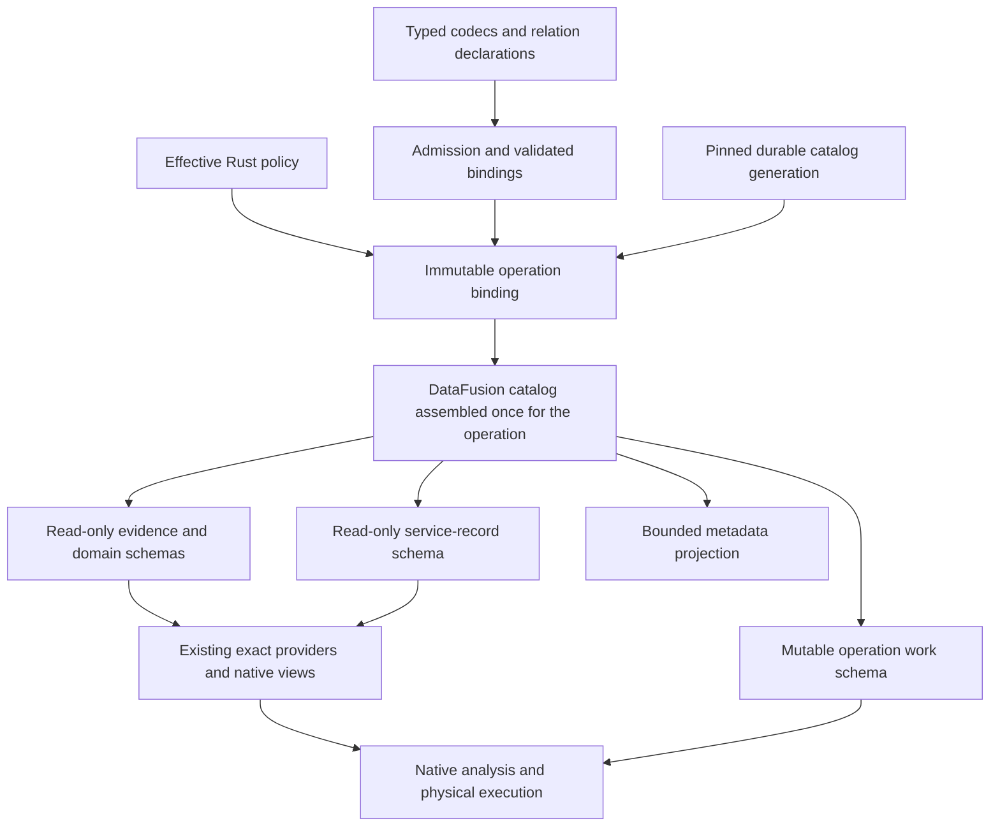

# Design review: DataFusion capability use and catalog policy ownership

## 1. Decision and scope

**Decision:** Accept the implemented research-operation architecture within the inspected scope,
with the SHOULD deviations recorded in §10. Prioritize a catalog/schema binding consolidation
as the next architectural increment. This review found no demonstrated MUST-level correctness
defect in the inspected paths; that is not certification of every service behavior.

**Target:** The codebase at `a78c74191d69ad82de7348c6503b58443f7f9c13`, including the completed
[Plan 13](../../plans/13-datafusion-research-operations-hard-pivot.md) and
[execution ledger](../../plans/13-research-operations-execution-ledger.md). The working tree was
clean when this review began. **Verified 2026-09-15:** DataFusion 55.1.0, Arrow/Parquet 59.3.0,
object_store 0.13.2; the deployed adapter uses FastMCP 4.0.3.

**Reviewer:** Coding agent, applying the
[design-review skill](../../../.claude/skills/design-review/SKILL.md),
[charter](../design_principles/DATA_MODEL_DESIGN_CHARTER.md), directive, addendum and review template.
The DataFusion skill, the three supplied capability maps and Context7 support capability discovery.
Recommendations are **Proposed**, API conclusions **Interface-checked**, code observations
**Implemented**, and only the explicitly recorded live calls/probes **Tested**.

**Principal conclusion:** The hard pivot is substantive. Native relational plans already own
selection, joins, reconciliation, pagination and coverage. The next large improvement is to make
the existing admitted relation and policy authorities drive DataFusion's catalog hierarchy,
instead of repeatedly assembling equivalent registrations around them. The strongest additional
engine opportunity is to expose validated facts through **physical scan statistics**. Neither
requires another query language, general workflow engine or replacement storage system.

### Method and coverage

Deep source inspection covered `enrichment-store` admission, exact providers, durable catalog
generations, views, comparison, scoring, preparation, runtime, operation indexes, leases and
query diagnostics. Consumer inspection covered snapshot queries, browsing, search plans,
coverage, ingestion, writers and the daemon's construction of effective query/admission policy.
The review compared these with the full fifteen-axis capability index in the DataFusion skill;
§7.3 records adoption, retention and deferral decisions across those axes.

The catalog focus includes **CatalogProviderList → CatalogProvider → SchemaProvider →
TableProvider**, qualified references, retained views, mutation boundaries, policy ownership,
metadata discovery, asynchronous lookup, statistics and physical properties. The durable
`RelationalCatalog` and the DataFusion catalog namespace are different objects with different
responsibilities; sharing a name does not make them interchangeable.

The deployed MCP was actually used through its registered stdio adapter from an external scratch
directory. Its connector tools were absent from this session's tool catalog, so a recorded SDK
client launched the installed adapter using the existing registration. This was not a fixture
server or a mock. It performed **27 recorded research calls: 10 `ok`, 16 `partial`, one explicit
path error**, in addition to protocol initialization, tool discovery and any delivery/job reads.
It resolved exact 55.1.0 crates, obtained an overview, searched evidence and inspected traits and
methods. Output schemas, native outcomes, artifact digests and page continuity were checked by
the recording harness. These counts describe the research transcript, not acceptance gates.

The one path error used the private implementation-module path for `PeakRecordingPool`; inspection
of the public re-export succeeded. Searches on the facade crate sometimes returned re-exports
rather than implementation members. Searching/inspecting the owning crate resolved this.
`partial` results explicitly reported missing examples/release notes. These are real discovery
limitations, not evidence that DataFusion lacks the features. The MCP supplied useful exact-version
API and documentation evidence; pinned local source supplied implementation/default details.

Context7 resolved `/apache/datafusion` and supplied provider/statistics, parameter-binding, UDF and
catalog leads. It also returned old upgrade examples and `main` documentation. Those examples were
not accepted as 55.1 proof. Direct docs.rs browser retrieval was unavailable in this session;
the actual MCP's hosted-rustdoc evidence and installed 55.1.0 crate sources were used instead.

Four focused mechanism probes ran in one standalone Rust executable, outside the checkout. Its
linked DataFusion dependency file identifies 55.1.0. See the committed
[probe source](evidence/datafusion-capability-leverage-2026-09-15/capability_probe.rs),
[output](evidence/datafusion-capability-leverage-2026-09-15/probe-run.log) and
[research receipt](evidence/datafusion-capability-leverage-2026-09-15/research-receipt.json).
They establish upstream behavior, **not an implemented integration or a service speedup**.

No broad test suite, acceptance campaign, deployment, ADR change or production-code change was
performed. Existing negative-test bodies were inspected but not rerun. Producer sandbox internals,
all normalizers, every RPC branch, all supported clients, and process-kill recovery were not
independently re-audited. Historical Plan 13 qualification is background, not fresh evidence here.
The deployed MCP and the source checkout are separately identified evidence surfaces; this review
does not claim that the installed binary was rebuilt from the reviewed commit.

A separate [MCP functional campaign report](../../reports/mcp-functional-datafusion-2026-09-15.md)
appeared in the working tree during this review. It is concurrent work, preserved without edits.
It reports additional diagnostic/recovery findings outside this review's executed requests; those
were not independently reproduced here. The scoped G1–G7 judgments below do not supersede that
report or certify all malformed-input and recovery behavior.

## 2. Authority and lifecycle map

| Concept or fact | Semantic type and identity | Authority / owner | Revision boundary | Permitted update path | Derived surfaces |
|---|---|---|---|---|---|
| Evidence relation shape | `Relation`, typed Arrow fields, projection version | Rust codecs and `Relation::schema`, `admission.rs:75` | Projection/schema revision | Change Rust contract and explicit storage compatibility policy | Parquet schema, admitted provider schema, query fields |
| Relation keys and references | `Relation::key`; conditional relational predicates | Admission, `admission.rs:133`, `:438` and subsequent checks | Exact files plus `EvidenceScope` | Validate candidate before exposing trusted constraints | Provider keys/functional dependencies; proposed contract inventory |
| Durable service records | `Table`, catalog root digest/generation | `RelationalCatalog`, `catalog_generation.rs:46`, `:950` | One validated manifest/root publication | Typed delta, validation, atomic root write | `PinnedCatalog`, latest-selection and distinct-record views |
| Snapshot visibility | Manifest/file identities and admitted providers | Repository/admission | Exact snapshot, environment and catalog binding | Open/admit a new binding | Request catalogs, views, comparison sides |
| Effective execution policy | `Config`, `QueryLimits`, `AdmissionLimits` | Daemon configuration and explicit runtime construction, `service.rs:96`, `:138` | Service configuration; captured operation digest | Validated service construction | Session options, resource objects, operation diagnostics |
| Query meaning | Native `LogicalPlan`, `Expr`, typed `QueryFamily`; captured `SearchSpec` | Rust operation builders and preparation | Request and immutable input bindings | Checked construction, analysis and optimization | Physical plan, key/score index, bounded result |
| Resource ownership | `OperationBinding`, snapshot leases, memory reservations, spill files | `QueryRuntime` and lease wrappers | Operation/stream/output lifetime | Scoped acquisition, cancellation and drop | Execution metrics and diagnostic snapshots |
| Evidence about the library | Source item/artifact and six epistemic classes | Admitted producer observations | Exact context/snapshot/producer | Explicit acquisition/publication | Research MCP results; never inferred feature truth |

**Already single-sourced:** `Relation::schema()` derives from the actual typed encoders; it is not
a hand-maintained second Arrow schema. `Table::schema()` uses the same pattern. The daemon derives
runtime/write/admission limits from `config.arrow` in `service.rs:138–174`. Separate representations
of those values are not automatically competing policy authorities.

**Still procedural:** The same admitted-object-to-session binding recipe is repeated in
`AdmittedRelations::{register, register_leased, register_views}` and `PinnedCatalog::session`.
Comparison creates another prefixed registration inventory. That is the principal consolidation
target, not merging evidence identities with service-record identities into one universal enum.

**Deliberately ordinary code:** Static extraction, domain decoders, stable identity generation,
specialized lexical scoring, filesystem publication and process isolation remain Rust/Python
mechanisms behind explicit contracts. DataFusion catalogs should expose their admitted products;
catalog lookup should not perform package resolution, extraction or execution.

## 3. Semantic contracts and invariants

| Contract | Current enforcement | Failure behavior | Evidence strength / implication |
|---|---|---|---|
| Only exact admitted files supply persisted evidence | `admission.rs:388` keys scope/files; `provider.rs:174` rechecks witnesses; `provider.rs:260` checks before scan | Changed/missing file is an invariant error | Implemented; retain across catalog refactoring and scan elimination |
| Keys are established before optimizer declarations | Duplicate/reference queries precede `with_validated_constraints`, `admission.rs:616–624` | Invalid candidate is refused | Implemented; a native `Constraint` does not validate rows |
| Registration and lookup are operation-scoped | Fresh catalog list/schema at `runtime.rs:503–520`; leased bindings at `admission.rs:240` | Duplicate bindings refused | Implemented; use immutable schema providers to make this policy reusable |
| Analysis/optimization cannot silently weaken result contracts | `preparation::result` at `runtime.rs:592`, `:607`, `:616`; exact stream check at `:630` | Structured invariant failure | Implemented; preserve these checks even with richer native type APIs |
| Predicate pruning cannot silently lose qualifying rows | `provider.rs:280` reports `Inexact`; filtered scan does not push the limit at `:271` | Native residual filtering remains | Implemented; enabling decoder filtering does not justify changing this to `Exact` |
| Old generations remain coherent | Candidate bind/validate before root write, `catalog_generation.rs:965–991`; pinned providers retain old files | Failed validation leaves old root | Implemented; new catalog-provider objects must represent a pin, not poll `current.json` |
| Reused views and native execution retain ownership | `leases.rs:166–188` binds scan leaves; `:121–141` retains leases around physical work | Errors/cancellation do not turn into successful emptiness | Implemented; cached view definitions themselves must remain lease-free |
| Unknown evidence differs from absence | MCP coverage assessments and native `partial` outcomes | Missing aspects stay explicit | Tested through live research calls within their requested scope |

**Equivalence:** Preserve exact result membership, identifiers, epistemic classes, coverage,
NULL behavior, nested field meaning and deterministic page ordering. A physical encoding change
may preserve these without preserving Arrow buffer bytes. Optimizer estimates are not evidence
coverage; an absent statistic is not zero. Metadata discovery must distinguish an unavailable
relation from an empty admitted relation and from failed lookup.

## 4. Derivation and execution design

### 4.1 Current path

| Stage | Inputs and output | Ownership/effects | Important existing leverage |
|---|---|---|---|
| Admit | Exact manifest and scope → validated providers | Bounded isolated native decode and relational checks | Native joins/anti-joins establish closure; schema metadata is checked |
| Bind | Providers and cached view plans → fresh mutable memory namespace | Repeated registration and lease attachment | Cached logical views already avoid reconstructing definitions per request |
| Prepare | Native query + family → analyzed/optimized plan | Bounded operation; default analyzer/optimizer retained | Typed parameter binding, native field derivation and schema preservation checks |
| Execute | Physical plan → Arrow stream | Shared RuntimeEnv, memory/spill limits and operation leases | Native Parquet scans, filters, aggregates, joins, windows, sorts and metrics |
| Reuse within operation | Key/score result → IPC-backed `StreamingTable` | Native disk accounting plus explicit decoding reservation | Avoids repeating expensive reconciliation/scoring for count and page |
| Publish/deliver | Validated artifacts/results → durable root or bounded delivery | Rust publication/job authority | No DataFusion DML or Python publication authority |

Typed placeholders are already used, for example `query.rs:151`, `:304`, `:937`,
`coverage.rs:183` and `semantic_scope.rs:50`. Native views, UNNEST, arrays, windows, semi/anti joins
and set difference are also already in production. Introducing these as absent features would
misdescribe the pivot.

### 4.2 Proposed catalog architecture

Use the existing Rust relation definitions and admitted objects to produce a **small immutable
bound inventory**. Project that inventory through DataFusion interfaces. Build a separate mutable
schema for operation-local views/indexes. Names below illustrate responsibilities, not a new wire
contract or required global naming convention.

| Native layer | Concrete responsibility | What it should consume | What it must not take over |
|---|---|---|---|
| `CatalogProviderList` | Install the operation's catalog roots | Fully constructed root inventory | Durable publication or an invented typed mutation-refusal API: `register_catalog` has no `Result` |
| `CatalogProvider` | Expose stable schema names and lookup | One immutable binding; reject optional schema mutations | Refreshing a pin by rereading a mutable current pointer |
| `SchemaProvider` | Project available relations; consistent `table_names`, `table_exist`, `table_type`, async `table` | Admitted providers/view definitions and one visibility/binding policy | Fetching/extracting packages; conflating `Ok(None)` with an error; independent authorization rules |
| `TableProvider` | Schema, logical view, trusted constraints, scan planning and physical properties | The same admitted facts, policy and ownership binding | Re-proving domain semantics differently from admission; publication side effects |
| Native memory schema | Temporary query views and retained operation indexes | Explicit operation builders | Overriding admitted names or becoming durable state |

`SchemaProvider` is the highest-value seam. Its optional mutation methods already fail by default;
`table_type` can avoid constructing a view when inventory only needs classification. Its async
`table` method can resolve a cached local definition, but schema visibility and generation must
already be pinned. A lightweight immutable `CatalogProvider` is justified if needed to enforce
schema immutability. A custom catalog-list implementation is not necessary merely for symmetry;
keep the native root private and construct it once.

The upstream probe demonstrates why this matters: a retained plan continued reading three rows,
while a cloned `SessionState` saw four rows after replacement of a shared memory-catalog schema.
**Cloning state is not a deep catalog snapshot.** Today's `QueryRuntime::session()` explicitly
creates fresh catalogs and therefore avoids this particular shared-template hazard.

#### One declaration per rule; separate declaration from proof

The smallest useful contract connects existing relation IDs to their derived Arrow schema,
key fields, table class, available projection/view definition and admissible binding kind. Use
typed fields/functions associated with the existing finite Rust relation families. It need not be
a stringly typed rule engine, runtime plugin registry, YAML language or universal schema generator.

For repeated key/reference checks, retain native expressions/plans generated from typed declarations.
Keep specialized conditional checks as ordinary functions returning offending-row plans. Admission
executes them and creates the admitted binding. Provider constraints and diagnostic metadata are
then derived from that binding. A declared key and a **validated key for these rows** remain distinct.

For example, `Relation::key()` supplies the key name today, while constraint publication assumes
column zero at `admission.rs:620`. Resolve the declared key against the authoritative schema once
and use that mapping for validation and native constraints. This removes an implicit positional
rule without replacing the existing schema authority. For durable catalog records, do not put a
primary key on raw append files: duplicate raw rows and historical selections are intentional.
Only the validated folded relation can support the corresponding uniqueness claim.

#### Programmatic binding, not more registration loops

Replace snapshot, leased snapshot and generation registration loops with projections of the same
bound inventory. View definitions stay cached and transparent to the optimizer; lease attachment
still uses the existing subquery-aware scan rewrite. Cache immutable definitions, not request
leases or mutable sessions. Make failed binding construction unpublishable as a partial namespace.

Comparison can install two independently pinned catalogs/schemas and use native qualified
`TableReference`s, instead of copying all names to `before_*` and `after_*` tables and replacing
`SIDE_` in SQL (`comparison.rs:166–187`). Ordinary SQL remains suitable for fixed relational
definitions. This change localizes side selection; it is not a claim of SQL injection in the current
trusted strings. Query output contracts still distinguish the two contexts and their coverage.

#### Singular policy ownership

Keep configuration and execution authority in Rust. Capture an immutable bound context when
constructing catalog/schema/provider objects, derived from the existing `OperationBinding` and
effective configuration. Each provider should consume this binding, not rediscover policy from
names, ambient state or a second set of defaults. This does not replace task-scoped cancellation,
semaphores, producer profiles or publication checks.

Use native session/table options for actual engine settings. `ExactParquet` currently creates
`ParquetFormat::default().with_skip_metadata(false)` independently of session table options
(`provider.rs:212`). The 55.1 `ParquetFormat::create_physical_plan` installs its own options on the
source. A central factory should capture the intended effective `TableParquetOptions`, preserve
the mandatory metadata setting and feed the actual source. Setting a flag only on an unrelated
session configuration would not establish that this provider consumes it.

**ConfigExtension remains conditional.** Plan 13 §8 explicitly deferred it until a concrete native
consumer replaces repeated plumbing. The current code already has a policy owner. An opaque
`SessionConfig::with_extension(Arc<T>)` can carry an immutable handle if native consumers need it;
a read-only `ConfigExtension` is appropriate only when named native policy access and `df_settings`
inspection share that same value. Neither should create another editable policy. Avoid adding both
until their distinct consumers are demonstrated.

#### Discovery that reflects execution

Enable bounded internal `information_schema` inspection where it replaces hand-assembled structural
inventory. Derive a small domain-contract metadata relation from the same binding for facts the
engine cannot expose: nested semantic field roles, admitted key status, binding identities, visibility
and applicable rule IDs. Existing query diagnostics are a concrete consumer; admission/catalog
conformance checks are another. These projections must use the same objects that queries resolve.

55.1 exposes seven information-schema tables: tables, columns, views, schemata, df_settings,
routines and parameters. They are not a complete domain registry. Columns are top-level structural
metadata, not nested semantic metadata; `views` membership is not a reliable table classification
in this release; `owner_name` is not authorization. Inventory construction can enumerate providers
before a SQL filter/limit applies. Bound enumeration and implement cheap `table_type` explicitly.
Do not expose a raw SQL MCP tool or treat this internal inventory as whole-library evidence coverage.

## 5. Representative journeys

| Journey | Current change path | Proposed local change and preserved boundary |
|---|---|---|
| Add a new evidence relation with a key and producer binding | Extend the typed codec/Relation; admission rules; domain views; applicable consumers and registration-dependent inventories | One relation declaration drives schema/key/binding metadata and schema lookup. Add only genuinely new conditional validation and operation behavior. Transport generation remains Rust-owned. |
| Compare two snapshots with overlapping relation names | Copy each relation into prefixed tables and rebuild side-specific SQL aliases | Mount two immutable bound inventories; use qualified references. A new relation should not require another independent before/after registration policy. |
| Reorder a stored schema's fields | Codec/schema changes; the positional `PrimaryKey([0])` assumption needs coordinated attention | Resolve key fields by name from the authoritative schema. Validate distinctness before publishing remapped native constraints; migration/version rules still apply. |
| Change decoder filtering or another engine policy | Runtime/session options and the provider's separate Parquet format construction must agree | One effective options factory supplies the provider and reported settings. Compare actual scan behavior; do not infer consumption from the configuration file. |
| Change a generation while an old query runs | Existing root publication produces a new pin; old providers/leases remain live | Preserve this exactly. A new schema/provider object is created for the new binding; existing objects never follow the new root. |
| Missing table, missing file, cancellation | Missing name, corrupted admitted source and budget cancellation have different paths | `Ok(None)` only for absent names; changed known source remains an error. An optimized-away scan still requires admission/binding checks and retained provenance. |

## 6. Acceptance gates

These are **charter design-review verdicts for the inspected architecture**, not results from
`tests/gates.toml`. Pass means the inspected mechanism supports the requirement; fresh behavioral
evidence is separately identified in §9. It does not convert unexecuted regression tests into passes.

| Gate | Verdict | Evidence and scope rationale | Required action |
|---|---|---|---|
| G1 — Authority | Pass | Typed codecs own schemas; Rust admission owns validity; durable root publication owns visibility; `service.rs:96` binds effective policy. Repeated binding mechanics are a SHOULD-level locality defect, not evidence of two current durable authorities. | Preserve these owners in F1/F2; catalog metadata must be derived. |
| G2 — Semantic fidelity | Pass | Native family/field checks survive analysis and physical lowering; six evidence classes and partial coverage remain explicit. Live MCP results did not hide missing aspects. | Differentially qualify encoding, namespace and metadata changes before adoption. |
| G3 — Validity | Pass | Bounded native admission plus key/reference queries precede optimizer constraints. Exact-file providers fail closed. Negative-test bodies exercise duplicate keys and dangling references. | Derive key positions; keep proof before statistics/constraints. |
| G4 — Hidden behavior | Pass | Explicit admission/binding and operation ownership; query catalog construction uses already admitted local objects. Research probes used external scratch; real MCP resolution was an explicit acquisition operation. | Keep lazy schema lookup free of package acquisition and producer execution. |
| G5 — Consistency and recovery | Pass | Candidate bind/validate precedes manifest/root write; old pins and leases remain distinct. Negative-test bodies check invalid closure leaves the old root. No recovery campaign was rerun. | Preserve generation and cleanup semantics under new catalog objects. |
| G6 — Transformation and reuse | Pass | Admission key includes scope, files, manifest and projection version; cached views are rebound at scan leaves; ScoreUdf identity includes SearchSpec. State-clone probe supports the need for existing catalog isolation. | Do not share mutable catalogs or cache plans under incomplete identities. |
| G7 — Truthful capability claims | Pass | Exact-version MCP evidence reports scope and gaps; private-path error stays an error; recommendations distinguish interface support from tested mechanisms and unmeasured gains. | Keep new metadata capabilities bounded and consumer-specific. |

## 7. Principle findings

### 7.1 Prioritized findings

No severity below alleges a reproduced current wrong answer. **High architectural** means a
direct obstacle to the user's requested reduction in independent policy/construction decisions.
Performance changes remain hypotheses unless the probe establishes the specific mechanism.

| Finding | Principle IDs | Concrete evidence or gap | Consequence | Proposed correction | Verification |
|---|---|---|---|---|---|
| **F1 — High architectural: catalog/schema interfaces are underused as the binding-policy boundary.** | DM-16, DM-17, DM-25, DM-56 | `runtime.rs:512–518` supplies empty native memory containers. `admission.rs:207`, `:240`, `:276` separately assemble views, leased bases and bases; `catalog_generation.rs:344–384` repeats assembly; `comparison.rs:166–187` builds another named projection. | A change to visibility, lease binding, admitted projections or side selection requires coordinated procedural edits. Raw, domain and temporary bindings share an assembly surface rather than declaring their distinct lifecycles. | Introduce the immutable inventory/schema projection in §4.2; one binding recipe, separate work schema, native qualified references. Retain the existing durable catalog and lease implementation. | Proposed Rust catalog conformance test: the same declared inventory yields consistent names/types/lookup, refuses admitted mutations, and preserves both snapshot sides and old plans. Extend existing lease/cleanup tests. An ast-grep rule can then prohibit raw registration outside approved assembly/work modules; behavior tests remain the oracle. |
| **F2 — Medium architectural: relation and policy metadata are insufficiently connected to executable discovery.** | DM-17, DM-50, DM-52, DM-55 | `Relation::key` at `admission.rs:133` names a field; `:620` independently assumes column zero. `query_diagnostics.rs:352–365` derives labels from scans, but there is no catalog-backed contract/policy inventory. Runtime memory/schema objects have no domain declaration projection. | A schema reorder requires remembering the positional key rule. Diagnostics cannot directly join actual table availability with validated key status, field roles and effective policy; future consumers are encouraged to rebuild those inventories. | Resolve keys from existing schemas once. Derive bounded contract metadata from the same binding as SchemaProvider. Use native information_schema for its actual coverage; conditional read-only policy extension only when its consumer is real. | Proposed metadata/binding conformance test: reorder key field; enumerate actual schemas; join contract rows to table inventory; compare reported policy to the provider's captured values. Missing/empty/error and nested-role cases must stay distinct. |
| **F3 — High engine leverage: admission facts do not reach physical scan statistics.** | DM-23, DM-26, DM-38 | Native admission verifies the requested row count (`parquet_admission.rs:128–172`); `EvidenceFile.rows` already exists. `ExactParquet` retains no statistics (`provider.rs:148–154`); its scan builder omits `with_statistics` (`:267–272`). | Repeated count queries scan when an exact admitted row count could answer them; physical optimization also starts without those known source facts. Overriding TableProvider::statistics alone would not fix this. | Carry validated exact row counts into FileScanConfig statistics; add trustworthy per-column facts only with a provenance/validation argument and a consumer. Derive aggregate/per-file precision correctly. | **Tested upstream:** unknown and provider-only statistics retained a count scan; physical exact statistics produced `ProjectionExec [3] → PlaceholderRowExec`; filtered counts remained 2. Proposed store integration test compares scan/count/filter/limit results, including empty files, changed witnesses, projection and lease/provenance retention. |
| **F4 — Medium engine leverage: scoring signatures force narrower string encodings than the implementation requires.** | DM-22, DM-37, DM-38 | `scoring.rs:35–49` declares exact Utf8 arguments; `:99–102` uses TextColumn, which supports the string representations already arriving from native scans. | LargeUtf8 and Utf8View inputs are coerced to Utf8 before scoring, despite the reader accepting them. This creates an avoidable conversion opportunity; whole-service cost is not measured. | Use per-argument `Signature::coercible` with the native logical string class; retain the Boolean slot, NULL behavior, output field metadata and complete request identity. | **Tested upstream:** exact signature selected Utf8 for all three string types; declarative coercion preserved each type. Proposed scoring differential test uses identical Unicode/NULL/large text through Utf8, LargeUtf8 and Utf8View and asserts identical score/factors and output contract. |
| **F5 — Medium: operation materialization discards reusable physical facts.** | DM-23, DM-26, DM-36 | `operation_index.rs:200–211` retains maximum batch bytes but no row count; `:232–235` constructs a single-partition StreamingTable with no ordering declaration. Comparison count/page reuses this index at `comparison.rs:221–235`. | Counting the completed index still decodes it; any established ordering is unavailable to downstream planning. This is distinct from correctly avoiding a second execution of the expensive source stage. | Retain exact count during the existing fold. First use the count in the typed index result or a small physical-statistics adapter. Propagate native ordering/partition properties only if the materialization actually establishes them. | Proposed zero/one/many-batch index test verifies exact count without replay, pages equal the reference, and quotas/ownership hold. For ordering, compare plans and results with ties, NULLs and multiple partitions; never mark unsorted data sorted. |
| **F6 — Medium, measurement-dependent: decoder filtering and physical layout are not deliberately composed under one effective policy.** | DM-16, DM-36, DM-39 | `provider.rs:212` constructs independent default Parquet options. Pinned defaults enable page/row-group pruning and string views but disable decoder filter pushdown/reordering. Writers couple row-group size to batch rows (`dataset.rs:205`, `record_writer.rs:67`); catalog compaction slices at 1024 rows (`catalog_generation.rs:926`). | Selective queries may decode payloads or repeatedly process more small-file/footer work than necessary. Merely setting session flags would not change this format instance. Magnitude is unmeasured. | Centralize effective TableParquetOptions, then measure decoder filtering on actual eligibility/ID predicates. Evaluate row-group/file sizing and selective column Bloom filters separately. Keep metadata preservation and Inexact filter classification. | Proposed cold/warm A/B workload: small and large exact files, selective and unselective predicates, nested payloads; equal results/coverage plus bytes, decode rows, planning time, wall time, memory and metadata cost. Adopt only a measured net benefit. |
| **F7 — Low-cost observability opportunity: useful native diagnostic hooks remain unused.** | DM-50, DM-55 | `runtime.rs:471` installs bare FairSpillPool; `:590`, `:602` use no-op analyzer/optimizer observers. Existing diagnostics record plans/timings/metrics but no managed-pool high-water mark or rule transitions. | Resource failures lack a native managed-memory peak; a changed analyzed/optimized plan does not identify the rule transition. Current diagnostics are still materially useful. | Wrap the empty shared pool with PeakRecordingPool; consider bounded TrackConsumersPool errors. Record capped rule names/changes only for requested diagnostics or failures. | **Tested upstream:** 1024-byte pool still rejected excess allocation; after release current reservation was 0 and peak 512. Proposed diagnostic test checks bounds, truthful global-vs-query attribution, error preservation and capped overhead. |

### 7.2 Applicable-principle verdicts

| Principles | Verdict | Basis |
|---|---|---|
| DM-01, DM-02, DM-03, DM-04 | Satisfied within inspected scope | Typed domain authority and derived representations remain distinct; specialized algorithms are not misrepresented as generic relational semantics. |
| DM-06, DM-07, DM-08, DM-09 | Satisfied within inspected scope | Admission enforces typed/conditional relationships; preparation checks fields; observed MCP gaps remain explicit. F2 improves mechanical derivation without asserting present invalid rows. |
| DM-11, DM-12, DM-13, DM-14, DM-15 | Satisfied within inspected scope | Semantic identities, artifacts, attempts, pins and atomic publication are distinct; catalog/provider consolidation must preserve them. |
| DM-16, DM-17, DM-25, DM-52, DM-55, DM-56 | **Violated at SHOULD level in the identified binding/metadata scope** | F1/F2 leave repeated construction and an implicit positional key rule instead of shared bindings and discoverable projections. Existing Rust schema generation remains aligned. |
| DM-18, DM-19, DM-20, DM-21, DM-22, DM-23, DM-24 | Satisfied for current behavior | Native plans stay visible; effects and supported query families are explicit; schema/field checks guard lowering. Lack of optional optimizer facts is not itself semantic corruption. |
| DM-26, DM-36, DM-37, DM-38, DM-50 | **Violated at SHOULD level for the bounded opportunities F3–F7** | Native views/index reuse and bounded diagnostics already exist, but known statistics/encodings and some lifecycle observations are unnecessarily discarded or reconstructed. Layout improvement remains unmeasured. |
| DM-28, DM-29, DM-30, DM-31, DM-32, DM-34, DM-35 | Satisfied for inspected ownership and reuse paths | Explicit operation/pin identities, isolated registrations and lease/queue lifetimes; no persistent query cache is proposed as already correct. |
| DM-39, DM-40, DM-41, DM-42, DM-43, DM-44, DM-45 | Satisfied at the evidence strength stated here | No whole-service performance gain inferred from the probes; native capabilities remain separate from domain authorization and semantic compatibility. Producer internals are outside this renewed audit. |
| DM-46, DM-47, DM-48 | Satisfied for inspected query/result path | Binding identities and structured bounded diagnostics exist. More rule/consumer detail is a SHOULD improvement, not evidence that provenance is absent. |
| DM-51, DM-53, DM-54, DM-59, DM-60 | Satisfied for current scoped design and this review | Versioned admission/storage, inspected negative oracles, explicit evidence labels and proposed regression controls. Integration of the new proposals is not yet tested. |
| DM-57, DM-58 | Satisfied by the bounded direction | Prefer existing native interfaces and finite Rust declarations; reject speculative catalog platforms and another semantic interpreter. |

**Applicability:** All twelve groups bear on this review because catalogs connect authority,
types, revisions, composition, lowering, effects, reuse, execution, providers, provenance,
evolution and architectural leverage. Unlisted SHOULD principles are not newly adjudicated:
for example, whole-service invalidation granularity and semantic-diff ergonomics were not deeply
reassessed. Numerical units, scientific tolerances and GPU/distributed execution examples in the
maps are outside this service's scope; their presence is not a reason to add those mechanisms.

### 7.3 Capability disposition across the native surface

| Capability axis | Already deployed / preserve | Additional capability and disposition |
|---|---|---|
| Sessions, configuration, runtime | Shared bounded RuntimeEnv; pristine defaults; fresh request catalogs | **Adopt:** immutable catalog binding; effective table-options factory. **Conditional:** opaque binding extension; read-only ConfigExtension only with a native consumer. |
| Catalog/schema hierarchy | Native memory providers; exact generation and snapshot ownership in Rust | **Adopt:** read-only SchemaProvider projections; cheap table_type; qualified references; bounded metadata discovery. Do not replace durable catalog publication. |
| Source providers | ExactParquet, TableSchema, predicates, projection/limit handling, metadata cache | **Adopt:** validated physical row statistics. **Measure:** decoder filtering and richer statistics. Keep Inexact and exact-file scope. |
| Reading/layout | Parquet native pruning and view-string adaptation | **Measure:** page/Bloom usefulness, row-group/file sizing, file grouping and parallelism. No claim that existing pruning is disabled. |
| Writing/publication | Arrow/Parquet encoders and explicit atomic Rust publication | Native sinks may help a future batch export consumer; do not substitute INSERT/UPDATE/MERGE for transactional snapshot publication. |
| DataFrame/native relational composition | Joins, windows, arrays, UNNEST, set difference, sorted pages | **Preserve:** current native plans and fixed trusted SQL. Hierarchical navigation already uses bounded array ancestry; no recursive CTE rewrite is needed. |
| Expressions | Typed literals/parameters; native eligibility and namespace expressions | **Adopt selectively:** shared typed invariant-plan builders where one rule repeats. Do not build a general expression interpreter. |
| SQL/planning frontends | with_param_values; DataFrame/SQL both lower natively | **Defer:** custom SQL ExprPlanner/TypePlanner/RelationPlanner, parser extensions and new DSL—no missing current semantics require them. |
| Logical planning | Default analyzer/optimizer; explicit stage checks; cached native view plans | **Adopt:** bounded observer detail. **Defer:** custom AnalyzerRule until a repeated plan-wide semantic check has a demonstrated consumer, as Plan 13 specifies. |
| Optimization | Native rules, transparent views, validated evidence keys | **Adopt:** supply physical facts first. **Conditional:** requested statistics and custom rules only with an actual request producer/consumer; scan_with_args alone adds no optimizer benefit. |
| Physical execution and streaming | Native operators, operation-owned IPC, lease-preserving wrappers | **Adopt:** completed-index count. **Measure:** truthful ordering/partition declarations, small-index memory path and parallel files; maintain resource accounting. |
| Scalar/aggregate/window functions | Specialized immutable ScoreUdf with field-aware output; native aggregate/window functions | **Adopt:** declarative string coercion. **Defer:** UDAF/UDF monotonicity, preimage, intervals, short-circuit and placement hooks until mathematically valid for a real function. |
| Arrow type/metadata contracts | Typed nested fields; targeted string adaptation; exact physical field checks | **Preserve:** semantic validation. **Conditional:** DFExtensionType only when operator semantics need it; UUID-like storage IDs do not automatically need extension types. |
| Memory/Parquet ecosystem | FairSpillPool, disk quotas, manual bounded IPC decoding | **Adopt:** peak recorder. **Conditional:** TrackConsumersPool. ArrowMemoryPool requires the `arrow_buffer_pool` feature and allocator-aware buffers; it cannot account for all current allocations automatically. |
| Interop, persistence of plans | Thin FastMCP/Rust boundary; durable evidence artifacts | **Defer:** Substrait, protobuf plan caches, FFI providers, distributed plans. No current cross-engine/foreign-provider consumer justifies their compatibility and trust obligations. |

Additional catalog exclusions are deliberate: `ListingSchemaProvider`, `DynamicFileSchemaProvider`
and broad ListingTable discovery can make unlisted filesystem data queryable, conflicting with
the exact-manifest boundary. Async remote catalog helpers are unnecessary for an already admitted
local pin; they cache requested names, not a complete transactional remote snapshot. UDTFs remain
deferred: native views plus Rust parameterized builders already serve current consumers, and a
table function would not automatically provide correlation, publication or once-only execution.

## 8. Alternatives and architectural leverage

| Alternative | Duplication / locality | Correctness and operational risk | Cost | Performance evidence | Decision |
|---|---|---|---|---|---|
| Current design plus local performance fixes | Retains repeated registration/lease/name assembly; improves stats and coercion independently | Lowest immediate change risk; existing isolation remains | Low | Probe establishes two mechanisms, not service latency | Viable interim work, but insufficient for requested catalog/policy consolidation |
| **Bound immutable inventories projected through native providers** | One relation/binding policy drives lookup, leases, classification and metadata; operation algorithms remain local | Requires pin, view-inlining and cleanup regression checks; no new durable authority | Moderate, concentrated in store binding/runtime and consumers | Catalog conformance mechanism tested; latency benefit unmeasured | **Preferred next architecture** |
| **Simpler viable alternative: common bound-table builder + existing memory catalogs** | One builder returns all name/provider pairs and owns lease application; no custom schema implementation | Mutation remains possible through internal SessionContext; enforce construction-only access and separate work schema | Lower than full provider projection | Unmeasured; may remove most duplicate assembly | Start here if it demonstrably removes all parallel binding policies. Add immutable SchemaProvider when enforcement/discovery benefits justify it. |
| Universal semantic registry/compiler, dynamic catalog plugin system, persistent plan service | Many more extension surfaces and independent lifecycles | Broad trust/cache/versioning obligations without consumers | High | None | Reject for this scope |

The preferred implementation may begin with the simpler builder; the acceptance criterion is
**one authoritative binding policy and a clear immutable/work boundary**, not a quota of custom
traits. Replacing loops with a generic registration helper that still lets every caller choose
visibility, lease and naming rules independently does not meet that criterion.

## 9. Verification and measurement plan

### Evidence actually obtained

| Claim | Strength | Executed evidence | Limit |
|---|---|---|---|
| Installed MCP can research exact DataFusion releases and named interfaces | Tested | 27 recorded resolve/overview/search/inspect calls; full receipt and transcript hashes in research-receipt.json | Static API/docs scope; missing examples/release notes are explicit; not a new installed-system certification |
| Physical statistics eliminate an eligible count scan | Tested | `capability_probe.rs`: three-row Parquet; unknown/provider-only/physical-statistics variants; identical count=3, filtered count=2 | Upstream mechanism, not the production ExactParquet change; no service speedup measured |
| Read-only SchemaProvider supports discovery and query binding | Tested | Same executable: qualified lookup, one-table information_schema inventory, absent lookup, registration/deregistration refusal | Root used native MemoryCatalogProvider; does not prove a future immutable catalog implementation |
| State clone shares mutable catalog objects; bound plans retain sources | Tested | Retained plan=3; cloned state after shared schema replacement=4 | Reinforces existing fresh-catalog design; not a defect reproduction against QueryRuntime |
| String coercion can preserve physical representations | Tested | `fields_with_udf`: Utf8, LargeUtf8 and Utf8View exact-vs-coercible cases | No scoring integration or byte-allocation benchmark performed |
| Peak recorder preserves bounded inner pool behavior | Tested | 1024-byte FairSpillPool; reservation 512, excess refused, final reserved=0, peak=512 | Managed reservations, not RSS; no per-operation attribution under concurrency |
| Existing negative admission/catalog oracles cover important boundaries | Implemented; test bodies inspected | `tests/admission.rs:171`, `:198`; `tests/catalog_generation.rs:220`, `:259` | Not rerun; not reported as newly passed |

The probe compiles directly with existing dependency artifacts rather than rebuilding the
workspace. Its recorded compiler is Rust 1.98.1. Exact build arguments and raw MCP transcripts
are retained at `/home/paul/.cache/library-enrichment-review-2026-09-15/`; the committed receipt
records their hashes and identifiers. Source, output and probe receipt are included beside this
review. Reproduction on another checkout should compile the standalone source against the pinned
dependencies and pass an absolute service-owned scratch Parquet path as its sole argument.

### Required checks when implementing recommendations

| Change | Cheapest meaningful oracle | Required cases / acceptance condition |
|---|---|---|
| F1 binding/catalog consolidation | Focused store integration tests and existing ownership tests | Identical relation availability and results for ordinary/leased/catalog/comparison bindings; immutable namespace mutation refused; temporary names isolated; view source leases survive inlining and cancellation; new generation cannot alter an old binding |
| F2 declaration/metadata derivation | Contract conformance + metamorphic schema test | Reorder fields; add a relation; key indices and metadata update through the declaration; no duplicated side-binding policy; nested metadata and missing/error distinctions remain visible |
| F3 physical statistics | Differential native plans/results | Empty and multi-file inputs, projection, residual predicates, limits, nullable fields; exact→inexact weakening; statistics cannot authorize a stale or unadmitted source; Count scan disappears only when valid |
| F4 scoring coercion | Existing scoring reference expanded across encodings | Exact same result/factor order, Unicode handling, NULL/error semantics and function identity; TextColumn currently accepts dictionaries by casting to Utf8, so dictionary preservation needs a separate implementation and cost argument |
| F5 index properties | Count/page/ownership integration | Exact count with no second IPC decode; empty and quota-exhausted indexes; ordered claims prove ties/NULL/global-vs-partition behavior; all readers release reservations |
| F6 options/layout | Controlled end-to-end A/B probe, not microbenchmark alone | Same evidence and query semantics; cold/warm, tiny/large, selective/unselective, concurrent operations; separately attribute construction, admission, planning, metadata, decoding, execution and delivery costs |
| F7 diagnostics | Bounded observer/resource tests | No unbounded plan rendering; no global peak mislabeled as one query; errors and pool limits unchanged; failed execution retains bounded causal context |

Metrics should separate managed memory from process RSS, file bytes from decoded Arrow bytes,
and catalog/view preparation from execution. Never reset a shared pool peak per request and label
it per-query under concurrency. Do not assume a native LIMIT bounds metadata enumeration or that
a view provides once-only evaluation. A persistent prepared-plan cache requires its own proof
of provider identity, config/function dependencies, bounded size and lease lifetime; defer it
until repeated cross-operation planning cost is measured.

## 10. Exceptions and unresolved decisions

These are **review-scoped SHOULD deviation records**, not new binding ADRs or permission to waive
a MUST. The accountable roles below are proposed owners for the next implementation decision.

| ID / principles | Scope and rationale | Compensating control | Owner | Revisit trigger |
|---|---|---|---|---|
| E1 / DM-16,17,25,52,55,56 | Current procedural catalog binding remains acceptable while the consolidation is designed | Fresh request catalogs, duplicate-name refusal, typed schema authority, explicit leases | Store/catalog maintainer | Next relation, projection, visibility or comparison-binding change; implement F1/F2 together |
| E2 / DM-26,37,38 | Existing scans/coercions retain correctness while known engine opportunities are integrated | Conservative statistics/encoding behavior; differential result oracles | Native query maintainer | Next performance increment: physical counts and string coercion first |
| E3 / DM-36,50 | Index properties, layout tuning and extra diagnostic detail remain deferred until benefit/overhead is established | Bounded disk/memory/output work and existing query diagnostics | Runtime/storage maintainer | Count/page replay cost, selective decode cost, metadata overhead or unexplained memory failure observed |
| D1 / DM-26,32,58 | Persistent plan cache is not justified by these probes | Immutable view cache and operation-local index remain the supported reuse layers | Query maintainer | Measured repeated cross-operation preparation bottleneck plus complete semantic dependency key |
| D2 / DM-16,58 | ConfigExtension remains conditional under Plan 13's native-consumer trigger | One Rust Config authority; explicit derived QueryLimits/AdmissionLimits and operation policy digest | Core/runtime maintainer | Catalog/provider/native rule needs named captured policy and this replaces repeated plumbing |
| D3 / DM-36,40 | Ordering, partitioning, decoder filtering and Bloom/layout choices require workload evidence | Do not advertise unknown order or Exact filtering; retain explicit deterministic final sort | Storage maintainer | Controlled A/B evidence demonstrates benefit without changed rows, order, coverage or budgets |

No in-scope current MUST requirement was left unresolved by a missing design decision in this
inspection. **The proposed implementations and their performance remain unverified** until §9 is
executed; these are not automatically accepted future integrations.

## 11. Decision and implementation changes

**Decision: Accept scoped design with documented SHOULD deviations.** Preserve the completed
native research-operation pivot. Make the next architectural change concentrate policy and binding
in the catalog/schema/provider composition, then let the engine consume the facts already proven
by admission. Do not expand the number of independent semantic interpreters to achieve this.

| Priority | Recommended increment | Principles | Acceptance evidence | Regression protection |
|---|---|---|---|---|
| 1 | F1/F2: shared bound inventory, explicit immutable/work namespaces, derived key mapping and contract discovery | DM-16,17,25,52,55,56 | Same results and availability through all existing binding modes; local extension path; qualified two-snapshot comparison | Catalog/binding conformance plus ownership and metadata tests |
| 2 | F3/F4: validated physical row statistics and declarative scoring coercion | DM-23,26,37,38 | Eligible count scans disappear; scoring outputs unchanged across all supported string encodings | Differential plans/results and stale-source negatives |
| 3 | F5/F7: completed-index counts and bounded native resource/rule diagnostics | DM-26,50 | No unnecessary count replay; preserved cancellation/quotas; truthful diagnostic scope | Index lifetime/count and bounded diagnostic tests |
| 4 | F6: measured provider-options and storage-layout improvements | DM-16,36,39 | Controlled end-to-end benefit under representative workloads | Semantic equality plus cost regression evidence |
| Deferred | Persistent prepared plans, custom analyzer/SQL extensions, UDTFs, remote catalogs, FFI/Substrait and allocator changes | DM-32,44,57,58 | A concrete consumer and a complete compatibility/ownership argument | New scoped decision and focused oracle when trigger fires |

### Exact-version source and MCP evidence index

The URLs identify primary upstream APIs; the conclusions above were checked against local pinned
source and the MCP records, not inferred from the mutable `latest` documentation.

| Topic | Primary 55.1.0 reference | Recorded MCP evidence / local proof |
|---|---|---|
| Catalog hierarchy | [CatalogProvider](https://docs.rs/datafusion-session/55.1.0/datafusion_session/catalog/trait.CatalogProvider.html), [SchemaProvider](https://docs.rs/datafusion-session/55.1.0/datafusion_session/schema/trait.SchemaProvider.html) | `catalog-provider-inspect`, `schema-provider-inspect`, `cheap-table-type-inspect`; context `ctx_d064983874ce8ffc`, snapshot `snap_291f0afb27370f4e` |
| Provider statistics limitation | [TableProvider source](https://docs.rs/datafusion-session/55.1.0/src/datafusion_session/table.rs.html) | `table-statistics-inspect`; source lines 313–318; standalone differential probe |
| Physical statistics and filter weakening | [FileScanConfigBuilder](https://docs.rs/datafusion-datasource/55.1.0/datafusion_datasource/file_scan_config/struct.FileScanConfigBuilder.html) | `scan-statistics-inspect`; context `ctx_7c23874bdd6f2a01`, snapshot `snap_812ec71282d61643`; local source lines 423–438 |
| Schema discovery and async catalogs | [information_schema](https://docs.rs/datafusion-catalog/55.1.0/datafusion_catalog/information_schema/index.html), [async helpers](https://docs.rs/datafusion-catalog/55.1.0/src/datafusion_catalog/async.rs.html) | Pinned skill/map plus schema lookup/inventory probe; no remote catalog implementation claimed |
| Coercion | [Coercion](https://docs.rs/datafusion-expr-common/55.1.0/datafusion_expr_common/signature/enum.Coercion.html), [UDF interface](https://docs.rs/datafusion-expr/55.1.0/datafusion_expr/trait.ScalarUDFImpl.html) | `scalar-udf-inspect`; local `fields_with_udf` and signature source; encoding probe |
| Streaming properties | [StreamingTable](https://docs.rs/datafusion-catalog/55.1.0/datafusion_catalog/streaming/struct.StreamingTable.html) | `streaming-table-inspect`; context `ctx_66874c8875aa04d3`, snapshot `snap_6c19f0b815c4eb96` |
| Native managed-memory peak | [PeakRecordingPool](https://docs.rs/datafusion-execution/55.1.0/datafusion_execution/memory_pool/struct.PeakRecordingPool.html) | `peak-public-inspect`; context `ctx_37ccc940653836f3`, snapshot `snap_db16ae7e9fe5cb12`; memory probe |
| Effective Parquet options | [ParquetFormat source](https://docs.rs/datafusion-datasource-parquet/55.1.0/src/datafusion_datasource_parquet/file_format.rs.html), [configuration](https://docs.rs/datafusion-common/55.1.0/src/datafusion_common/config.rs.html) | Local source `create_physical_plan:485–523`, ParquetOptions defaults `1201–1275`; no tuning benchmark claimed |

Full evidence IDs, context/snapshot bindings, transcript hashes and the probe receipt are in the
linked research receipt. In particular, the native schema/provider docs came from retained
`statically_extracted` evidence; this review's judgments are analysis, not new producer observations.

**Final check:** No current feature is credited merely because DataFusion can represent it. No
unused hook is called a correctness defect merely because it is unused. The proposals name actual
consumers, displaced repetition, lifecycle constraints, simpler alternatives and executable oracles.
