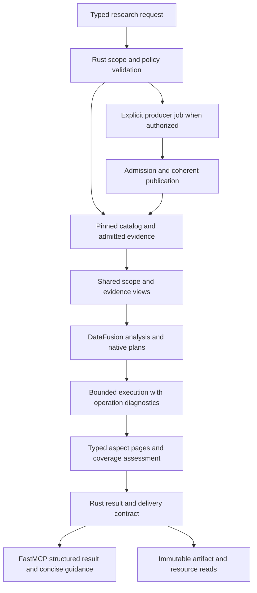

# Design review: DataFusion evidence operations and FastMCP delivery

## 1. Decision and scope

**Decision: Revise.** Extend the existing native architecture around explicit research-scope,
coverage, paging and diagnostic contracts. The strongest defect is that a requested comparison
scope can disappear without an explanation. High-fanout inspection then exposes a second design
problem: a bounded presentation is treated as a request for an indivisible complete set.

**Proposal:** A DataFusion-centric evidence service whose acquisition, inspection, search,
comparison and delivery paths preserve the same meaning and tell an agent what it can do next.
**Reviewer:** Codex. **Review date:** 2026-09-14, repository-local date.
**Depth:** Deep across the reported functional failures and the associated data/adapter paths.
**Affected implementation:** Git HEAD `41ac67219ea39e6b085dde6273c9df08c9937bba`.
At review start, the capability-map directory and campaign report were untracked; tracked source
was clean. The older uncommitted-tree description in `STATUS.md` is not the live Git baseline.
**Claim strength:** Current paths below are **Implemented**, established by source inspection.
The target design is **Proposed**. Selected upstream APIs are **Interface-checked**. No new
service execution, benchmark or acceptance certification is claimed.

### Outcome and architectural judgment

The user's diagnosis is substantially right about missing integration of data semantics, but
the current implementation is already extensively DataFusion-based. Search folds definitions
with windows; overview uses native aggregates; comparison uses native sets and joins; admission
uses native uniqueness and reference checks; query execution shares memory/spill resources.
Replacing these mechanisms wholesale would discard useful work without addressing the main causes.

The highest-value next step is to make **requested scope, observed coverage, selected projection,
continuation, failure cause and recovery action explicit inputs and outputs of those operations**.
DataFusion should own all suitable set processing over those facts. Rust should continue to own
effects, semantic identity, producer policy, jobs and publication. FastMCP should mechanically
expose the resulting contract with a reliable agent-facing presentation.

“Maximally DataFusion-centric” means retaining relational work in native plans for as long as it
benefits execution and explanation. It does not require archive extraction, JSON byte framing,
HTTP fetching or cancellation state transitions to run inside UDFs. This follows DM-03, DM-25,
DM-38 and the charter's explicit allowance for specialized algorithms.

### Method and coverage

Inspected:

- The [functional campaign](../../reports/mcp-functional-datafusion-2026-09-14.md), including
  F1–F4, O1–O9 and its delivery observations; corroborating entries in the retained campaign
  ledger under `.dev-state/mcp-campaign-2026-09-14/ledger.md`.
- The frozen blueprint and handoff, living [design](../../design/DESIGN.md), current status,
  charter/directive/template/addendum, ADR-0024 and ADR-0029, and the relevant ADR index.
- Rust relational records, admission/provider/runtime/view/query paths; inspection, comparison,
  revision, resolution, artifact and job handlers; shared errors and delivery encoding.
- The complete handwritten FastMCP adapter surface at relevant operation boundaries, its RPC
  client, generated-schema validation mechanism, and selected existing contract assertions.
- All three supplied DataFusion maps at the applicable operator, semantic-field, provider,
  configuration, reuse and verification sections. The FastMCP reference was read selectively:
  tools/results, validation, context/DI, tasks, middleware and the v4 capability map. Its remote
  authentication, Apps and numerical/process examples are not requirements for this service.
- Context7 discovery for DataFusion and FastMCP; installed version-matched crate/package source
  for consequential recommendations; official FastMCP current documentation and 4.0.3 release notes.

The campaign is external behavioral evidence, not a test run performed by this reviewer. Its
ledger is corroborating narrative, not a substitute for every raw response. Its executable
deployment hashes are recorded in the campaign; equality of that deployment and current source
was not established here. Findings are confirmed against the current source independently.
The report's campaign group names such as G4.1 are unrelated to charter gates G1–G7 below.

No production daemon was stopped, restarted, reconfigured or used to acquire new evidence. No
full test campaign was repeated. Publication crash recovery, sandbox containment, qualified
Python execution, actual client rendering and cancellation under load were not attacked anew.
The proposed changes require those focused regressions in §9. Their absence here is a coverage
limit, not a finding that the existing mechanisms fail.

### Library and reference qualification

| Source | Use and qualification |
|---|---|
| `Cargo.toml`, `Cargo.lock` | Rust DataFusion 55.1.0; Arrow/Parquet 59.3.0. No dependency upgrade is proposed. |
| `pyproject.toml`, `uv.lock`, installed distribution metadata | FastMCP and fastmcp-slim 4.0.3; installed MCP 2.2.0. |
| [Logical planning map](../capability-maps/datafusion_logical_planning_capability_spec.md) | Native composition, stable ordering, typed expressions, plan inspection, exact comparison and materialization tradeoffs. |
| [Semantic analysis/types/UDF map](../capability-maps/datafusion_semantic_analysis_types_udfs_capability_spec.md) | Analyzer placement, field contracts, extension-type limitations, pure specialized functions and conformance. Its process/solver examples are not transplanted into this product. |
| [Data model contracts map](../capability-maps/datafusion_data_model_contracts_capability_spec.md) | Providers, views, table functions, catalogs and configuration; domain metadata remains application-owned. |
| [FastMCP 4.0.0 reference](../capability-maps/fastmcp_python_advanced_reference_4.0.0.md) | Main capability reference, as requested. A patch-version difference does not invalidate its architectural guidance. Examples still need the project's actual imports and contracts. |
| Context7 `/apache/datafusion`, `/prefecthq/fastmcp` | Discovery and explanations. FastMCP resolution listed v3.2.0/v3.2.4 and queries returned unversioned `main` sources. These were not treated as 4.0.3 release proof. |
| Installed FastMCP `tools/base.py:95–190` | `ToolResult(content, structured_content, meta, is_error)` and preservation into the MCP result are directly present in 4.0.3. |
| Installed FastMCP `server/context.py:453–483`, `server/middleware/middleware.py:239–251` | Progress is conditional on request support; tool/resource middleware hooks are present. Neither supplies core job ownership. |

Official [4.0.3 release notes](https://github.com/PrefectHQ/fastmcp/releases/tag/v4.0.3)
describe fixes to mixed-era startup, unconstrained sequence output, task timing and callback
cleanup. They do not establish a broad incompatibility with 4.0.0. The
[v4 upgrade guide](https://gofastmcp.com/getting-started/upgrading/from-fastmcp-3) explains the
snake_case Python fields and retained wire aliases. Both were retrieved during this review.
The enrichment MCP itself was not exposed among this session's tools; local source and primary
documentation supplied the exact-release fallback. No enrichment tool results are invented.

### Source locator key

Short `file:line` references below resolve to these files at the reviewed source baseline.
Line ranges describe inspected evidence, not runtime test receipts.

| Area | Source files |
|---|---|
| Evidence and extraction | [relational.rs](../../../crates/enrichment-core/src/evidence/relational.rs), [archive/mod.rs](../../../crates/enrichment-core/src/archive/mod.rs), [producer/source.rs](../../../crates/enrichment-core/src/producer/source.rs) |
| Native query families | [query.rs](../../../crates/enrichment-store/src/query.rs), [views.rs](../../../crates/enrichment-store/src/views.rs), [browse.rs](../../../crates/enrichment-store/src/browse.rs), [search_plan.rs](../../../crates/enrichment-store/src/search_plan.rs), [comparison.rs](../../../crates/enrichment-store/src/comparison.rs) |
| Execution and admission | [runtime.rs](../../../crates/enrichment-store/src/runtime.rs), [query_diagnostics.rs](../../../crates/enrichment-store/src/query_diagnostics.rs), [provider.rs](../../../crates/enrichment-store/src/provider.rs), [admission.rs](../../../crates/enrichment-store/src/admission.rs), [scoring.rs](../../../crates/enrichment-store/src/scoring.rs), [semantic.rs](../../../crates/enrichment-store/src/semantic.rs) |
| Research handlers | [inspect.rs](../../../crates/enrichment-daemon/src/ops/inspect.rs), [compare.rs](../../../crates/enrichment-daemon/src/ops/compare.rs), [resolve.rs](../../../crates/enrichment-daemon/src/ops/resolve.rs), [revision.rs](../../../crates/enrichment-daemon/src/ops/revision.rs), [verify.rs](../../../crates/enrichment-daemon/src/ops/verify.rs) |
| Errors and delivery | [common.rs](../../../crates/enrichment-daemon/src/ops/common.rs), [artifact.rs](../../../crates/enrichment-daemon/src/ops/artifact.rs), [delivery.rs](../../../crates/enrichment-daemon/src/delivery.rs), [server.rs](../../../crates/enrichment-daemon/src/server.rs) |
| Python adapter | [server.py](../../../python/enrichment_mcp/server.py), [daemon_client.py](../../../python/enrichment_mcp/daemon_client.py) |

## 2. Authority and lifecycle map

| Concept | Identity / semantic distinction | Authority | Revision boundary | Permitted update | Derived representations |
|---|---|---|---|---|---|
| Library and environment | Release, environment, context; requested configuration differs from observed build | Rust core identities and committed catalog | Immutable IDs; new resolved environment derives a context | Explicit resolve/enrich operation | Tool identity fields, bound source providers |
| Evidence | Definition, public binding, qualified observation, typed relationship, fragment | Rust relational records admitted into snapshots | Snapshot + schema/normalizer + producer/input identity | Producer observation followed by Rust admission/publication | API, fragment and navigation views |
| Coverage | Subject + evidence kind + producer + outcome/gaps | Existing `CoverageFact` | Bound to the same selected evidence snapshot | Recorded producer scope; never inferred solely from row absence | Proposed shared coverage assessment |
| Research intent | Operation, selected subject/scope, requested aspects, depth, filters, page policy | Rust request/operation contract | Versioned query and selection semantics | Validated explicit request | DataFusion expressions/plans and agent guidance |
| Query policy | Allowed result shape, ordering, completeness and resource bounds | Rust configuration and operation contract | Captured effective policy per operation | Validated operator configuration; request may narrow | Optional read-only ConfigExtension, diagnostics |
| Job | Logical work key, attempt, interests, stage, terminal state | Rust durable job owner | Existing job journal/publication contract | Typed transitions and interest-token cancellation | Compact job status/result reference; optional MCP progress |
| Delivery | Original research outcome differs from inline/page/artifact representation | Rust delivery contract | Result artifact identity and transport request identity are distinct | Mechanical rendering of committed result | Canonical envelope, concise MCP text, resource link |
| Failure/recovery | Domain absence, input error, unsupported operation, capacity, infrastructure, internal defect | Rust diagnostic variants; adapter-local transport variants when core unavailable | Diagnostic/rule version + affected operation | Typed classification at origin, bounded projection at edge | Stable public code, precise next action, linked diagnostic evidence |

The existing `SubjectRef`, `TargetRef`, `FactSource` and `CoverageFact` are useful foundations.
Do not add another generic evidence store or make a single universal table. Several proposed
relations below are **views or transient request relations**, not new persistent authorities.

**Opaque behavior kept in ordinary Rust:** archive decoding/path checks, registry selection,
source-span interpretation, lexical scoring, semantic canonical hashing, process supervision,
interest cancellation, file synchronization and final JSON encoding. Their declared inputs,
limits, effects and outcomes connect them to the same model.

**Identity rules:** harmless batch/partition changes must not alter semantic IDs. A new coverage
or selection policy can alter a query/result identity without rewriting the original observation.
A projected observation cites its original ID and declares excluded fields; it is never persisted
as if it were a complete replacement fact. New aliases may change navigation without conflating
independent observations. Registry freshness can change without changing immutable evidence.

## 3. Semantic contracts and invariants

| Contract | Representation and enforcement | Failure / partial behavior | Evidence and required oracle |
|---|---|---|---|
| Every requested scope is accounted for | Small requested-scope relation joined to coverage for each selected side/subject | Missing coverage becomes unknown/missing assessment, never zero changes by default | Existing `CoverageFact::new`, `relational.rs:697–704`; proposed comparison coverage matrix test |
| “Empty” requires an evaluated domain | Assessment records whether scope was indexed, partial, missing or not applicable by explicit rule | A zero-row data result alone cannot prove absence | Negative fixtures with no coverage row and with an explicitly indexed empty scope |
| Presentation bounds do not redefine complete evidence | Explicit projection mode, per-aspect page, stable cursor/result artifact | Keep usable aspects; declare omitted rows and how to retrieve them; fail genuine compute/admission errors truthfully | F1 trace and existing ADR-0029 complete-set rule; proposed boundary tests at limit−1/limit/limit+1 |
| Independent observations remain independent | Qualified fact IDs and source/environment columns throughout joins and folding | Conflicting variants remain visible; only presentation aliases fold | Existing typed observations; proposed re-export/conflict metamorphic cases |
| A diagnostic identifies the actionable cause | Typed origin, stage, affected ID, budget/rule, recovery class | Same-input retry only when that can help; operator-only action is identified | `common.rs:129–154` currently erases these distinctions |
| Core outcome survives MCP delivery | Generated schema, structured content, explicit protocol-error mapping | `partial` and `pending` remain usable results; ordinary service errors also set MCP error state | `_tool_result`, `server.py:126–137`; installed `ToolResult.is_error` supports correction |
| Input interpretation is identical at MCP and RPC | One authored Rust request contract; strict validation or an explicit conversion contract | Invalid wire types rejected before core invocation, not silently coerced differently | Current secondary validation occurs after Python binding; end-to-end negative corpus required |
| Publication and retention stay coherent | Pinned catalog generation; admitted exact files; existing lease/commit protocol | No incomplete artifact exposed as complete; old snapshots remain readable | `common.rs:47–118`, admission/provider sources; focused lifecycle rerun required after changes |
| All resource costs have an owner | Shared RuntimeEnv plus operation deadline/admission and bounded output ownership | Capacity exhaustion differs from an ordinary presentation page boundary | `runtime.rs:74–108,201–242`; proposed whole-operation contention test |

### 3.1 One coverage assessment, reused everywhere

Extend the existing closed Rust vocabulary with a small scope contract rather than a new
general-purpose rules language. An operation declares:

- requested evidence kinds and subject domain;
- which producer observations are sufficient for that domain;
- how independent partial scopes compose;
- which omissions are allowed in the presentation and their retrieval route;
- whether a result count is exact, an observed lower bound, or unavailable.

Lower the request to `requested_scopes(side, scope, subject)` and derive a
`coverage_assessment` from the same pinned inputs used for the answer. For comparison, the
finite before/after × requested-scopes product is intentional. Join it to the relevant
`CoverageFact` records with explicit subject rules. Aggregate coverage and gaps; retain producer
provenance. An absent join match becomes an unknown assessment. It does not become `Indexed`.

Do not require every historical failed attempt to disappear before a scope can be complete.
Equally, do not declare a whole library covered because one symbol has an indexed observation.
Define sufficiency over the requested domain and compatible producer scope. Preserve failed
attempts as provenance when a later compatible observation supplies the requested evidence.

For the campaign comparison, the intended result is: docs have observed changes; release-note
comparison is unavailable because neither side has the requested evidence. The overall result
is partial, the docs delta remains useful, and release notes have no certified zero-change count.
If a scope is indexed on both sides and empty on both sides, zero is valid within that scope.
If only one side is indexed, its records are not automatically “added” or “removed.”

Use the same assessment to render first acquisition and retained reads. A fresh registry check
legitimately changes freshness. It must not silently change the meaning of the same evidence's
coverage. Preserve the four public envelope statuses and the separate epistemic classes.

### 3.2 Bounded selection versus resource failure

Three independent limits need separate representation:

1. **Acquisition/admission capacity:** whether complete source evidence can be safely retained.
2. **Query capacity:** whether the selected relational operation can finish within managed and
   external allocation, spill, concurrency and deadline limits.
3. **Presentation capacity:** how much already-supported evidence fits this response/page.

`LIMIT n+1` is useful for detecting a continuation. It is not intrinsically a failure. However,
silently replacing ADR-0029's promised complete alternatives with the first n would be wrong.
Introduce an explicit paged projection contract and keep completeness visible. If the engine
fails before it produces a valid ordered page, do not disguise that failure as truncation.

### 3.3 Structured diagnostic and next-action contract

Use a closed Rust diagnostic type with: cause, stage, affected IDs, violated rule or budget,
observed/allowed values when known, retry class and bounded recovery actions. Recommended action
variants are `call_tool`, `read_artifact`, `retry_after`, `change_request`, `operator_setup`, and
`report_defect`. These are proposed internal variants, not newly registered MCP tools.

Project the existing thirteen public error codes from those causes. An unknown but well-formed
job can keep `ARTIFACT_UNAVAILABLE`, with `retryable=false` and an instruction to use a job ID
returned by this service. Permission denied on the journal is a different cause. No new public
error code is necessary just to repair F2. Rich typed data belongs in a declared tool payload or
an admitted diagnostic artifact; adding fields to the frozen root/error object requires the
separate contract evolution described in §10.

| Situation | Correct useful response | Next action |
|---|---|---|
| Too many relationships for the default page | Signature/docs plus relationship page and explicit continuation | Follow the provided page selector/cursor; no blind retry |
| Actual query memory/deadline exhaustion | Typed capacity failure; retain safely completed independent aspects only if their contract permits it | Narrow a named aspect/filter, or operator adjustment if appropriate |
| Unknown job | Nonretryable domain lookup error | Use the issued ID; resubmit only if the original work is actually absent |
| Execution profile unavailable | Existing policy refusal with exact prerequisite | Link the operator workflow already advertised by status; ordinary agent reads remain available |
| Complete answer stored | Readable continuation carrying result identity and original outcome summary | `read_artifact` with the returned handle/section |
| Invalid input | Field/rule-specific rejection | Correct the indicated argument |
| Unexpected internal error | Bounded defect diagnostic and correlation ID | Report the diagnostic; do not prescribe an irrelevant directory repair |

## 4. Derivation and execution design

### 4.1 Target flow

| Stage | Inputs / dependencies | Output | Effects and ownership | Provenance / invalidation |
|---|---|---|---|---|
| Resolve intent | Generated request contract, operation version, effective policy | Validated selectors and scope | Rust; no implicit producer execution | Request and selection-policy identity |
| Bind sources | One catalog generation, exact snapshots, admission witness | Scoped provider/view set | Existing read leases retained | Actual snapshot/schema/validator identities |
| Derive relational work | Scope, native views, captured pure function objects | Original/analyzed/optimized plans | Query preparation under operation budget | Query version, function/config dependencies |
| Execute | Bound physical plan, shared resources, deadline | Bounded batches, counts, witnesses, aspect outcomes | Runtime owns streams; operation owns retained outputs | Request/operation/query/stage linkage |
| Construct answer | Typed projections + coverage assessment | Complete valid envelope or delivery descriptor | Rust semantic renderer | Original evidence IDs; no invented observation |
| Deliver | Effective byte cap and client transport support | Concise content + structured result + continuation | Python adapter is mechanical | Request correlation; original result identity |
| Acquire/publish when requested | Producer plan, profile, source identity | Admitted snapshot and recoverable committed result | Existing daemon job/commit machinery | Existing exact-input and environment provenance |

### 4.2 DataFusion capability-to-code displacement map

| Capability | Current implementation / gap | Recommended use and displaced responsibility | Conditions and stop boundary |
|---|---|---|---|
| Native `Expr`, DataFrame and logical plans | Already used by `views.rs`, `search_plan.rs`, `browse.rs`, `comparison.rs` | Keep filters, joins, grouping, classification and paging native; derive scope assessment as a plan instead of independent handler loops | Programmatic predicates and parameterized trusted SQL are both valid. Rewriting fixed SQL as builders without removing duplicated meaning is not a goal. |
| Outer/anti/semi joins, CASE, aggregates | API-only completeness in comparison; coverage already stored as rows | Derive before/after scope availability, missing requirements, counts and witnesses | Null/missing coverage must remain explicit; a left join must not collapse unknown into false success. |
| Windows and deterministic keyset pages | Overview/search already use `row_number`; inspection returns `Vec` or fails | Return relationship/aspect pages and bounded member facets with stable tie-breaking | Keep relation direction/kind explicit; do not combine ownership and lexical ancestry. |
| Native set reconciliation | Comparison builds per-key `array_agg(DISTINCT value)` then joins, with a fixed group bound | Compare normalized `(key, value)` sets first; derive changed keys with anti/full joins; hydrate a bounded variants page afterward | Preserve the current set equivalence deliberately. For bag-sensitive contracts use occurrence counts, not an assumed `EXCEPT ALL` oracle. |
| Reusable views / retained plans | `into_view()` is already extensive | Add shared scope/aspect/diagnostic views over admitted inputs; compose through them until an actual reuse/egress boundary | A view is not a result cache. Only add UDTFs when multiple callers need a named parameterized relation factory. |
| TableProvider schema, projection and pushdown | `ExactParquet` uses exact file groups, inexact filtering and conservative limit handling | Preserve admitted providers; strengthen output-contract conformance for new views; keep selective columns/keys before payload hydration | Do not replace exact file selection with directory discovery. Advertise Exact only after complete predicate equivalence is established. |
| Field semantics / `ExprSchemable` | `DerivedRelation` already repairs relation metadata across union/physical boundaries | Declare the small set of required identity/provenance/role fields for each result relation; validate after analysis, optimization and output | Arrow extension metadata does not itself prevent invalid ID joins or prove row membership. |
| `AnalyzerRule`, plan traversal and invariant checks | Shared runtime optimizes native plans but has no operation-level contract check | Prefer a small preparation validator for fixed internal query families; add an analyzer only for a recurring semantic check/rewrite across families | Retain default DataFusion analysis/coercion. Rules must be repeat-safe, pure and subquery-aware where relevant. No speculative compiler framework. |
| Field-aware scalar UDFs | Lexical scoring and semantic hashing already have pure Rust UDF boundaries | Improve declared output fields/nullability and document function identity; keep specialized code native and batch-oriented | Do not rewrite scoring/hash semantics using approximate built-ins. Test scalar/array/empty/null/partition cases. |
| Catalogs / `information_schema` | Request-scoped registration exists; agent sees the nine semantic tools | Derive bounded internal diagnostics of bound relations/functions/settings from actual session inventory plus application metadata | Engine metadata is not whole-library coverage. No arbitrary SQL MCP endpoint. |
| `ConfigExtension` | Core `QueryLimits` already supplies runtime config | Optional read-only projection of captured policy for planner consumers and diagnostics; derive it from core config | No second writable policy authority. Validate prefix/entries/typed lookup and actual consumer use. |
| RuntimeEnv, streams, physical metrics | Shared FairSpillPool, spill/cache limits, permits and bounded results already exist | Extend to whole-operation accounting, correlated stage costs and explicit result-buffer ownership; use streaming sinks for large retained results | Managed pool is not total process RSS. Streaming output does not make sort/group/join state free. |

The [DataFusion logical-plan guide](https://datafusion.apache.org/library-user-guide/building-logical-plans.html)
supports native plan construction. Exact interface checks also used local
`datafusion-optimizer-55.1.0/src/analyzer/mod.rs:58,89–90,118`,
`datafusion-expr-55.1.0/src/udf.rs:457,690,733`, and
`datafusion-session-55.1.0/src/table.rs:209–224` under the Cargo registry. These establish
interfaces, not application correctness or a speedup. The supplied maps document the additional
composition limits, including metadata propagation and provider pushdown obligations.

### 4.3 Inspection: reachable high-fanout evidence

Default inspection should select signature, availability and a small documentation projection.
Relationships should be an explicit aspect with a bounded summary or page, not an implicit demand
for the complete incident-edge set. Existing complete-observation semantics must remain available
through an explicit route, with a resource failure only when its actual execution/storage bounds
cannot be met.

For relationship selection, bind the exact symbol/definition once, then form endpoint-specific
selections. The current semi-join has four OR terms across subject/target IDs
(`query.rs:506–509`). Separate equality selections plus union/dedup by relationship identity can
expose hash/filter opportunities. This is a performance hypothesis; compare the actual physical
plans and full results before adopting it. Preserve self-edges, direction, legitimate external
targets and distinct observations.

Apply the stable relationship order and cursor predicate before a bounded final hydration. A
page response records selected subject, requested relation kinds/directions, returned count,
whether more exist, continuation and omission reason. Exact totals are optional unless promised;
a full count can itself cost more than the page. A summary can use grouped kind/direction counts
and a small ranked sample; it must say it is a sample and retain the route to all retained edges.

The available-signature result must survive a presentation overflow in relationships. Genuine
query failures should remain diagnostics attached to that aspect when independent-aspect partial
delivery is permitted. Do not issue an `ok` complete relationship answer after cancelling a scan.

### 4.4 Comparison: coverage first, flat sets before nested payloads

The current comparison is already relational. Its scalability limit comes partly from the
required nested result representation: `comparison.rs:179–200` preflights a bounded group and
then builds a complete distinct array of values for that key. DataFusion cannot optimize away a
requirement to deliver every variant inside one indivisible cell.

Keep normalized alternatives as rows through reconciliation:

1. Assess each requested scope on both sides using the shared coverage view.
2. Project the scope's stable semantic key and typed comparison value. Explicitly normalize
   only representation differences already permitted by that scope's equivalence contract.
3. Compare sets using native joins and null-safe value equality; derive added, removed and
   changed keys. If multiplicity is meaningful, compare per-value counts instead.
4. Page changed keys deterministically, then hydrate bounded before/after variants with their
   evidence references. Very large per-key alternatives need their own continuation/artifact.
5. Report observed deltas alongside the assessment; never infer unchanged behavior from a
   missing documentation/release-note relation.

Compiler/rustdoc changes such as `Infallible` versus `never` remain a confounder until a
version-qualified interpretation establishes equivalence. Preserve both rendered observations.
Do not globally replace these strings or classify every presentation difference as a proven
breaking library change. A new compatibility classifier needs its own fixtures and provenance.

### 4.5 Preparation, reuse and resource ownership

Keep `QueryRuntime` and its isolated registration namespaces. Add a small operation context
that binds selected snapshots, policy, deadline, cancellation and correlation, and records all
child queries. Some paths already wrap a multi-query deadline; make coverage of the supported
operation families explicit. A per-`execute()` timeout alone does not bound a whole journey.

Repeated count/page/hydration queries over `into_view()` can recompute common work:
`search_plan.rs:209–215` counts the folded relation separately; `comparison.rs:182–245` adds
preflights and a count; `browse.rs:45–94` executes several related plans. This is visible repeated
execution structure, not a measurement that it dominates latency.

Measure these alternatives before changing them:

- retain lazy plans for narrowly filtered calls;
- compute a compact key/score index once per operation when count and page reuse it;
- retain a bounded derived result only when repeated pages justify its memory/storage cost;
- make totals explicitly optional/unknown for contracts that can use `has_more` instead.

Any retained computation needs snapshot, query/selection version, function identity, schema,
relevant configuration, coverage policy and ownership dependencies. View names, EXPLAIN strings
and serialized plans alone are not semantic cache identities. Do not reuse live mutable catalogs
or unqualified provider objects under a different snapshot. Prepared plans that retain leases
also retain data: account for that lifetime and make cache eviction release ownership.

The runtime currently releases its execution permit after returning a bounded `QueryOutput`.
Callers can still hold those batches while issuing later queries. Operation-owned result budgets
should cover that overlap; a fresh per-query budget is not automatically an aggregate resident
memory bound. Preserve the existing isolated native producer/admission boundaries for allocations
that DataFusion cannot account for.

### 4.6 Revision acquisition: safe selective omission

The source archive decoder must remain ordinary bounded Rust code. For revision mode, introduce
an explicit extraction disposition contract: regular file retained, directory accepted, link
omitted under a named policy, or archive rejected. The raw immutable archive remains retained.

Do not implement “skip anything that errors.” Validate all entry paths and account for entry,
metadata and decompression budgets even when an entry will not be written. Reject traversal,
absolute paths, conflicting duplicate names, devices and malformed metadata. Never create or
follow symlinks/hard links in the extraction tree.

A benign `CLAUDE.md` symlink outside the selected package's required source closure can be
omitted with an explicit record. A symlinked selected manifest, source file or required workspace
input is a different case: do not claim complete package evidence or a faithful build capsule.
Mark affected scopes incomplete or refuse that requested execution capability. Selecting
`package_subdir` cannot excuse ignoring workspace manifests and inherited configuration needed
to interpret the package.

The extraction record should include archive digest, normalized member path, entry kind,
disposition, reason and bounded link-target text as untrusted evidence. Keep the link policy in
the producer/admission identity. DataFusion can join these observations to requested source
coverage; it does not make the extraction policy safe by itself. Revise the relevant policy ADR
before changing the current deliberate whole-archive refusal.

### 4.7 Best-in-class FastMCP profile for this service

Success means valid requests yield useful, consistently shaped evidence or a precise, recoverable
failure. It cannot mean that unavailable upstreams, absent evidence or policy denials never occur.
The adapter's job is to preserve and explain those distinctions.

#### A. One semantic contract and an accurate tool catalog

Keep nine stable tools and four shared resource implementations. Generate or conformance-check
their names, descriptions, argument schemas, defaults, effects and output shapes from a small
Rust-owned operation catalog. The current explicit Python wrappers can remain; do not replace
them with an elaborate provider framework simply to reduce boilerplate.

Publish the actual tool payload schema within the common envelope where compatible, rather than
only describing `data` as an unconstrained object. All tools currently advertise the same root
schema and validate typed data later in `_emit`. A generated per-tool composed output schema
can make job handles, candidates, coverage and continuation discoverable before a call. Retain
the generic envelope as a common contract and check the generated specialization against it.

Enable explicit input strictness or document a single named coercion policy shared with Rust.
The current server leaves FastMCP strictness to its settings, then validates the already-bound
Python arguments. That cannot by itself prove equivalence for original JSON inputs. Compare
actual MCP calls and daemon requests for numeric strings, booleans-as-integers, unknown fields,
nulls, invalid enum values and missing parameters. Framework-rejected parameters may remain MCP
validation errors; promise one domain envelope only once a research request is admitted, unless
a supported outer adapter hook deliberately normalizes those errors too.

Correct annotations to describe every action the tool can perform. `job_control` includes
interest cancellation but uses `_READ_ONLY` (`server.py:600–627`). Its broad annotation must
disclose mutation even though `status` is a read. `resolve_library` and cold comparison can
acquire/publish service state; annotations should state that conservatively while descriptions
explain that studied repositories are untouched. Hints do not grant or enforce producer policy.

#### B. Canonical structured output and an actionable text projection

Retain explicit `ToolResult` and the existing one-copy structured envelope. For ordinary admitted
domain errors set `is_error=True` while preserving `structured_content`; `partial`/`pending`
remain normal results. The installed 4.0.3 implementation supports this directly. Do not replace
rich errors with a `ToolError` string, and do not expect raising an exception to retain a data
payload automatically. Reserve masked exceptions for unexpected defects and use `ToolError`
only when an intentionally human-facing exception is the chosen contract.

The current `_tool_result` supplies no error flag, so every returned envelope, including
`status=error`, has FastMCP's default non-error protocol state. Correct this with explicit
handling for the existing delivery-overflow protocol: `BUDGET_EXCEEDED` with
`data.result_artifact_id` currently means the answer is available elsewhere. Do not mechanically
turn that usable continuation into a host exception without checking actual clients.

Preferred target: Rust supplies a typed delivery classification and original research outcome;
the adapter applies a declared mapping. Ordinary domain errors map to MCP errors. Successful
delivery continuations remain usable and say where the result is. A new representation of
overflow as partial/continuation is a versioned payload/behavior decision, not an unannounced
change to the frozen error vocabulary. If retaining the current error-shaped overflow for
compatibility, its exception to the mapping must be explicit and conformance-tested.

Replace blind summary clipping with a bounded core-authored preview containing the outcome,
most consequential gap, and one next step. For example: “Signature available; relationships are
paged. Continue with the returned cursor.” Recovery IDs must not be clipped halfway through.
The current 160 encoded-byte text and 512-byte frame allowances are accepted design constraints;
changing them needs measurement and an ADR response. First shorten canonical previews within
those bounds. Full explanations remain in structured data or an artifact.

Tool schema and text must make continuation usable for hosts that expose structured data
differently. A supported resource link may help; `read_artifact` remains mandatory. Never
automatically expand every artifact into the model context or duplicate the full JSON as text.

#### C. Errors, transport and diagnostics

Use a small middleware layer for correlation, timing, result/error telemetry and unexpected
exception handling. Both tool and resource hooks should participate. Domain error classification
stays in Rust. Unexpected exceptions should produce a bounded incident reference, with detailed
logs on stderr/daemon storage. Deliberate domain messages and recovery actions remain readable.
Set masking/strictness explicitly so environment defaults cannot silently alter the product.

`DaemonClient` currently folds request oversize, unavailable socket, timeout and malformed JSON
into `DaemonUnavailableError` (`daemon_client.py:128–143`). These need distinct adapter-local
transport diagnoses. Validate response object shape, JSON-RPC version, response ID and
result/error exclusivity before forwarding; verify the configured stream-reader framing limit
matches the advertised RPC bound. These are protocol mechanics, not evidence-model ownership.

Bind `MCP request → daemon request → operation/job → DataFusion query/stage → result artifact`.
The current native `QueryDiagnostics` has a query number, plans and metrics, but no parent
research-request/operation fields (`query_diagnostics.rs:35–47`). Preserve the bounded recent
history and add linkage. Capture diagnostics from the plan that actually ran; do not rerun
EXPLAIN ANALYZE to explain a failed request. Important failure diagnostics should outlive a
short ring buffer through an explicit retained handle when needed.

#### D. Async execution, progress and cancellation

Keep async tools for socket I/O. `CurrentContext`/dependency injection can supply request context
and an adapter client/configuration handle without exposing runtime arguments to the model.
An adapter lifespan may own cheap reusable resources; it must not fetch libraries or require a
running daemon just to list tools. Connection pooling is optional and measurement-driven.

Ordinary `pending` plus Rust `job_control` is the portable long-running contract. Project
confirmed stages into progress only when the negotiated request supports it; report stage text
or honest progress units, not guessed percentages. Notifications are supplementary: clients must
be able to recover state using ordinary tools after disconnect.

An adapter timeout means the response was not received. It does not prove the core job was
cancelled or the query never ran. Return an issued job/request recovery handle where available.
Only an explicit cancellation action with the correct interest token alters shared work.
Resource cleanup remains the daemon's responsibility. Do not introduce a second durable job
owner in Python via Docket/tasks to solve the existing pending-result UX.

#### E. Resources, delivery, guidance and discovery

Return a compact terminal job record with outcome, context/snapshot IDs, summary and a direct
result reference or first useful page. Avoid embedding a large complete research envelope
inside another envelope merely to tell the caller its job finished. Keep precommit validation
of the complete result and the existing recovery protocol.

`max_bytes` is honored at the outer dispatcher but capped by operator configuration
(`server.rs:264–268,480`; `common.rs:222–226`). The campaign observation is therefore not proof
that the argument is ignored. Expose the requested/effective cap and the relevant hard limit.
Artifact paging currently halves a candidate slice on overflow (`artifact.rs:258`), which can
leave avoidable space unused. Use an encoded-byte-aware fit calculation with UTF-8-safe progress;
do not assume every returned slice can be as large as the raw byte budget.

Add declared JSON-section or semantic-page selectors to retained result reads where they let
agents reach `signature`, `coverage` or `changes` directly. The current immutable byte reader
remains the fallback. Do not parse a 32 MiB artifact afresh on every page without accounting for
that cost; store a bounded section index at creation if measurement justifies it.

Derive a compact capability/status view distinguishing implemented route, installed dependency,
enabled policy, qualified execution profile, retained evidence and currently reachable daemon.
An offline adapter-local status variant should have a declared schema instead of bypassing the
typed status payload check (`server.py:201–206,766–781`). Keep a single discoverable operator
setup action shared by `service_status`, `verify_usage` and execution inspection.

Optional prompts/resources can expose a short research workflow and recovery reference derived
from the shipped skill. They must not become a second evolving research policy. Argument
completion can assist supported hosts with finite known selectors, but cannot be required for
discovering the tools or for validation.

#### F. Capability adoption decisions

| FastMCP capability | Decision for this service | Why / proof obligation |
|---|---|---|
| Typed tools, explicit schemas and `ToolResult` | Keep and strengthen now | Main agent contract; verify actual wire aliases, structured data, error state and byte budget |
| Middleware and explicit error settings | Adopt a small bounded layer | Correlation and consistent unexpected-error behavior; check tools, resources and early rejections separately |
| Context / DI / cheap lifespan | Adopt where it removes repeated adapter mechanics | Hidden runtime arguments remain hidden; no domain policy or persistent job ownership in Python |
| Resources / resource links | Keep; improve direct section/result reachability | Useful optional UI path with equivalent tool fallback and identical authorization/limits |
| Progress | Optional projection of real core state | Negotiated behavior; no required callback channel, no invented completion estimate |
| Prompts / completions | Optional, derived from the authoritative catalog/skill | Bounded guidance; verify client support; no extra acquisition at catalog listing |
| Native tasks extension | Defer | Current Rust jobs already provide durability/shared interests; integrating it would require a thin explicit projection, not another scheduler |
| Response-cache middleware | Defer for research outcomes | Risks stale registry/status and evidence-policy differences; native exact-context reuse already has the required authority |
| Tool Search / dynamic providers | Defer | Nine stable tools are small; this feature searches the MCP tool catalog, not DataFusion evidence |
| Code Mode / sampling / embedded agents | Exclude from the proposed design | Not needed for the evidence service; violates or undermines the established execution/reasoning boundary |
| HTTP auth, remote proxies, sessions, Apps | Outside this local stdio review | Separate deployment/product requirements; they do not repair F1–F4 |

The official [tool documentation](https://gofastmcp.com/servers/tools) supports explicit output
schemas, structured content and intentional error handling. Its current defaults are guidance;
the inspected 4.0.3 source and this repository's contracts govern implementation.

## 5. Representative journeys

### Ordinary extension: add a new searchable evidence kind

Add its semantic kind, subject/producer coverage rule, supported operations and projection to
the existing Rust vocabulary. Supply the genuinely new producer implementation. Native views
derive search eligibility, overview facets and comparison scope assessment from those shared
declarations. Generate the request/data schemas and catalog descriptions. Focused tests prove
missing, indexed-empty, indexed-nonempty and partial states. Python should need only regenerated
types/schema or a mechanical wrapper change, not a parallel definition of the new kind's meaning.

### Meaningful change: relationship projection policy changes

Moving from an indivisible complete set to an ordered page changes selection semantics. Version
the operation/payload contract and cursor rules; keep the original relationship observations and
source IDs. Old snapshots remain usable. A cursor for an incompatible sort/selection policy is
rejected; it must not silently skip or repeat relationships. Retry of a read does not acquire new
evidence. A new summary ranking is presentation policy, never inferred library importance.

### Boundary journey: release comparison with missing notes

Resolve two exact contexts, pin one coherent catalog view, and bind both snapshots. The requested
scope relation includes docs and release notes. Coverage assessment reports notes missing on both
sides. Native reconciliation returns docs changes only, with the scope limitation preserved in
the root and typed data. If the result exceeds the inline budget, its compact continuation retains
the original outcome/coverage summary and artifact reference. MCP structured data and text agree.
The agent can retrieve the docs page and accurately say that release-note changes were not assessed.

### Failure and interruption

Inspect a high-fanout symbol: signature and documentation remain accessible; relationship
presentation has a continuation. A true memory failure has its own capacity diagnostic. If a
producer job is needed, a disconnect leaves the Rust job/interests intact; `job_control` recovers
the state. If the job ID never existed, the next action concerns the ID, not data-directory repair.
Publication still admits complete artifacts before committing success. Failure while generating
a new page/result index must not make its artifact look committed or damage the original snapshot.

### Revision journey

Fetch the pinned DataFusion revision into service-owned scratch. Validate the whole archive's
structural safety while recording explicitly omitted links. Establish the selected package and
required workspace inputs. An unrelated omitted link yields scoped partial source evidence;
omission of a required input prevents a complete-source/build claim. Retain the archive and
disposition record, publish only the admitted closure, and reclaim scratch through the existing
ownership protocol. No repository under study is an extraction destination or subprocess cwd.

## 6. Acceptance gates

These are **charter design verdicts**, not acceptance-registry test results. The table identifies
current contradictions separately from unresolved target contracts. None claims an executed gate.

| Gate | Verdict | Independent evidence / scope rationale | Required action |
|---|---|---|---|
| G1 — Authority | Fail for answer interpretation; core storage authority preserved | Acquisition and retained response paths independently derive coverage/status (`resolve.rs:222–305,1435–1511`); comparison adds its own API-only interpretation (`compare.rs:152–168,234–242`) | One scope/coverage assessment and outcome projection; keep existing single publication owner |
| G2 — Semantic fidelity | Fail | Requested release-note scope is omitted from coverage; unknown jobs become retryable I/O diagnoses; service errors lose MCP error state | Findings R1, R3, R4 |
| G3 — Validity | Unresolved at the MCP input/projection boundary | Coverage consistency and native duplicate/FK validation precede trusted keys (`admission.rs:438–448,601–609`); MCP validation follows Python binding and does not establish original-wire parity; proposed page states lack a validation contract | Preserve native rejection boundaries; settle coercion and prove new partial/page states cannot bypass validity checks |
| G4 — Hidden behavior | Fail at effect disclosure; core routing remains explicit | `job_control` advertises read-only yet accepts cancellation (`server.py:600–627`); explicit core inspection intent still routes execution (`inspect.rs:32–62`) | R4: disclose the union of tool effects; preserve core policy enforcement and non-effectful native query preparation |
| G5 — Consistency and recovery | Unresolved for the proposed partial-result/delivery lifecycle | Existing precommitted results and bounded delivery are present (`delivery.rs:76–111`); new independently partial aspects, page artifacts and original-outcome descriptors do not yet have a complete commit/recovery contract | Specify and test interruption and retry behavior in §9. This review establishes no new defect in the existing physical publication protocol |
| G6 — Transformation and reuse | Fail for coverage projection | First-acquisition and retained renderers use different inputs for status/gaps; campaign O5 reports the observable difference. Metadata preservation also requires explicit output contracts for new views | R1; compare cold/retained semantics while allowing legitimate freshness differences; §9 field/identity tests |
| G7 — Truthful capability claims | Fail | Small default inspection is described, but default aspects require bounded complete relationships; missing comparison scope has no usable support assessment; diagnostic actions can be wrong | R1–R4; declare and test exact supported scope and recovery routes |

The proposed target is not yet accepted or tested. Its new contracts, lifecycle behavior and
client mappings remain obligations, including on gates whose existing baseline passes review.

## 7. Principle findings

Severity is ordered by correctness/authority first, reachability and semantic duplication next,
then operational cost. Proposed tests/recipes named here do not yet exist unless explicitly cited.

| Finding | Principle IDs | Concrete evidence or gap | Consequence | Proposed correction | Verification |
|---|---|---|---|---|---|
| **R1 — Critical: requested coverage has no shared interpretation across operations** | DM-02, DM-08, DM-30, DM-32, DM-42 | F3; `compare.rs:152–168` checks PublicApi only and `:234–242` starts with empty missing coverage; `resolve.rs:222–305` differs from `:1435–1511` | Notes absent on both sides contribute a silent zero; identical retained evidence can acquire different completeness meaning | Extend existing CoverageFact with shared request-scope assessment and derive envelopes from it (§3.1) | **just gate/test, proposed:** per-scope before/after coverage truth table, cold/retained equivalence excluding freshness, mutation removing one scope must fail |
| **R2 — High: default inspection couples useful evidence to complete high-cardinality alternatives** | DM-18, DM-22, DM-30, DM-43 | F1; `inspect.rs:76–79,313–325`; `query.rs:513–526`; related observation/heading sentinels at `:414–421,601–609`; ADR-0029 explicitly permits failure | A valid signature cannot be reached by the default request when unrelated relationship fanout exceeds its bound; retry is ineffective | Explicit small defaults and typed paged/sample aspects, complete-evidence route, real compute failures kept distinct | **just gate/test, proposed:** high fanout at n−1/n/n+1, full cursor traversal, duplicate/self/external edges, independent signature survival; schema conformance |
| **R3 — High: error translation discards cause and prescribes the wrong recovery** | DM-08, DM-30, DM-47 | F2; `verify.rs:959–1003` sends lookup errors to `common::store_error`; `common.rs:129–154` uses blanket retryable errors and generic advice | Unknown ID triggers infrastructure troubleshooting; fixed capacity errors invite unchanged retries; invalid plans resemble extraction failures | Typed domain/store/query diagnostics at origin; one core mapping to existing public codes and structured next actions | **just gate/test, proposed:** unknown vs unreadable/corrupt job, invalid plan vs capacity vs absent snapshot; assert recovery class and affected identity, not only code |
| **R4 — High: MCP presentation and validation are not a fully faithful projection of the core contract** | DM-28, DM-41, DM-42, DM-47, DM-52 | `_tool_result` omits `is_error` (`server.py:137`); job cancel is `_READ_ONLY` (`:600–627`); strictness is implicit (`:175–186`); offline status skips typed payload validation (`:201–206`) | A host can classify a domain failure as success, treat cancellation as read-only, or see different parameter/status behavior across transports | Explicit outcome/delivery mapping, generated operation metadata and per-tool payload schemas, strictness decision, typed offline status, bounded transport diagnostics | **just gate/test, proposed:** real raw-stdio success/partial/pending/error/overflow matrix; early-invalid input corpus; annotation assertions for every action; resource parity |
| **R5 — High reachability gap: revision extraction has no scoped omission contract** | DM-22, DM-30, DM-43, DM-45 | F4; `archive/mod.rs:176–189` rejects all links; `revision.rs:166–175` extracts the entire archive before choosing the package | An irrelevant root link prevents all evidence from the selected package; blindly skipping would instead risk a false complete-source claim | Versioned safe extraction dispositions and required-input coverage, preserve no-follow policy (§4.6) | **just gate/test, proposed:** benign unrelated link, required manifest/source link, escape/absolute link, duplicates, hard links, devices, bombs, selected workspace inheritance and offline replay |
| **R6 — Medium: derived relation contracts and invariant diagnostics are too local to explain failures consistently** | DM-07, DM-22, DM-24, DM-47, DM-56 | `admission.rs:641–648` discards selected violation rows into a string; `provider.rs:25–101` already needs explicit relation metadata repair; no shared operation result-field/witness contract found in reviewed paths | A new view can lose required metadata or fail with no offending identity; every family reconstructs its own diagnostic conventions | Small declared output/selection contracts and bounded violation relations, reused by admission/query diagnostics; selective preparation checks (§4.2) | **just gate/test, proposed:** wrong ID-domain join, nullable outer join, union/projection/cast field preservation, duplicate/dangling witness; compare typed outputs before/after optimization |
| **R7 — Medium: physical diagnostics and budgets lack a uniform research-operation boundary** | DM-26, DM-35, DM-39, DM-50 | `runtime.rs:207–239` bounds each execution and returns retained batches; `query_diagnostics.rs:35–47` has no parent request; search/comparison/browse execute shared views repeatedly | Several individually bounded queries can accumulate latency/retained buffers, while a caller cannot identify which stage caused its failure | Operation context, retained-output accounting and correlated query traces; measure then remove repeated work (§4.5) | **just gate/benchmark, proposed:** representative cold/warm 1- and 8-client tasks with child-query counts, queue/plan/scan/format times and peak resident memory; failure/timeout correlation |
| **R8 — Medium: bounded delivery preserves bytes but adds avoidable retrieval work** | DM-18, DM-37, DM-50, DM-55 | Campaign job/artifact observations; `verify.rs:987–1001` nests job data/result; `delivery.rs:76–111` replaces answer with overflow; `artifact.rs:258` halves slices | Completing a resolve requires reading multiple wrappers/slices before the useful scope or signature appears | Compact terminal descriptor and direct result sections/pages; display effective cap; encoded-byte fit within unchanged operator limits (§4.7E) | **just gate/test and benchmark, proposed:** complete roundtrip with Unicode/escaping/binary; direct-result reachability; fewer calls/bytes on fixed tasks, no lost mandatory fields |
| **R9 — Medium: discovery projections omit distinctions needed for useful navigation** | DM-09, DM-18, DM-34, DM-55 | O1/O3/O9; `search_plan.rs:169–172` emits fragment IDs directly while API hits fold; `browse.rs:76` excludes methods/fields/variants; inspection missing-doc outcome is not uniformly explicit | Re-export docs occupy multiple hits; a type appears childless despite retained members; requested documentation can lack an explanatory outcome | Source-qualified presentation folding; separate lexical and MemberOf member facets; per-aspect available/absent/omitted outcomes | **just gate/test, proposed:** alias-heavy docs with one source plus truly independent copies; type member navigation; missing-vs-projection-excluded docs; deterministic paging |

### Campaign disposition: every reported item

| Campaign item | Review disposition / destination |
|---|---|
| F1 | R2. Confirmed current source; revises an intentional ADR-0029 complete-set policy rather than merely fixing an off-by-one. |
| F2 | R3. Keep public code if desired; fix cause, retryability and action. |
| F3 | R1. A truthfulness defect despite the campaign scenario's shape-oriented pass and its statement that returned evidence correctness was unaffected. Missing-scope meaning is part of correctness. |
| F4 | R5. Current refusal is safe; selective omission needs a complete policy and coverage contract. |
| O1 | R9. Fold presentation by compatible source/locator/subject semantics, not by text equality alone; retain citation alternatives. |
| O2 | R3/R4. Derive the same operator setup guidance from the readiness/action contract. |
| O3 | R9. Add bounded type-member facets using the correct relationship meaning. |
| O4 | §4.4. Keep the reported confounder; improve classification only with qualified equivalence evidence. No unconditional Infallible/never rewrite. |
| O5 | R1. Same evidence coverage must agree; registry freshness legitimately differs. |
| O6 | Designed pending behavior. R7/R8 can improve queue explanation and recovery cost; do not promise eight cold resolves always finish inline. |
| O7 | Source window versus item extent must be explicit. `producer/source.rs:306–348` reads a bounded window from a start line; it does not establish a syntax-exact item end. Preserve actual source range and label it honestly; use a trustworthy recorded span before adding a parser. |
| O8 | Layered-cache observation, not a broken cache. Distinguish catalog/evidence reuse from HTTP cache hits in status/metrics. |
| O9 | R9/§3.1. Distinguish no documentation body, documentation excluded by depth/projection and documentation unavailable; never synthesize text. |
| Job results and repeated 6144-byte slices | R8. The dispatcher caps `max_bytes`; the halving algorithm explains a plausible 12 KiB→6 KiB fit. Exact campaign byte utilization was not remeasured. |
| Incorrect `data.daemon.available` expectation | R4. Published current status never promised that field; the ad hoc offline variant encourages confusion. Declare both readiness states. |

### Applicable-principle verdicts

Each row scopes its verdict to an existing mechanism or a requirement of the proposed design.
Proposed runtime mechanisms are not credited as implemented. Grouped IDs share the stated
evidence; each listed ID receives that row's verdict.

| Principle IDs | Verdict | Mechanism, rejection or concrete loss |
|---|---|---|
| DM-01, DM-03, DM-06, DM-09, DM-11, DM-12, DM-13, DM-46 | Satisfied within the inspected base evidence model | Distinct definitions/bindings, tagged subject/target domains and qualified observations preserve identity/provenance; admission checks local references. |
| DM-02, DM-08, DM-30, DM-42 | Violated for answer coverage | R1: competing procedural interpretations and missing requested scope; this is not a finding against raw evidence identity. |
| DM-04, DM-19, DM-20, DM-45 | Satisfied within inspected core effect enforcement | Explicit retained/execute intent and no-follow extraction; this does not satisfy the separate tool-effect declaration requirement in DM-28. |
| DM-07, DM-14, DM-23, DM-29 | Satisfied within inspected admission/publication structure | Validated keys before optimizer assertions, scoped providers and existing commit ownership. Crash behavior was not rerun here. |
| DM-15, DM-24, DM-40, DM-48 | Unresolved for the proposed new projections/equivalence | Current canonicalization is retained; new set/value/page and compiler-confounder interpretations require explicit equivalence and replay tests. |
| DM-16, DM-17, DM-21, DM-25, DM-26, DM-27, DM-31, DM-32, DM-33, DM-35 | Unresolved at the proposed shared operation boundary | Native views and runtime supply foundations; shared scope/preparation/operation ownership and reuse contracts remain proposed. No new cache-key collision is claimed. |
| DM-18, DM-28, DM-41, DM-43, DM-47, DM-50, DM-55, DM-56 | Violated in the specific reviewed journeys | R2/R3/R4/R7/R8/R9: indivisible alternatives, incorrect actions, misleading effect declarations, ad hoc adapter status and opaque multi-call retrieval. |
| DM-10, DM-34, DM-38 | Satisfied in the established typed/native evidence operations | Typed relations, native set work and separate lexical/member meanings are enforced in the cited core records and views; specialized scoring/hashing remain explicit functions. |
| DM-37, DM-39 | Unresolved for proposed cost improvement | Mechanisms are identified; no new performance measurement demonstrates a gain. |
| DM-44, DM-49, DM-51, DM-52, DM-53, DM-54, DM-60 | Unresolved for new contract conformance | Existing tests and generated schemas are foundations; §9 specifies additional negative, boundary, semantic-change and evolution evidence. |
| DM-57, DM-58, DM-59 | Satisfied by the constrained recommendation | Extends current small vocabulary; rejects unsupported engine/platform claims; proposed gains are falsifiable. |

**Applicability:** All twelve principle groups bear on this broad evidence/transport review, but
this is not a blanket audit of every principle throughout the repository. Solver arithmetic,
derivatives, distributed transaction semantics, multi-tenant authentication and alternate cloud
deployments are outside scope. DM-05 is reflected in the authority map rather than separately
adjudicated; no technology-neutral request migration is proposed. DM-36 physical-layout changes
are deferred pending measurements rather than graded against an invented target workload.
DM-40 applies here to ordering/null/set semantics; scientific
precision machinery from the supplied process examples is not applicable. Uninspected producer
details and historical gates are not credited as clean.

## 8. Alternatives and architectural leverage

| Alternative | Semantic duplication / extension locality | Correctness and operational risks | Cost | Performance evidence | Decision |
|---|---|---|---|---|---|
| Current baseline | Native plans share evidence, but handlers independently assemble scope/outcome and delivery details | F1–F4 and misleading recovery remain | Lowest immediate work | External campaign shows reachable failures; existing runtime costs not remeasured | Retain sound foundations, revise gaps |
| Recommended integrated extension | Shared Rust scope/selection/diagnostic contracts lower to native views/plans; FastMCP derives transport presentation | Needs explicit payload evolution, paging and lifecycle tests | Moderate and incremental; no new service/store | Repeated work and wasted delivery space are hypotheses to measure | Selected target |
| Simpler viable repair | Small defaults, bounded relationship artifact, per-scope missing coverage, correct unknown-job error and annotations | Fixes immediate journeys; other aspects can repeat the same completeness/diagnostic mistakes | Low; appropriate first corrective slice | Can directly demonstrate restored reachability without promising throughput gains | Required starting slice, insufficient final integration by itself |
| Convert every operation to DataFusion extensions plus FastMCP tasks/providers | Introduces generic nodes, schedulers and registries around effects that already have owners | Effect reordering, duplicate job authority, difficult debugging; violates proportionality | High with no present need | No supporting measurement | Rejected |

Justified abstractions are small and concrete: scope assessment used by multiple tools, aspect
paging for currently unreachable evidence, structured diagnostic projection used across failures,
and an operation context joining existing query resources to a real request. Fixed trusted SQL
and specialized Rust kernels remain acceptable. A table function, analyzer rule or materialized
index is adopted only for a demonstrated consumer beyond what ordinary composition already does.

No new Delta Lake adoption is justified by these findings. Existing immutable snapshots and
catalog publication already establish the needed storage boundary; DataFusion is not itself a
transaction manager. A different storage substrate would need its own measured requirement.

## 9. Verification and measurement plan

The following are future implementation oracles, **not executed test results**. Each correctness
slice should add a focused regression to the existing unit/contract/integration tier and run its
applicable checks. Only then run the affected end-to-end journeys. Do not relabel old receipts as
evidence for new semantics or restart an unrelated full acceptance campaign merely for this review.

| Claim / risk | Evidence label now | Oracle and conditions | Required result |
|---|---|---|---|
| F3 coverage correctness | Implemented defect, source-confirmed | Before/after × every supported scope: indexed-empty, indexed-nonempty, partial, missing, no coverage record, incompatible producer scope | Every requested scope accounted for; unknown never zero; independent docs deltas retained |
| Warm/cold semantic equivalence | Implemented divergent paths; campaign observation | Resolve then offline/revalidated replay over same artifact/environment; compare coverage/data projections separately from registry timestamps | Same evidence interpretation; only legitimate freshness/provenance differences |
| F1 high-fanout reachability | Implemented failure path | Fixtures at each bound and DataFusion SessionContext/DataFrame/Expr; complete relationship cursor traversal | Useful small default; stable complete traversal without loss/duplication; true capacity failures remain errors |
| Native replacement equivalence | Proposed | Independent expected sets/multisets, not two queries sharing the same faulty normalization; nulls, duplicates, outer-join misses, self-edges, tied order, alias permutation | Identical promised values/multiplicities/provenance and explicit intended policy differences |
| Field and UDF contract | Interface-checked mechanisms | Analyze/optimize/execute aliases, casts, unions, joins and nested projections; scalar/array/empty/null UDF calls across partitions | Required identity/role metadata and nullability survive; incompatible domains rejected |
| Admission diagnostics | Implemented validations, proposed witnesses | Inject duplicate/dangling/foreign-environment rows; assert rule and offending IDs | Refusal before trusted constraints/publication; bounded useful witness retained |
| Revision omission policy | Proposed | Benign unrelated symlink versus required input; hostile paths/metadata and incomplete package closure | Safe useful partial where allowed; no traversal/link extraction or false complete-source claim |
| FastMCP result contract | Implemented mapping gap, interface-checked correction | Raw stdio on pinned 4.0.3; `ok`, `partial`, `pending`, true domain error, artifact continuation, nested failed job, malformed request | Consistent structured data/error state; full mandatory fields and recoverable handles; no duplicated large payload |
| MCP/RPC input parity | Unresolved | Same invalid JSON corpus at both boundaries; include coercible strings and unknown fields | Declared rejection/coercion policy agrees; original invalid wire data is not silently accepted differently |
| Offline readiness/resources | Implemented variant gap | Catalog listing without daemon; offline status; tool and resource reads; unsupported optional progress | Typed truthful offline state, prompt catalog, equivalent supported reads; progress never required |
| Failure/recovery ownership | Existing mechanism inspected; target Proposed | Cancel one of two interests; adapter disconnect; query deadline; crash before/after page artifact commit; retained snapshot re-read | Shared work and old evidence survive correctly; no orphaned result ownership, false terminal success or forced producer replay |
| End-to-end cost | Proposed hypothesis | Fixed tasks: known API, high-fanout inspect, unfamiliar capability, upgrade comparison and pending completion; cold/warm; 1 and 8 clients; exact versions/limits | Correct results first; report per-stage latency, p50/p95, peak RSS/Arrow/output bytes, spill, scans, queries, MCP bytes/calls and first-useful-result latency |

**Cost accounting:** distinguish queueing, admission, parsing/analysis/optimization, scan and
operators, Rust hydration, serialization, MCP framing, artifact reads, retained buffers and cleanup.
Compare equal work and equal semantic results under the same resources. An eight-worker setting
with sixteen partitions is not proof of useful parallelism. Increasing the workstation's memory
budget cannot remove a fixed relationship cardinality rule. Do not claim a performance gain from
DataFusion use alone or a global containment guarantee from its managed memory pool.

**Regression placement:** behavioral coverage, pagination and equivalence belong in tests exposed
through `just`; source-shape mistakes such as direct `ToolResult` construction bypassing the
canonical adapter can use `ast-grep` with positive/negative fixtures. Do not use a pattern rule to
claim relational correctness. A hook cannot determine whether a query preserved missingness.

**Review-artifact validation, 2026-09-14:** `typos` on this document passed; `just rules-test`
passed all eight existing ast-grep rule fixtures. Local-link, source-locator, section-order,
code-fence and whitespace checks passed. Because this file is new and untracked, whitespace was
also checked with `git diff --no-index --check /dev/null <review>`; it emitted no whitespace
diagnostics (exit 1 indicates the added content). These checks validate this documentation
change only; no product/acceptance tests were run for the review.

## 10. Exceptions and unresolved decisions

This review is evidence and recommendation, not an ADR or a change to the governing design.
No MUST-level gap is waived. Proposed corrections require the following explicit decisions:

| Decision | Recommended direction | Authority / owner | Trigger and consequences |
|---|---|---|---|
| Inspection completeness and default aspects | Respond to ADR-0029 with explicit paged/sample versus complete projection semantics | Core/query maintainer and project owner | F1 demonstrates current default reachability failure. Version payload/cursor semantics; preserve original observations. |
| Scope sufficiency and status | One Rust rule for requested coverage, reused by acquisition/retention/comparison | Evidence-model maintainer | F3/O5; no missing scope may be silently classified unchanged. Record independent attempts without pessimistically requiring every attempt to pass. |
| MCP error versus delivery continuation | Explicit outcome/delivery mapping using 4.0.3 `is_error` | Wire/adapter maintainer | Host behavior and existing overflow convention need raw-wire and real-client proof. Do not silently change every BUDGET_EXCEEDED into a failed SDK call. |
| Tool-specific output and status variants | Generated composed schemas; explicit offline status payload | Wire/adapter maintainer | Public schema/behavior changes need ADR and generated artifacts; keep common envelope validity. |
| Input coercion | Prefer explicit strict wire validation; any convenience conversion must be declared and shared | Wire/adapter maintainer | Current implicit framework settings do not prove parity. Check client corpus before a compatibility change. |
| Revision link omission | Safe non-extraction plus scoped coverage and required-input refusal | Producer/policy maintainer | F4; update policy identity and negative tests before supporting selective omission. |
| Totals/materialization | Keep exact totals where promised; make alternate cheap mode explicit if needed | Query maintainer | Adopt only after task measurements; no silent conversion of exact counts to estimates. |
| ConfigExtension / analyzer / UDTF | Small optional integration over existing core declarations | Query maintainer | Add only when a recurring consumer/check warrants it; no new authority or general-purpose compiler. |

The root `contracts/research-envelope.schema.json` remains frozen and behaviorally authoritative.
First place richer semantics in generated typed tool data or referenced artifacts where permitted.
If a root/error schema change is truly needed, use an ADR and a new dated provenance bundle while
retaining the old bundle; never edit frozen provenance to make a new implementation appear
conformant. Existing production evidence is now retained user state: the development reset
assumptions in older pivot ADRs do not authorize deleting it. Prefer new query/payload versions
and derived views; justify any storage migration and preserve exact evidence readability.

No additional SHOULD exception is requested for leaving effects in ordinary Rust or keeping
small explicit Python wrappers: those choices follow the charter. Optional machinery is deferred
with the concrete adoption triggers above, not presented as an implemented capability.

## 11. Decision and implementation changes

**Decision: Revise the reviewed research-operation and delivery design.** Preserve the current
Arrow/DataFusion storage and execution foundations. Fix truthfulness and reachability first,
then consolidate shared semantics, then measure and optimize repeated work. The user-requested
review is complete when this artifact is validated; implementation and acceptance remain future
work, not implied accomplishments of this review.

| Priority / dependency | Change | Principle IDs | Acceptance evidence | Regression protection |
|---|---|---|---|---|
| **P0 — establish target semantics** | ADR responses for scope completeness, inspection projection, error/delivery mapping and revision omission; keep frozen contracts intact | DM-02, DM-08, DM-22, DM-30, DM-51 | Decidable contracts with examples from F1–F4 and compatibility boundaries | Generated-schema and review traceability checks |
| **P1 — immediate correctness** | Per-scope comparison gaps; accurate unknown-job/query errors; small default inspection with explicit safe continuation; truthful MCP error/annotation mapping | DM-18, DM-30, DM-41, DM-42, DM-47 | Focused F1/F2/F3 regressions, raw-stdio outcome tests; no dependence on broader refactor | Existing tiers extended with negative cases |
| **P2 — shared relational interpretation** | Native requested-scope/coverage/aspect views; common Rust result projection; cold/retained agreement; bounded member/fragment navigation | DM-09, DM-16, DM-24, DM-32, DM-55, DM-56 | Coverage truth table and alias/member/omission journeys | Generated operation metadata; semantic differential tests |
| **P3 — safe source reachability** | Explicit revision extraction dispositions and required-input coverage | DM-22, DM-30, DM-43, DM-45 | DataFusion pinned revision journey and hostile/archive-closure cases | Producer-policy tests plus applicable state-boundary checks |
| **P4 — native operation integration** | Flat comparison alternatives; output field contracts and violation witnesses; operation-scoped budgets/correlation; streaming result sinks where needed | DM-07, DM-26, DM-35, DM-38, DM-47, DM-50 | Typed equivalence, schema/metadata, concurrency and interruption oracles | Focused native tests and request-linked diagnostic assertions |
| **P5 — agent delivery quality** | Compact terminal jobs, direct sections/pages, useful previews, explicit effective caps, typed offline readiness, optional progress/resources | DM-37, DM-41, DM-42, DM-55 | Supported real-client task traces with preserved partial/error meaning and fewer retrieval steps | Raw protocol budget/continuation matrix and resource parity |
| **P6 — measured tuning** | Choose lazy versus retained index, improve slice fitting, tune partitions/concurrency/physical layout from observed plans | DM-26, DM-36, DM-39, DM-59 | Equal-result cold/warm/concurrent task measurements; no unbacked speedup claim | Stable representative workload and source-bound benchmark receipts |

P1 need not wait for the full P2/P4 consolidation once its contracts are settled. P3 can proceed
independently of native query tuning. P5's field/preview changes depend on the shared outcome and
delivery decisions, while its optional progress support does not gate core correctness.

**Final assessment:** DataFusion can substantially improve this service by making coverage,
selection, reconciliation, validation and execution inspection share native relational contracts.
FastMCP can make those results far easier for agents to use through faithful schemas, structured
errors, explicit continuations and concise guidance. Neither library supplies the missing domain
decisions automatically. The proposed design makes those decisions explicit, keeps their owners
clear, and names executable checks that can establish the intended behavior.
