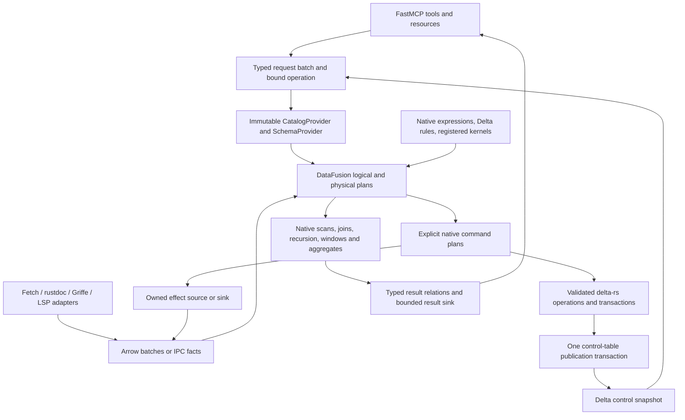

# Design review: a unified DataFusion and Delta execution architecture

## 1. Decision and scope

**Decision: revise the architecture; select DataFusion 55.1 as the service execution substrate and Rust delta-rs as its transactional table implementation.** The current architecture is a useful retrieval implementation, but is not the destination requested in this review. Producer normalization, acquisition decisions, durable jobs, publication, and delivery must become native plans over typed relations. Merely putting the existing procedures behind providers or large UDFs would not achieve the requested pivot.

**Status:** target architecture **Proposed**; native interfaces **Interface-checked**; the focused executable evidence is recorded in §9. No service implementation or deployment is performed by this review.

**Follow-up:** [Delta integration refinements](design_review_delta-integration-followup_2026-09-15.md) make the complete native builder route, bounded CDF relations, codec restrictions, discovery/publication distinction, paired kernel patches and retention/telemetry policy more concrete. Apply those refinements together with this target; they preserve its full DataFusion direction.

**Reviewer:** Codex. **Date:** 2026-09-15. **Baseline:** working tree at HEAD `a78c74191d69ad82de7348c6503b58443f7f9c13`, including the existing Plan 14 changes. The tree was already dirty when this review began. Those changes are the reviewed baseline, not changes made by this review.

During the review those baseline changes were committed as `9c154de8b2ead1d082fd253399bb1694627395c1`. The service-source digest remained `5b2640ca15e4e1e6bb3355eda84edb89d4bcdab3e390897513648c0581d4026a`; this review adds documentation and isolated probe evidence only.

### Controlling objectives

1. Maximize the unification of data operations, transformations, policy evaluation, and execution through DataFusion's native contracts and capabilities.
2. Preserve useful code insights over MCP: exact resolution, discoverable capabilities, contextual evidence, inspection, comparison, source retrieval, qualified verification, jobs, bounded delivery, and truthful limitations.

Implementation cost, legacy compatibility, prior scope exclusions, and existing architectural boundaries do **not** outweigh those objectives. Existing policies are change candidates. Correct identity, actual effect ownership, coherent results, and evidence fidelity remain necessary because losing them damages the second objective. No score or percentage is assigned.

**Observable destination:** a new library operation is composed from provider-backed input relations, native expressions and operators, and an explicit output or command contract. The daemon schedules execution of that plan and transports its result. It does not independently select, normalize, score, merge, validate, or publish the same meaning in procedural handlers.

### Method and coverage

This is a deep cross-cutting review of the semantic paths, not an assertion that every line was audited. It used the design-review and DataFusion skills, the charter and its addendum, the frozen blueprint/handoff, the current design/Plan 14, and the supplied [provider-contract map](../capability-maps/datafusion_provider_contracts.md). The map's namespace, logical, physical, datasource, mutation, transport, standardization, and verification surfaces informed §4. A delta-rs reference pinned to `43a0cf10` (2026-08-23) supplied leads, especially its provider, write, transaction, schema, and session sections. Its older sample patch pins are not substituted for this project's pins. That document has since been removed and superseded by the generated [`deltalake` skill](../../../.claude/skills/deltalake/SKILL.md), pinned to `58f07cd6`; note that several APIs it described — `DeltaOps` above all — no longer exist, so leads taken from it must be re-checked against the skill's index rather than trusted.

Inspected executable paths include Rust and Python normalization, registry selection and requirements, ingestion, schemas/admission, immutable catalog binding, native policy/runtime, scoring and identity, catalog commits/rebase, leases, job persistence/recovery, producer admission/execution, inspection/verification dispatch, and result encoding. §4.2 maps the operation families and §7 supplies concrete source locations. The DataFusion skill's project-gap scan was also run; its diagnostics are leads, not findings. For example, the lease wrapper has input-statistics forwarding despite the scan's warning about absent `partition_statistics`.

Context7 resolved `/apache/datafusion` and `/delta-io/delta-rs` and supplied discovery documentation. Neither result provided a matching exact-release documentation ID. Some snippets were old or inconsistent with the pinned APIs. Consequential claims were checked against locally available DataFusion **55.1.0** source and delta-rs commit **`58f07cd62bfbce3649a7e1c87c696288068ae184`**. Cargo metadata resolves that Delta revision, whose package version is `1.0.0`, with one DataFusion 55.1.0 / Arrow and Parquet 59.3.0 / object_store 0.13.2 universe. Upstream `main` HEAD was checked directly on 2026-09-15 and resolves to this September 15 commit. Its Cargo manifest selects the Buoyant kernel fork: both `buoyant_kernel` and `buoyant_kernel_engine` resolve to git commit **`8ba063f8f84fec222000f66d40d70911d7c79675`**, verified as the current `buoyant/main` HEAD, with package version 0.25.1. Both git revisions are captured in the probe lockfile. This is current-commit evidence, not a claim that these are published releases. The initial August 23 probe used the older document revision; its evidence is retained separately, and all final Tested claims in §9 use this current pair.

No library-enrichment MCP connector was exposed in the review tool inventory. The review therefore used the requested capability maps, skills, Context7, exact source and a scratch native probe. Earlier Plan 14 client qualification is historical baseline evidence; it does not certify this target. The full acceptance suite, external producers, installed MCP clients, power-loss durability, production-scale recursion, and full Delta schema round trips were **not** requalified. The review does not claim their success.

## 2. Authority and lifecycle map

### 2.1 Target authorities

| Concept | Semantic type and identity | Authority / owner | Revision boundary | Permitted update | Derived representations |
|---|---|---|---|---|---|
| Relation and operation definitions | Named, versioned Arrow fields, logical meaning, keys, rules, effects and output contracts | Rust definitions expressed using native Arrow/DataFusion types | Contract revision + implementation identity | Explicit replacement of the definition revision | Provider metadata, generated wire types, validation plans, operation catalog |
| Raw acquisition | Artifact digest, fetch observation, source locator, bounded bytes | Captured source bytes plus independent acquisition facts | Artifact and producer attempt | New capture; no silent replacement | Native JSON/Arrow providers, source-file and source-span relations |
| Extracted observations | Typed rustdoc/Griffe/LSP/verification facts, producer-local identity and source origin | Producer output before normalization | Input digests + actual producer/environment identity | New attempt | Native normalization plans; retained independent observations |
| Normalized evidence | Public binding, definition, relationships, fragments, coverage, environment and evidence class | Validated Delta relation revisions | Publication ID + exact Delta table versions | DataFusion-derived Delta writes | Native domain views, search, comparison and MCP results |
| Effective policy | Typed policy rows + native expressions; engine options as native config | One bound policy revision; Delta table properties for persisted row invariants | Policy revision captured with the operation | Authorized policy command creates a revision | ConfigExtension, table options, eligibility and diagnostic relations |
| Job, claim, interest, cleanup obligation | Typed control records, command ID, predecessor and fencing sequence | **One Delta control table** | One Delta commit for related control changes | Conditional native command; Delta OCC and application transaction IDs | `jobs.current`, runnable work, interests, status, recovery and cleanup views |
| Publication | A validated vector of table identities, versions, scopes, schema revisions and artifact references | Control-table publication records | One control commit also changes head and terminal result reference | Commit after referenced data/result materialization succeeds | Bound catalog/schema/provider objects; no mutable-current lookup during a query |
| Presentation | Typed result sections, rows, diagnostics, evidence references, ordering and coverage | Native result plans and retained result relations | Request + publication + policy + rendering-contract revision | New result; bounded pages are derived | MCP JSON/content and resources; Arrow IPC/export artifacts |

**This is not one universal evidence table.** Use purpose-specific Delta tables for observation and evidence families. The control table is a finite tagged union of typed records that need one transaction: job events/claims, interests, context heads, publication descriptors, and retention obligations. It has explicit struct fields and tag/nullability checks, not arbitrary JSON or an EAV payload. Provider views expose each family as a normal typed relation. This physical colocation is justified by atomic control updates, not by a preference for universal storage.

### 2.2 What Delta replaces

Replace the application-owned Parquet catalog log, generation manifests, current-pointer machinery, per-job JSON journal, hand-written compaction, and ordinary table write buffering with Delta snapshot loading, transaction-log publication, DataFusion-backed operations, checkpoints, and maintenance. The reviewed replacements are `catalog_generation.rs:885`, `jobs.rs:660`, and `dataset.rs:134`.

Keep artifact **bytes** content-addressed where their exact bytes are evidence. Put their inventory, lineage, retention and acquisition facts in Delta. A rustdoc JSON archive, source archive, process log or signature source is not made more faithful by destroying it and retaining only a normalized table. Its decoding and downstream processing do enter the DataFusion path.

### 2.3 Identity and deliberately opaque mechanisms

Separate semantic content identity from physical Delta version and file layout. Compaction changes files and may advance Delta versions without changing the evidence meaning. Publication, context, release, environment, observation, definition and public-binding identities remain distinct. Canonicalization must declare field order, null/absent treatment, list/set behavior, numeric representation and domain separation. Native `sha256` can hash defined bytes; it does not define those bytes.

The irreducible boundary is **mechanism**, not a second domain engine: fetch protocol I/O, archive decoding, rustdoc/Griffe parsing, compiler/LSP/subprocess interaction, cryptographic canonical-byte encoding, and storage/process ownership. Express these as registered source, sink, function or physical-plan extensions with typed inputs/outputs and explicit effects. Never hide alias resolution, policy selection, record merging or ranking inside those kernels just because the old function already exists.

## 3. Semantic contracts and invariants

| Contract | Representation | Enforcement boundary | Failure behavior | Evidence / required oracle |
|---|---|---|---|---|
| One coherent read | Publication descriptor holds exact table ID/URI, Delta version, cohort predicate, schema and policy revision | Catalog construction loads those versions, then binds immutable provider maps | Missing version/artifact is unavailable evidence, never a substitution of latest | Existing immutable binding is useful; Delta pinned-provider probe and multi-table publication oracle in §9 |
| Valid persisted rows | Delta schema, NOT NULL / CHECK predicates, generated columns where appropriate | Validated Delta write/update/merge execution path | Reject before commit; retain structured violation | Direct provider INSERT must be qualified separately from WriteBuilder |
| Keys and references | Composite semantic keys, uniqueness aggregate, anti-join and cross-relation validation plans | Candidate admission **before** publishing trusted provider constraints | Candidate not published; emit bounded diagnostic rows | DataFusion `Constraints` alone does not enforce uniqueness; neither CHECK nor MERGE establishes a PK automatically |
| Exactly one current claim | `job_key`, predecessor sequence, claim token, owner, state and attempt | Eligibility query and commit use the same Delta snapshot; transaction action keyed by logical job | Conflicting claimant reloads and recomputes eligibility | Two independent stale writers, fresh retry, predecessor mismatch and restart oracle |
| Coherent terminal result | Publication vector + terminal job event + selected context head | One transaction in the control table after all result dependencies exist | Either old control state or complete new state | Interrupt after each data commit and before/after control commit |
| Effects are owned | Effect contract, operation/attempt identity, cancellation, input revisions and cleanup obligation | Native command execution boundary; resource guard retained until actual cleanup | Distinguish cancelled request, running external effect, failed cleanup and committed result | Stream-drop and external-process fault injection |
| Correct capabilities | Behavior of provider/factory/function implementation plus effective policy and conformance evidence | Plan binding and command admission | Unsupported, denied, invalid and unknown remain distinct | SQL, DataFrame, direct provider and codec paths tested separately |
| Bounded delivery | Ordered result relations, encoded-byte accounting and retained continuation reference | Native result sink and final mechanical MCP adapter | Explicit budget outcome with retained complete result where available | Escaping, large strings, nested values, continuation identity and replay |
| Reuse is valid | Full dependency witness: inputs, contracts, functions, policy, environment, table versions and effect class | Plan/result/producer reuse boundary | Cache miss or explicit stale/unsupported result | Change one dependency at a time and compare answers |

**Absence and uncertainty:** retain the six epistemic classes and distinguish absent, unknown, ambiguous, failed, unsupported, invalid and partial. Store independent source/stub/runtime facts rather than taking an arbitrary first row. A missing catalog object is not a backend failure; a zero-row query is not complete knowledge. Delta's transaction version is not an evidence confidence level.

**Equivalence:** raw artifacts require byte equality; normalized meaning requires identity and field equivalence; result ranking requires declared tie-breaking; unordered sets must compare as sets. Arrow view/dictionary/list representation changes may preserve meaning but require explicit conversion contracts. Delta schema types do not represent every Arrow datatype or arbitrary field extension metadata automatically. Preserve semantic metadata in a versioned contract relation and reattach only after a verified mapping. Invalid values must not become NULL through permissive casting.

## 4. Derivation and execution design

### 4.1 Native execution spine

Use a real `SessionState` constructed from a shared `RuntimeEnv`, default native functions and optimizers, registered extensions, the effective policy and operation-specific catalogs. Avoid a custom `Session` implementation that accidentally inherits no-op optimization or unsupported planner defaults. Delta builders receive this concrete state and `SessionFallbackPolicy::RequireSessionState` where supported. The session captured by an operation is reused rather than cloned inside row loops.

**Planner composition is required.** A normal DataFusion SessionState alone cannot plan Delta's `MetricObserver` node: the probe encountered that failure before installing Delta's planner. Compose `DeltaExtensionPlanner` with the service's effect/command extension planners in the native physical planner, then retain the existing lifetime wrapper around that planner. `DeltaPlanner` is a ready-made option when Delta is the only added extension family; installing it by replacement must not discard the service's retention behavior. DeltaSessionContext also changes identifier normalization and disables some join dynamic-filter settings; select these deliberately in the single effective configuration rather than inheriting a second set of defaults. See [Delta planner](https://github.com/delta-io/delta-rs/blob/58f07cd62bfbce3649a7e1c87c696288068ae184/crates/core/src/delta_datafusion/planner.rs#L73) and `store/runtime.rs:506` / `store/leases.rs:111`.

Keep definitions in native `Schema`, `Field`, `Expr`, `LogicalPlan`, `TableReference`, options and extension types. A small typed operation descriptor links those objects and their effects. Do not add a second generic rule language, query IR, or workflow interpreter. Native operators own relational execution; Delta owns transaction-log conflict checking and publication of a table version; the command extension only binds the operation's declared semantic preconditions to those mechanisms.

### 4.2 Whole-service operation mapping

The mappings below are target replacements. Existing domain algorithms are not declared incorrect merely because they are currently ordinary Rust.

| Operation family and current evidence | Structure needed before execution | Native replacement and residual kernel |
|---|---|---|
| Registry parsing/selection: `core/registry/mod.rs:176,343,375` | Releases, versions, dependencies, features and fetch observations; parsed version components and precedence key | Native JSON scan where source format fits; filter, join, sort, window and top-k. SemVer/PEP 440 parsing/comparison is a small typed UDF kernel, not lexical version sorting |
| Python requirements: `core/producer/python/requirements.rs:32,102` | Requirement records, extras, marker AST and typed environment fields | Native marker expressions and eligibility joins; retain standards-conformant version parser kernel. Dependency solving supplied by Cargo/uv remains an observed effect, not a guessed SQL resolver |
| Rust normalization: `core/producer/normalize.rs:121,178,211,345` | Items, module membership, reexports, implementation edges, type/signature facts, paths and spans | Joins, unions, recursive CTEs, path/cycle guards, grouping, explicit ambiguity. Decoder exposes lossless language facts; `public-api` rendering may remain a versioned pure parser/render kernel |
| Python normalization: `core/producer/python/normalize.rs:23,83,128` | Independent declarations, alias edges, base-class edges, overloads, publicness signals and origins | Recursive alias closure; group/count-distinct; typed conflict rows; native nested projection and UNNEST. Remove repeated maps/walks and first-value semantic decisions from the normalizer |
| Worker interchange: `python/enrichment_worker/__main__.py:75,129,182` | Explicit Arrow schemas for facts and processing/gap rows | Stream Arrow IPC from the separate worker; Rust owns semantic transforms. Python may use PyArrow solely to encode the generated contract. Griffe tree visitation remains extraction mechanics |
| Ingestion: `store/ingest.rs:100,140,158,164` | Producer facts already in Arrow relations | One native normalization DAG through admission and Delta write. Remove object→staging Parquet→DataFusion→decoded objects→writer cycles |
| Validation/admission: `store/native_catalog.rs:22,49,196`; `repository.rs:677` | Schema rules, keys, reference rules, scope and diagnostics | Delta row constraints plus native aggregate/anti-join validation. Generated diagnostics include rule ID, subject, observed value, allowed value and source. Trusted metadata is emitted only after validation |
| Search: `store/scoring.rs:100`; `core/search/mod.rs:111,196` | Query-token relation, normalized text fields, factor definitions with priority and weight | `lower`, `starts_with`, `ends_with`, `strpos`, CASE, joins to tokens, `bool_or`, aggregates and windows; factor explanations derived from the same expressions as score. Replace the current whole-score UDF where built-ins express it |
| Inspection: `daemon/ops/inspect.rs:127,146` | Request selection relation, matching bindings/definitions, aspect requirements | Native exact/fallback candidate plans, ambiguity aggregation, aspect coverage joins, stable pagination. Domain selection leaves the handler |
| Comparison/environment contribution: `repository.rs:595,645` | Before/after tables, changed-field structs, contributions and dependency scopes | Full/anti joins, native union and typed conflict plans; Delta write/merge selected by semantics. Do not reduce field-level changes to a string comparison or silently overwrite contradictory observations |
| Job submission/readiness/selection: `daemon/jobs.rs:80,110,162`; `ops/verify.rs:53,90` | Command, interests, prerequisites, qualification and current claim state | Native eligibility joins and window-derived current state; transactional command provider replaces the JSON journal and handler-specific state machine |
| Fetch/build/LSP/verify: `daemon/execution/mod.rs:218`; `ops/verify.rs:104` | Effect-input batch with exact environment, source digest, producer, limits and owner | Registered finite effect operator/source/sink. Native plans select work and shape outputs. The OS/network/compiler adapter performs only the external mechanism and reports observations |
| Publication/rebase: `repository.rs:487,593`; `catalog_generation.rs:885` | Validated cohort descriptor and expected control predecessors | Delta data commits followed by one conditional control-table transaction. Rebase is a native recomputation over pinned winners, not object-list merging |
| Identity: `store/semantic.rs:49,70,105` | Canonically ordered typed values and semantic contract | Native projection/distinct/sort plus narrowly scoped canonical-byte UDF and digest aggregate. Avoid reconstructing every domain object inside a UDF. Ordinary SHA aggregation must not assume associative ordered hashing |
| Results and delivery: `daemon/delivery.rs:109`; `store/result.rs:100` | Typed result sections, coverage, factor rows, artifact links, display order and continuations | Native result plans and Arrow/Delta/JSON sinks; one explicit JSON/MCP encoding boundary with exact escaped-byte accounting. Remove repeated handler mutations of result DTOs |
| MCP adaptation: `python/enrichment_mcp/server.py:121,161,332` | Generated operation schemas, structured result and optional text/resource content | Retain strict input/output conformance and FastMCP ToolResult transport; generate operation binding/annotations from native definitions where mechanical. Final MCP-frame encoding remains a protocol concern, not a second evidence query engine |
| Cache, retention and maintenance: `store/leases.rs:111`; `catalog_generation.rs:997` | Revision dependencies, referenced Delta versions, readers, cleanup and materialization state | Native cache-selection/retention queries; Delta checkpoint/OPTIMIZE/CDF/vacuum operations under the same command contracts. Leases still protect the actual lifetime, including optimized-away scans |

Paths abbreviated `core/`, `store/` and `daemon/` refer to `crates/enrichment-{core,store,daemon}/src/`.

### 4.3 Provider-contract deployment map

This covers the map's contract families, including interfaces that should be inherited or delegated rather than reimplemented. Maximum leverage means the native implementation supplies the behavior wherever it can.

| Native level / contracts | Target use | Rules and built-in leverage | Important boundary |
|---|---|---|---|
| `CatalogProviderList` | Private assembly of each operation's root inventory | Native conforming registration; explicit fully qualified references | Registration has no error channel. Do not simulate read-only refusal by returning None without inserting; keep mutable root assembly private |
| `CatalogProvider` | Stable logical domains: inputs, evidence, control, results, metadata | Cheap synchronous schema lookup over a captured version vector | No backend refresh or I/O during synchronous lookup |
| `SchemaProvider` | Stable table inventory and cheap table summaries | `table_type`, `owner_name`, schema metadata and information_schema | Default `table_type` can build the full provider. Inventory and lookup must agree |
| Async catalog/list/schema providers | Optional batch preparation when metadata actually becomes remote | Resolve references before installing synchronous maps; reuse captured snapshots | Native async resolution is not cross-table MVCC; do not use its partial namespace as the full service inventory |
| `Session`, `ContextProvider` | One configured native planning environment | Default functions/planners, native type coercion, `SQLOptions`, configuration and extension registries | `SQLOptions::verify_plan` must cover DataFrame/programmatic routes too; DML-capable providers enforce their own command boundary |
| `TableSource`, `DefaultTableSource` | Logical face of the same provider | `provider_as_source` forwards schema, constraints, defaults and pushdown | Avoid an independent source with inconsistent promises; custom `plan_table_scan` only for a demonstrated need |
| `TableProvider`, `ScanArgs`, `ScanResult` | Delta snapshot, Arrow input, result and command relations | Projection, predicate classification, limits, native DML construction, metadata and statistics | Registration is not permission or mutation support. Candidate keys remain untrusted; default expressions are route-specific |
| `TableProviderFactory`, `FileFormatFactory` | Construction from typed relation/storage declarations | Delta builder for Delta; native Arrow/Parquet/JSON format factories for matching input artifacts | Factory selection is not per-row execution. Do not expose arbitrary source URLs through table names |
| `TableFunctionImpl` | Parameterized read-only source construction for literal captured handles | Native argument simplification/coercion, then provider construction | UDTF call is synchronous planning; it is not an async per-row correlated effect API |
| `UrlTableFactory`, `ListingSchemaProvider` | Only controlled artifact inventories where listing is the declared source | Native format inference/listing when consistent with captured inputs | Automatic URL discovery and mutable directory discovery do not define admitted evidence snapshots |
| `MemTable`, `ViewTable` | Bounded request/fact batches and analyzed views | Native in-memory scans and transparent logical view plans | MemTable is not durable or a PK enforcer. `ViewTable::new` is not a validation certificate |
| `PartitionStream`, `StreamingTable`, `StreamProvider` | Finite worker/metadata streams | Native stream/table machinery where its boundedness/filter semantics fit | `StreamTable` is an unbounded file abstraction, not a durable command engine; effect sources need ownership beyond plain stream drop |
| `ExecutionPlan` | Native operators by default; effect/command extensions only where required | PlanProperties, expression traversal, child replacement, projection/filter/sort/repartition pushdown, statistics, cancellation and metrics | Extensions must declare eagerness, boundedness, cardinality and ordering truthfully and preserve native optimization contracts |
| `DataSource`, `FileScanConfig` | Delegate native scanning and physical layout | Native batching, file groups, repartitioning, statistics, ordering and cooperative scheduling | A declared partitioning or ordering is a semantic promise, not a performance hint |
| `FileSource`, `FileFormat` | Native Parquet/Arrow/JSON plus a decoder only for an unmatched external format | Native pruning, predicate evaluation, schema inference and writers | Do not replace Delta's file membership/column mapping/deletion-vector handling with a bare Parquet listing |
| `FileOpener`, `Decoder`, `BatchDeserializer` | Incremental source-format boundaries | Existing decoders first; bounded new decoder for rustdoc-shaped facts only if needed | Parser-specific facts must not be lost by schema inference; skip-on-error must yield explicit coverage gaps |
| `Morselizer`, `MorselPlanner`, `Morsel` | Inherit native Parquet scheduling; consider only for new partitionable source work | Native I/O/CPU scheduling and cooperative batches | Experimental API; no new application scheduler alongside it |
| `PhysicalExprAdapterFactory` / adapter | Validated Arrow/Delta read-schema mapping | Native projection/cast adaptation; Delta-aware mapping for nested schema and column mapping | Deprecated SchemaAdapter family is not an implementation option; permissive NULL fill is not semantic admission |
| `PruningStatistics`, `PruningPredicate`, `ParquetFileReaderFactory` | Native Delta file skipping + Parquet row-group/page/Bloom/dynamic filtering | Real physical statistics, exact/inexact semantics, file selection and existing readers | Custom access plans require actual index evidence; don't create a second file-membership authority |
| `StatisticsProvider` / registry | Optional workload-specific native statistics provider | Use actual physical-statistics consumer; preserve row/column precision | `StatisticsRequest` is an extension channel, not an automatic aggregate-answer shortcut |
| `ObjectStoreRegistry`, `MemoryPool`, TaskContext | Shared stores, pools, caches and owned operation resources | Native storage lookup, MemoryReservation, spill, metadata caches and metrics | Separate I/O/process allocations still need declared accounting. A config entry alone enforces nothing |
| `DataSink`, `DataSinkExec`, `FileSink`, `BatchSerializer` | Native output and command write boundaries | Delta validated operations; native Parquet/Arrow/JSON output formats | Sink completion must include its promised commit. One execution does not establish retry idempotency |
| Logical/physical extension codecs, DataFusion FFI | Versioned replay or in-process plugin transfer when used | Native codecs with registered extension identity; Arrow IPC for the worker process | FFI uses same-address-space pointers, not process transport. Provider FFI lacks several DML/metadata hooks; proto TableScan drops fields unless explicitly encoded |

### 4.4 Delta registration and write integration

**Select the snapshot-native provider.** At the checked revision, `DeltaTable::table_provider()` returns a `TableProviderBuilder`, seeded from the loaded snapshot and log store. Awaiting it yields `Arc<dyn TableProvider>`. Register that provider in the operation's immutable schema inventory, rather than treating `Arc<DeltaTable>` or a URI-backed ListingTable as interchangeable.

The construction sequence is:

1. Read one control-table snapshot and choose a published version vector.
2. Load each selected Delta table at its recorded version and verify table identity/protocol/schema compatibility.
3. Prepare the shared real SessionState/object-store registration; check that an existing mapping denotes the intended store. `update_datafusion_session` does not overwrite a conflicting mapping.
4. Build with `table.table_provider().with_session(Arc::clone(&state)).await?` from that loaded snapshot.
5. Bind the provider, or an analyzed view applying the publication cohort predicate, into the captured `SchemaProvider`. Publish the fully constructed catalog into the private operation session.
6. Rebuild a new inventory for a newer publication. Do not deregister/reregister tables inside a session already serving a read.

Exact source: [builder and session registration](https://github.com/delta-io/delta-rs/blob/58f07cd62bfbce3649a7e1c87c696288068ae184/crates/core/src/delta_datafusion/table_provider.rs#L471), [provider implementation](https://github.com/delta-io/delta-rs/blob/58f07cd62bfbce3649a7e1c87c696288068ae184/crates/core/src/delta_datafusion/table_provider/next/mod.rs#L711).

**Do not equate the registered provider's DML route with the full Delta operation surface.** This revision implements `scan` and `insert_into`, mapping Append/Overwrite to DeltaDataSink and rejecting Replace. It inherits unsupported update/delete/truncate/merge trait methods. Delta's separate operation builders implement richer native-expression behavior. Moreover, the reviewed DeltaDataSink takes `_context`, writes streams and commits with default CommitBuilder settings; it does not traverse the higher-level `write_execution_plan_v2` validation path or accept the application's commit properties. Therefore a plain SQL INSERT is not yet the selected command route for policy-governed writes.

**Target correction:** a thin native mutation adapter supplies TableProvider DML methods and a command ExecutionPlan whose execution invokes the applicable Delta operation builder with the captured logical input, concrete SessionState, strict session fallback policy, writer settings, rule contract, read snapshot and commit properties. The adapter must not execute effects during planning, collect whole inputs into Rust rows, or duplicate Delta's writer/transaction engine. Feed `WriteBuilder::with_input_plan` directly where available. For physical input, the current revision already supplies `DeltaDataWriterExt::write_plan(session, plan)`; use it instead of creating a custom stream-drain bridge. It expects validation/repartition/CDC nodes to be present and returns **uncommitted Add actions**. Its presence does not add table validation or commit policy automatically. Delta's table-derived `validation_predicates` helper remains crate-private: expose/compose that existing preparation path upstream, or retain the logical-input WriteBuilder route until a complete physical DML route is qualified. Do not clone Delta's constraint-feature interpreter or advertise unsupported DML just to fill a trait. The remaining adapter work is authoritative preparation, operation/transaction composition and lifetime ownership, not a new writer.

The current [physical-plan writer extension](https://github.com/delta-io/delta-rs/blob/58f07cd62bfbce3649a7e1c87c696288068ae184/crates/core/src/datafile/datafusion_ext.rs#L62) is an important additional integration point absent from the August reference.

Delta's own [validated write execution](https://github.com/delta-io/delta-rs/blob/58f07cd62bfbce3649a7e1c87c696288068ae184/crates/core/src/operations/write/execution.rs#L388) constructs native validation predicates and DataValidationExec. Reuse that mechanism for row constraints and generated columns. Cross-table integrity and uniqueness still use explicit native validation plans and the publication protocol. The direct [DeltaDataSink](https://github.com/delta-io/delta-rs/blob/58f07cd62bfbce3649a7e1c87c696288068ae184/crates/core/src/delta_datafusion/table_provider/data_sink.rs#L103) needs correction or bypass through the qualified adapter for these writes.

### 4.5 Durable claims and publication using Delta

**Claim protocol.** Store claim events and related control changes in the control table. Bind current-state and eligibility plans to Delta version V. Compute the next allowed event from that state and submit it with an application transaction action for the logical job key and its next sequence. The write must use the same read snapshot V. Delta's conflict checker detects overlapping application IDs in intervening commits. On conflict, reload and recompute eligibility; do not retry the same business decision against an advanced snapshot.

`CommitProperties::with_application_transaction(Transaction::new(app_id, sequence))` records a transaction identifier; it is **not sufficient on its own** as a fresh-retry deduplication API. Read `transaction_version` and reconcile the retained command/result before trying again. An operation ID in commit metadata is provenance, not mutual exclusion. These mechanisms are visible in [CommitProperties](https://github.com/delta-io/delta-rs/blob/58f07cd62bfbce3649a7e1c87c696288068ae184/crates/core/src/kernel/transaction/mod.rs#L567) and the [application-ID conflict check](https://github.com/delta-io/delta-rs/blob/58f07cd62bfbce3649a7e1c87c696288068ae184/crates/core/src/kernel/transaction/conflict_checker.rs#L608).

**Publication protocol.** Write all candidate relation batches through validated Delta operations. Record the resulting table IDs, versions, publication predicates, schema revisions, content digests and result references. Run cross-relation admission against exactly those versions. Then, in **one control-table commit**, publish that descriptor, advance the expected context head, and store the job's terminal result reference. The last transaction is the visibility boundary.

This does not claim an atomic transaction across multiple independent Delta tables. Unpublished data versions may exist after an interruption; ordinary readers cannot discover them through the admitted catalog. A control commit makes one already complete version vector visible. Job state and publication are colocated in the control transaction so recovery does not require a separate JSON-journal reconciliation protocol. Failed publication leaves explicit candidate/orphan ownership for native maintenance queries.

**Serialize every contested control predecessor.** A publication transaction includes the logical job transaction key **and** the context-head transaction key for the head it advances. Distinct jobs publishing to the same context must conflict even though their job keys differ. Evaluate the expected head and current claim/fence against the same control snapshot used for the commit; a conflict requires recomputing both. Apply the same rule to cancellation, claim renewal, interest and retention transitions whose validity depends on shared state. Transaction IDs provide conflict witnesses; native precondition plans supply the actual allowed state transition. This complete protocol remains proposed and requires the concurrent-head and stale-owner oracles in §9.

**Claims do not make external effects exactly once.** A subprocess may have run before the daemon lost its receipt. Retain an attempt/fencing token and cleanup obligation; an expired lease alone cannot authorize duplicate execution while the old process may still exist. Reconcile actual ownership and recorded output before resubmission. A native command guard owns this contract, with Delta providing durable records and conflict control. Do not place subprocess launch inside a volatile scalar UDF.

**Local durability and retention.** Delta supplies the log protocol; the selected object store supplies atomic create and durability. The checked DefaultLogStore uses `PutMode::Create`; object_store's local implementation uses staged writes and hard links/renames. Process-crash atomicity is not proof of power-loss fsync behavior. Preserve the current durable-storage requirement through a conforming local ObjectStore/LogStore adapter if the selected backend does not supply it. Keep this at the storage boundary rather than retaining the old catalog transaction engine.

Pinned queries, retained MCP results and publications protect referenced Delta versions/files. Derive retention from those relations. Delta's `with_keep_versions` vacuum API exists at this revision but is explicitly experimental; qualify it, log-retention behavior, and reader races before enabling reclamation. CDF supports incremental derived indexes/status projections, but is not the authoritative job ledger or a replacement for retained source evidence.

### 4.6 Native functions, policy, and effect placement

**Built-ins first:** use projections/CASE/casts, joins/semi/anti joins, unions, DISTINCT, windows, aggregate FILTER, native strings/regex, arrays/maps/structs, UNNEST, higher-order `array_filter`/`array_transform`, and recursive CTEs where their semantics match. The purpose is to expose real structure to the planner. Pre-normalize repeated text and relational keys once per declared revision rather than per search row. Recursion must carry explicit cycle and depth/coverage state; termination in a three-node probe does not qualify a million-edge rustdoc traversal.

**Residual pure kernels:** SemVer and PEP 440 parsing/precedence, canonical value encoding, producer-format parsing, and any genuinely unmatched language operation. Use typed ScalarUDFImpl / AggregateUDFImpl / WindowUDFImpl only as appropriate to the computation. Specify coercion for Utf8/LargeUtf8/Utf8View, nullability/return-field metadata, stable function identity, volatility, and bounds. Implement simplification, interval/order/statistics hooks only when their promises are true. For an ordered digest aggregate, native ordering and explicit merge semantics are required; a hash over arbitrary partition order is not equivalent.

**Policy placement:** engine settings go in SessionConfig/RuntimeEnv/TableOptions; durable row constraints go in Delta table metadata and native expressions; relation/scope/eligibility rules go in native validation and selection plans; effect grants and predecessor witnesses go in the command contract. The common definition generates operational metadata. `owner_name`, `information_schema`, a read-only ConfigExtension, and MCP annotations are descriptive surfaces, not authorization engines.

**Effects:** use a registered physical-plan/source/sink boundary for fetch, producer and verification work. Native plans select, prepare, transform and validate their batches. Use native stream ownership and resource reservations where applicable, and a process-resource guard where not. No unrestricted callback field or arbitrary shell operation is added. Typed effects are the required use of DataFusion extension contracts, not an exemption from the pivot.

### 4.7 Capabilities added or strengthened since the August reference

The current-source comparison changes the proposed implementation surface. These entries are **Interface-checked**, except the registration, CHECK, planner and transaction mechanisms separately **Tested** in §9. Upstream regression tests were inspected as source, not reported as executed here.

| Current native capability | Concrete source at `58f07cd6` | Architectural use and remaining boundary |
|---|---|---|
| Physical-plan-to-Delta writer | `datafile/datafusion_ext.rs:62` defines DeltaDataWriterExt; `:74` executes partition streams through the provided session | Reuse for physical DML inputs; no custom stream collector/writer. Plan preparation and committing returned Add actions remain explicit |
| Shared file/dataset read and write traits | `datafile/mod.rs:47,66,100,110` separates file I/O from dataset semantics | Reuse native writers and Delta-aware readers. Raw file readers cannot substitute for snapshot membership, column mapping or deletion-vector semantics |
| Native nested-value validation | `delta_datafusion/data_validation.rs:269,377,420` derives collection checks with `map_values`, `array_length`, `array_compact` and null-safe comparison | Use Delta's checks for non-null list elements/map values instead of hand loops. FixedSizeList and paths crossing collection elements are explicitly excluded; map these to supported structures or supply a declared native validator |
| Writer failure/cancellation and buffering | `operations/write/execution.rs:530` uses a cancellation guard and shared writer drain; `datafile/writer.rs:413,514` supplies abort/error cleanup | Reuse these mechanisms; the service still binds budgets and owns completion through unknown commit outcomes. Do not reimplement a competing upload/worker lifecycle |
| Deletion-vector-aware statistics and rewrites | `delta_datafusion/table_provider/next/scan/exec.rs:485` validates child replacement; `table_provider/next/mod.rs:2590` records the COUNT/deletion-vector regression | Retain Delta's native scan rather than wrapping raw Parquet; qualify projection/filter/COUNT and rewritten plans on the service's layouts |
| Snapshot-native maintenance | `operations/vacuum.rs:72,95,292,309` uses active-add snapshots, retained versions and bounded listing concurrency | Derive the protected version set from control relations and pass it to native maintenance; retain the explicit experimental status of keep_versions and qualify reader/log retention |

The direct provider sink still bypasses table-derived CHECK validation at this current revision, and recording a repeated application transaction still does not deduplicate a fresh-snapshot retry. Those two findings survived the new probe; other improvements above are credited rather than reimplemented locally. Kernel selection follows the actual Delta manifest, including its Buoyant fork, rather than substituting an unrelated kernel HEAD solely because it is newer.

## 5. Representative journeys

### Ordinary extension: add an API-surface visibility signal

Add the typed observation field and its provenance to the extraction contract. Generate its Arrow/IPC and wire projections. The producer adapter extracts the fact without choosing its publicness meaning. A native expression updates the declared visibility rule; the same expression feeds admission, search eligibility, inspection and diagnostics. Recompute affected derived relations under a new rule revision and publish their Delta versions. The extension should not require separate Python filtering, Rust Walker decisions, search scoring branches, and MCP aspect logic that all interpret the signal independently.

### Meaningful change: change verification eligibility

A new policy revision alters the allowed producer/profile/capability relation. Readiness, runnable work, refusal diagnostics and status derive from the same native plan. New commands bind that revision. A running job retains its granted policy/claim revision; an explicit revocation command has separately defined semantics. The environment and policy witnesses enter reuse identity. A cached result from the older policy can remain valid evidence of an old attempt, but does not establish eligibility for a new execution.

### Boundary: Griffe observations to a Delta-backed inspection

The separate worker emits independent `.py` and `.pyi` observations in Arrow IPC plus typed processed-file/gap rows. Rust verifies schema/version, bounds and provenance before binding the batches. Native plans resolve aliases, preserve conflicting signatures and derive coverage. Validated Delta writes persist the cohort; one control transaction publishes its exact versions. Inspection queries the immutable provider view. Native result plans retain origin, evidence class and conflict status through the final JSON encoder. No Arrow/Delta conversion may silently erase a source distinction, field tag or unresolved target.

### Interruption: two claimants and a lost publication acknowledgement

Two workers read control version V and both derive an eligible claim for job J. Their commits carry the same logical application-transaction key; only one may advance it. The loser reloads and returns/rejoins the existing job. The winner performs the external operation under a retained ownership token, writes evidence/results, and commits head + publication descriptor + terminal event together. If the acknowledgement is lost, replay finds the command ID and committed result at the new control version. It does not blindly append again or rerun the process. If the control transaction never committed, evidence remains unselected and the job's effect/cleanup observations determine recovery.

### Adversarial journeys the implementation must preserve

- A cyclic reexport graph reaches the declared depth/resource bound: emit partial coverage and retain unresolved edges; do not silently return a complete public API.
- A `.pyi` alias and `.py` declaration disagree: keep both observations and explain ambiguity; `first_value` is not a conflict policy.
- A candidate contains duplicate semantic keys: no trusted PK/FD metadata is exposed to optimization until validation rejects or resolves it by the declared rule.
- An old snapshot is being read while OPTIMIZE/vacuum runs: leases and retention obligations protect all required files and logs, including when COUNT optimization removed the physical scan.
- An input value cannot be represented in the chosen Delta schema: reject the conversion or preserve it using a declared typed encoding; never treat a successful cast as proof of equivalence.
- A provider returns zero rows because access failed: surface a structured error; absence is reserved for actual absent data.

## 6. Acceptance gates

These are **design readiness gates for the full requested pivot**, not a regrade of Plan 14's historical acceptance campaign. The candidate being challenged is the current code plus straightforward Delta provider adoption. Corrections described here remain proposed until their oracles run. A failed candidate route is identified precisely; it is not a claim that the currently installed service already uses that route.

| Gate | Verdict | Evidence or scope rationale | Required action |
|---|---|---|---|
| G1 — Authority | **Unresolved** | Current provider contracts cover evidence/catalog data, while job state, effect sequencing and delivery retain separate procedural authorities. The target authority map is explicit but not implemented | One native relation/operation/policy definition path; Delta control commit replaces journal/catalog dual mechanisms; amend obstructing policies |
| G2 — Semantic fidelity | **Unresolved** | Source/stub distinctions and canonical identity are load-bearing. Full producer→Arrow→Delta→provider→MCP preservation has not been demonstrated | Qualify nested/tagged schemas, Arrow metadata/view types, identities and language closure on representative fixtures |
| G3 — Validity | **Fail for unmodified direct Delta provider writes** | The final native probe inserted `-1` through SQL despite CHECK `id >= 0`; the correctly configured WriteBuilder rejected it with a validation diagnostic. Native PK metadata also does not enforce keys | Select/implement the qualified mutation adapter and exercise every supported write entry path; corrected target remains unqualified |
| G4 — Hidden behavior | **Unresolved** | Existing jobs deliberately own producer effects; moving execution under DataFusion requires an explicit effect boundary. Volatile functions are not a durable invocation protocol | Planning must be effect-free; native command nodes own lifecycle, cancellation, fencing and cleanup; validate EXPLAIN, repeated execution and stream drop |
| G5 — Consistency and recovery | **Unresolved** | Delta supplies table transactions and pinned providers. Multi-relation publication and external-effect recovery require the control-table protocol, which has not been executed end to end | Atomic publication-vector/head/terminal commit, claim races, unknown commit outcome, process restart, local durability and retention tests |
| G6 — Transformation and reuse | **Unresolved** | Native built-ins can express substantial current procedural work; only focused mechanisms have been probed, not complete normalization/ranking/reuse equivalence | Replace the loops with native plans and prove semantic equivalence and dependency invalidation; reject decorative UDF wrappers |
| G7 — Truthful capability claims | **Pass for this review's bounded claims** | Version-pinned source, dependency metadata and focused probes are distinguished from proposed service behavior; unsupported DML and untested client/recovery behavior remain explicit | Preserve route-specific capability evidence in implementation; never promote this review into product acceptance |

**Tally:** one pass, one failed candidate route, five unresolved. This is not a quality percentage. The full target is not accepted as implemented or behaviorally qualified.

## 7. Principle findings

### 7.1 Findings ordered by consequence

P0 denotes a semantic acceptance blocker for the proposed pivot. P1 denotes a structural change necessary to achieve it. These are review priorities, not the repository's machine acceptance states.

| Finding | Principle IDs | Concrete evidence or gap | Consequence | Proposed correction | Verification |
|---|---|---|---|---|---|
| **F01 · P0 · Direct Delta registration is insufficient as the write policy boundary** | DM-07, DM-43, DM-45 | Delta `table_provider/next/mod.rs:770` constructs DeltaDataSink; `data_sink.rs:103` ignores TaskContext and does not use `write/execution.rs:406` validation. Only insert is implemented on this provider | An insert accepted through SQL can bypass a CHECK applied by the write builder; richer command semantics/transaction IDs are not supplied by registration | Qualified native mutation adapter using Delta operation builders, existing physical-plan writer extension and actual validation/commit properties; contribute missing preparation/commit integration rather than a parallel writer | **Test / just gate:** same invalid rows through SQL, DataFrame, direct provider, write/update/merge; identical refusal and unchanged visible version. Focused probe in §9 |
| **F02 · P0 · Delta claim and publication semantics must be designed above individual table commits** | DM-14, DM-30, DM-35 | Current `jobs.rs:240,660`, `catalog_generation.rs:917,945`, `repository.rs:593` coordinate terminal/head/rebase. Delta conflict checker `:608` detects overlapping application IDs, but transaction recording alone does not define replay | Separate job/publication commits yield a terminal without usable evidence; blind fresh retry can duplicate a logical command; stale claimant can publish | One typed Delta control table; bound eligibility/read snapshot; transaction sequence and command reconciliation; one publication vector/head/terminal commit | **Test / just gate:** stale concurrent claimants, sequential retry, lost acknowledgement, crash at every commit boundary, stale-owner result rejected |
| **F03 · P0 · Arrow/Delta mappings and trusted metadata require explicit semantic validation** | DM-06–DM-09, DM-15, DM-24, DM-42 | `native_catalog.rs:29` builds trusted keys only in an admission design; `semantic.rs:60` decodes typed rows before hashing; Delta has a narrower persisted schema and its own schema adaptation | Collapsed tags, lost field metadata, permissive casts or false keys change query answers or identities while batches still look valid | Versioned Arrow/Delta mapping; separate semantic schema metadata; exact key/reference validators; no trusted constraints on unvalidated candidates | **Test:** full nested/tagged/view/dictionary/null round trips, malformed tag combinations, duplicate/FK witnesses, compaction identity invariance |
| **F04 · P0 · Function volatility and stream lifetime are not durable effect ownership** | DM-20, DM-28–DM-30, DM-35 | `execution/mod.rs:218` retains supervised creation; `ops/verify.rs:104` owns job execution; DataFusion scalar expressions may be eliminated or reevaluated | A scalar-wrapped fetch/build can run zero or multiple times; cancellation can leave a process while releasing its claim/permit | Native command/effect plan with explicit durable attempt, lazy execution, ownership guard and cleanup observations; retain OS mechanism only | **Test:** EXPLAIN/optimization invoke no effects; retry uses command identity; stream drop holds ownership until actual process cleanup; volatility probe in §9 |
| **F14 · P0 · Delta planning must be composed with existing lifetime and configuration behavior** | DM-19, DM-24, DM-35, DM-44 | The current-revision probe failed to lower Delta `MetricObserver` under a plain SessionState. Delta `planner.rs:73` adds its extension planner; current `runtime.rs:506` wraps the ordinary planner in `RetentionPlanner` | Table registration succeeds while writes fail later; replacing the planner can instead remove retention of optimized-away inputs or reset policy defaults | One planner composition with DeltaExtensionPlanner and service extensions, under retained ownership; one effective session/configuration authority | **Test:** same governed session scans, validates, writes and retains old inputs; optimized COUNT and cancellation retain leases; no fallback/default session |
| **F05 · P1 · Existing enforcement obstructs the requested architecture** | DM-16, DM-21, DM-37, DM-41, DM-56 | `scripts/architecture-check.py:28–46` bans DataFusion outside store and bans PyArrow throughout Python; Plan 14 `:69,333,551` constrains workflow/scoring/sink scope | Native normalization or Arrow worker interchange fails architecture checks even when it is the intended target | Amend the authority/crate rules and add positive native-boundary rules; replace prior exclusions as specified in §10 | **ast-grep + just gate:** allowed native planning modules and worker IPC; forbidden semantic filtering in transport adapter; no old journal/publication route |
| **F06 · P1 · Producer data reaches native plans too late** | DM-10, DM-17, DM-18, DM-22, DM-26, DM-37 | Rust `normalize.rs:178,211` repeats Walker traversal; Python `normalize.rs:23,83,128` builds alias/path maps per walk; `ingest.rs:140,158,164` decodes plan results into sink callbacks | A new alias/publicness rule still requires procedural changes before and after native joins; source structures are unavailable for reuse and explanation | Decode once into typed producer relations; native closure/normalization/admission DAG; stream directly into Delta | **Test / ast-grep:** native closure oracle for cycles/ambiguity, source-stub conflict fixtures; forbid production normalization via visit-symbol/relationship/fragment round trips after pivot |
| **F07 · P1 · Relation contracts do not yet govern the complete operation/policy surface** | DM-01, DM-16, DM-19, DM-27, DM-47, DM-52 | `native_catalog.rs:22` owns keys/references; `native_policy.rs:48` exposes query options; `jobs.rs:80` and `ops/verify.rs:35,53,62` separately select valid operation behavior | Adding a producer mode or policy changes branch sets and diagnostics in several owners instead of one native decision path | Extend native contracts to command/precondition/result/effect definitions; readiness/status/refusals become derived relations; native metadata reflects effective bindings | **Test / just gate:** change one policy row and observe consistent readiness, planning, execution admission and diagnostics; unsupported/denied/unknown remain distinct |
| **F08 · P1 · The score UDF wraps a mostly built-in-expressible algorithm** | DM-17, DM-21, DM-26, DM-56 | `scoring.rs:124,140,148` loops over rows and calls `core/search/mod.rs:111,196`; eligibility already uses native string expressions at `scoring.rs:179` | Matching/factor semantics remain opaque to optimization and are separately interpreted by scoring and eligibility | Native token/factor relations and CASE/string/aggregate/window plans; same factor rows produce score and explanation | **Differential test:** exact/suffix/prefix, token caps, null/empty/Unicode, reexports and deterministic ties; inspect plan for native operators and removal of the whole-score UDF |
| **F09 · P1 · Identity hashing still reconstructs domain objects inside native execution** | DM-15, DM-22, DM-26, DM-37 | `semantic.rs:60–75` converts batches to typed Rust rows and JSON values; `:113` folds sorted keys outside the plan | Schema additions require repeated conversions; replacing the code with a generic hash risks changing content identity or partition determinism | Explicit canonical typed encoding UDF and native ordered aggregate contract; separate physical Delta version from semantic digest | **Metamorphic test:** reorder batches/files, repartition, compact, reencode strings and repeat; semantic ID stable where declared, changed for meaningful differences |
| **F10 · P1 · Result composition remains a procedural data transformation** | DM-10, DM-17, DM-41, DM-47, DM-52 | `inspect.rs:146` sorts/deduplicates definitions after retrieval; `delivery.rs:129,151,154` mutates sections to fit; `result.rs:125` hand-maps result aliases | Adding an aspect or evidence class requires coordinated selection, presentation, continuation and recovery edits | Typed result/section declarations; native selection/aggregation/pagination; one bounded encoder/sink at the MCP boundary | **Contract + real MCP oracle:** aspect addition through declaration, exact evidence refs, byte cap with escaped Unicode, retained replay and cursor invalidation |
| **F11 · P1 · Custom durable Parquet/catalog machinery duplicates Delta-native operations** | DM-17, DM-23, DM-25, DM-56 | `dataset.rs:134,227` owns writer channel/transform/casts; `catalog_generation.rs:885,997,1044` owns commit/compaction/manifest lifecycle; `repository.rs:595` object-level rebase | Future storage features and metadata policies need reimplementation while the retrieval provider remains only a projection of another engine | Replace with Delta providers, validated native writes, commit log, checkpoint and maintenance; keep one control visibility protocol and artifact-byte storage | **Test / just gate:** remove old live entry paths; native DML/maintenance changes table versions correctly; pinned reads and semantic IDs survive compaction |
| **F12 · P1 · Native runtime accounting must extend to the newly native work** | DM-28, DM-29, DM-35, DM-38, DM-50 | `runtime.rs:353,376` has separate blocking/job scopes; `dataset.rs:151` owns a blocking writer; Delta provider sink receives `_context` | Moving work into extensions can report a bounded native query while writer, decoder or child-process allocations/lifetime escape it | One bound operation context carried through session/task/extension handles; native memory/spill metrics plus explicit decoder/writer/process budgets; no metadata-only accounting claims | **Resource/fault test:** cancellation during decode/write/commit; retain permits until exit; verify native pool plus external allocations and bounded diagnostic rows |
| **F13 · P1 · Capability evidence must describe the exact integration route** | DM-43, DM-44, DM-53, DM-55, DM-59, DM-60 | Provider map §18/§20, Delta source and Context7 disagree in important route/version details; Plan 14 qualification covers the old scope | A method name, successful dependency resolution or SQL parse can be mistaken for validated MCP functionality | Derived route-specific capability records: version, feature gates, method implementation, policy and conformance evidence; compile and behavior probes precede claims | **just gate:** exact dependency universe; actual provider/codec/DML probes; real Rust/Python MCP journeys; documentation claim links to receipt |

### 7.2 Principle verdicts and applicability

All twelve groups bear on this review because its scope includes the model, execution, persistence, transport and evolution of the entire service. This is why broader principle coverage is appropriate here. A **Satisfied** entry below means the named requirement is explicit and decidable in the proposed design or retained mechanism; it is not a product-test certification. **Unresolved** means the full pivot has not established the mechanism or equivalence. The **Violated** entry concerns the challenged unmodified Delta provider write route, not the current deployed store.

| Principles | Verdict | Mechanism, rejection or remaining gap |
|---|---|---|
| DM-01, DM-02, DM-04 | Unresolved | §2 identifies required authorities, but full operation/fact/effect definitions must replace the current implicit procedural contracts (F06/F07) |
| DM-03, DM-05 | Satisfied | One logical native substrate, multiple typed tables/layouts, and explicit boundary mechanisms; a universal untyped evidence table is rejected |
| DM-06, DM-08, DM-09 | Unresolved | Existing distinctions are retained as requirements; complete Arrow/Delta field and relationship preservation is unqualified (F03) |
| DM-07, DM-45 | Violated on the challenged write route | Direct provider insertion lacks the required validated/policy-governed operation path; §4.4 replaces it (F01) |
| DM-10, DM-16, DM-17, DM-18, DM-21, DM-26, DM-27 | Unresolved | The target's native relations and plans are specified but producer, job and delivery conversions remain unimplemented (F06–F10) |
| DM-11, DM-12, DM-13 | Satisfied | §2 retains distinct semantic/revision/artifact/attempt identities and separates policy from observation; Delta file/version identity is not substituted |
| DM-14, DM-15 | Unresolved | Control transaction and canonical encoding are explicit; cross-family publication and encoding equivalence still need implementation/oracles (F02/F09) |
| DM-19, DM-20 | Unresolved | Capability-bound command/read separation and planner composition are required; all programmatic/provider routes must enforce them (F01/F04/F07/F14) |
| DM-22, DM-23, DM-24 | Unresolved | Full transformation contracts and native equivalence remain to be realized; no successful probe substitutes for normalization equivalence |
| DM-25 | Satisfied | Specialized leaf mechanisms remain behind native source/sink/function contracts; no second semantic engine is selected |
| DM-28, DM-29, DM-30 | Unresolved | Existing ownership/recovery semantics are preservation requirements, not yet implemented in the native effect/control architecture (F02/F04/F12) |
| DM-31, DM-32, DM-33 | Unresolved | Full revision/function/policy witnesses and invalidation paths must be wired through new native operations and CDF materializations |
| DM-34 | Satisfied | Module membership, aliases, dependency solving, scheduling, ownership and provenance retain different typed edges and rules (§4.2) |
| DM-35 | Unresolved | Native scheduling plus Delta conflicts is insufficient without qualified effect fencing, retention and command replay (F02/F04) |
| DM-36, DM-37, DM-38 | Unresolved | Layout, IPC batching, effect and write bridges require representative execution evidence; unification is selected without a speed claim |
| DM-39 | Satisfied | No performance benefit is asserted as measured; §9 identifies conditions and costs to measure |
| DM-40 | Unresolved | Ordering, string/NULL handling, recursive truncation and digest determinism need full differential coverage (F03/F08/F09) |
| DM-41, DM-42, DM-43, DM-44 | Unresolved | Generated/mechanical boundaries and complete extensions are target requirements; Delta write and cross-process routes require conformance (F01/F03/F10/F13) |
| DM-46, DM-47, DM-48, DM-49, DM-50 | Unresolved | Input lineage, diagnostics, reproducible replay, semantic diffs and lifecycle metrics must survive the native pivot end to end |
| DM-51 | Satisfied at decision level | Explicit new storage/contract epoch and regeneration are selected; old data is not silently reinterpreted and compatibility is not required (§10) |
| DM-52, DM-53, DM-54, DM-55 | Unresolved | Complete contract generation, boundary/adversarial oracles and discoverable operation metadata remain implementation work |
| DM-56, DM-57, DM-58 | Satisfied at design-selection level | §8 rejects both the current split and a universal wrapper platform; every added native boundary has a named current consumer; cost does not veto the user-selected target |
| DM-59 | Satisfied | Findings distinguish inspected, tested, proposed and unverified claims and name falsifiable outcomes |
| DM-60 | Unresolved | Oracles are named here but the new architectural regression rules/gates are not installed by this documentation-only review |

## 8. Alternatives and architectural leverage

| Alternative | Semantic duplication / change locality | Correctness and operational risks | Cost | Performance evidence | Decision |
|---|---|---|---|---|---|
| Current Plan 14 baseline | Native retrieval/admission; procedural normalization, jobs, effects, publication and DTO composition remain | Existing boundaries are explicit, but changes continue to span several semantic paths | No pivot cost | Historical tests do not measure the new target | Reject as final architecture: it does not meet the requested full unification |
| **Native DataFusion operations + Delta tables/control transaction** | Native data contracts govern the full lifecycle; parsers and effects have narrow extensions; Delta replaces custom durable table/journal machinery | Write-route validation, Arrow mapping, control publication and effects must be qualified | Broad replacement; user has explicitly given this no veto weight | No claimed speedup; focused mechanism evidence only | **Select**, with the corrections and acceptance work in this review |
| Simpler viable alternative: keep Rust procedural producers/jobs, replace only storage with Delta | Eliminates some custom commit/storage code while retaining most existing call sequencing and DTOs | Easier to preserve baseline behavior, but duplicate interpretations and opaque transformations persist | Lower replacement surface; not a selection criterion here | Not measured | Reject because it knowingly stops short of the first objective despite being viable for the second |
| Put every old operation inside one UDF/provider callback | Superficial native entry point; essentially all independent semantics survive | Optimizer-invisible work, hidden effects, misleading capability claims | Superficially small edits | Not measured | Reject: it does not accomplish semantic unification |
| One universal Delta payload table or a second generic workflow/rule DSL | Centralized bytes but weak types or a second engine; native specialization is lost | Semantic erasure, complex interpreter, difficult validation/optimization | Irrelevant to selection, but no demonstrated semantic benefit | Not measured | Reject: multiple typed relations and native plans achieve greater usable unification |

**Why these abstractions are justified:** a provider factory is needed for captured source/Delta/result tables; a typed command boundary is needed for existing resolve/inspect/compare/verify/maintenance operations; a control transaction is needed for actual job/head/result atomicity; a canonical-value function is needed for actual content identity; a worker IPC schema is needed for existing Griffe output. No speculative multi-tenant platform, arbitrary workflow system or new public SQL service is required.

**What remains ordinary code:** native trait implementation and pure kernel bodies, OS/network/compiler adapters, protocol framing, storage atomicity/durability primitives and final encoding. Their domain inputs, output meaning, dependency identity and effects are fully represented in the native contracts. Existing non-native domain loops are removed rather than grandfathered in under this exception.

## 9. Verification and measurement plan

### 9.1 Evidence collected in this review

Evidence artifacts are under [evidence/unified-datafusion-delta-runtime-2026-09-15/](evidence/unified-datafusion-delta-runtime-2026-09-15/). The receipt records exact inputs, toolchain, dependency universe, commands, source/probe hashes and outputs. The scratch probe is deliberately a mechanism probe, not a substitute for service acceptance.

| Claim | Strength | Conditions / oracle | Result or remaining gap |
|---|---|---|---|
| Delta candidate composes with the pinned type universe | **Tested** | Offline Cargo metadata and compiled native probe with exact DF 55.1.0 / Arrow-Parquet 59.3.0 / object_store 0.13.2 and Delta SHA | One version of each selected core family resolved; native build and final probe exited 0 |
| Recursive native closure and nested processing | **Tested** | Three-node cyclic relation, native recursive plan, explicit array path guard and depth bound; UNNEST/filter | Closure emitted three rows, UNNEST/filter two; full Rust/Python closure and scale remain open |
| Volatility does not ensure invocation or retry semantics | **Tested** | Volatile scalar in dead branch and the same frame executed twice | Zero dead-branch calls; two calls on repeated execution; no live subprocess launched |
| Provider PK metadata is not write validation | **Tested** | MemTable advertises PK; duplicate inserted through SQL | Two rows retained after duplicate insert; candidate admission still required |
| Delta snapshot provider is version-bound | **Tested** | Provider registered before later commits; latest provider loaded independently | Pinned count 1; latest count 2; no cross-table publication/vacuum guarantee inferred |
| Direct Delta INSERT and WriteBuilder validation differ | **Tested** | Same negative `id` against Delta CHECK `id >= 0`, with DeltaPlanner correctly installed | WriteBuilder reported failed validation; SQL insert accepted; not a statement about untested revisions |
| Application transaction detects stale concurrent writers but needs replay discipline | **Tested** | Two stale snapshots, identical app ID/sequence; then fresh-snapshot repeat | One success and one ConcurrentTransaction conflict; fresh repeat accepted. This is not a complete job implementation |
| Delta extension planner is needed for the selected write route | **Tested** | Current-revision probe explicitly compares plain SessionState and state with DeltaPlanner | Plain state failed MetricObserver lowering; corrected state ran validation and writes |
| Current native physical writer and strengthened nested validation | **Interface-checked** | Read current `datafile/datafusion_ext.rs`, `data_validation.rs`, scan/writer/maintenance changes against August source | Existing physical-plan writer reduces adapter work; native collection rules and maintenance should be reused; no complete mutation or nested-schema acceptance inferred |
| Full unified service and MCP behavior | Proposed | Real Rust and Python resolution→search→inspection→comparison→verification→retained result journeys | Not run; target not implemented |

### 9.2 Required acceptance oracles

| Oracle | Required outcome |
|---|---|
| Native architecture removal gate | No live procedural normalizer, JSON job journal, custom catalog log, hand-coded score engine or result-selection fallback remains; only allowed boundary kernels bypass native operators |
| Contract declaration extension test | Add one relation/aspect/policy and derive schema, provider binding, validation, inspection and result projection without independent semantic lists |
| Producer differential suite | Public paths, definition IDs, reexports, source/stub ambiguity, signatures, overloads, spans and partial coverage equivalent on fixed Rust/Python inputs |
| Native writer conformance | Invalid schema, NULL, CHECK, duplicate keys and broken references fail every advertised write route; failed writes never publish control state |
| Control concurrency/replay suite | One claimant per logical predecessor; no duplicate logical command on fresh retry; distinct jobs racing one context head conflict; stale owners cannot publish; head and terminal result refer to one coherent version vector |
| Failure/recovery suite | Interrupt before/after each Delta/control/effect boundary; committed result replay does not rerun producers; unresolved effects retain explicit ownership |
| Resource and cancellation suite | Shared pool, spill, decoder/writer and process budgets stay effective; drop/timeout does not release ownership before work stops; no unbounded callback buffering |
| Provider conformance suite | Projection/filter-only columns, inexact filter+limit, ordering, statistics, dynamic filters, reset, constraints, read-only command separation and unsupported DML remain correct |
| Schema/identity metamorphic suite | Arrow→Delta→Arrow round trip preserves declared meaning; repartition/OPTIMIZE does not change semantic identity; meaningful facts do change it |
| Retention/maintenance suite | Old publications and active readers survive checkpoint/OPTIMIZE and qualified vacuum; CDF materializations have durable offsets and can rebuild |
| Real MCP acceptance | Useful Rust and Python code insights, qualified verification with success/failure/unsupported outcomes, bounded escaped JSON, continuations and recovery from unrelated directories |

**Measurement conditions:** measure native planning, Delta log/checkpoint loading, producer decoding, IPC transfer, normalization, validation, small control commits, artifact encoding, memory including non-pooled allocations, cold/warm query paths, concurrency, recovery and maintenance. Compare complete code-insight journeys and confirm equal semantics. Low-latency job polling may need a native materialized view of the control snapshot; it must remain derived and revision-bound. Performance measurements select native layout/configuration, not whether to keep the old non-native architecture.

## 10. Exceptions and unresolved decisions

### 10.1 Policy and design amendments required by the target

This review recommends the following changes. It does not edit frozen provenance or enforcement files. The user's explicit target supplies the architectural direction; a responding ADR records the concrete replacement contract rather than reopening whether a full pivot is wanted.

| Existing decision / rule | Treatment | Replacement and functional justification |
|---|---|---|
| Blueprint storage describes DataFusion for retrieval; handoff topology places it after normalization | **Supersede current interpretation through ADR/design update** | DataFusion owns the full data/execution lifecycle; delta-rs provides native transactional relations. Frozen documents remain provenance |
| Store-only DataFusion dependency rule, `architecture-check.py:28` | **Replace** | Either move all semantic planning into the native engine module or allow native planning wherever the new crate split places it. Prefer contracts/native-engine/adapters/daemon boundaries; file/crate names do not define authority |
| `deny.toml:100` denies unknown git sources | **Record the selected source explicitly** | If adopting the verified git candidate, authorize both Delta and its selected Buoyant kernel source, capturing exact revisions in Cargo metadata/lockfile and the ADR, or qualify a compatible release. Do not silently loosen dependency checks or use an unpinned branch |
| Blanket PyArrow ban, `architecture-check.py:44` | **Narrow** | Allow the extraction worker to encode/decode the generated Arrow IPC contract. Python transport remains mechanical; semantic transformations run in Rust DataFusion |
| Plan 14's small finite scope, ordinary scoring kernel, existing writer as final destination | **Supersede** | Full native normalization, scoring, command execution, Delta persistence and result plans are demonstrated consumers. Do not retain the old machinery for migration convenience |
| “No generic workflow engine” used to prohibit native job execution plans | **Clarify and replace where obstructive** | Use DataFusion's native plan/extension model for actual service operations. No second workflow engine is introduced; finite product operation contracts are not excluded |
| “Only daemon publishes” tied to hand-written directory/current-pointer protocol | **Replace mechanism** | Daemon-owned native commands authorize Delta writes; one Delta control commit publishes the version vector. Workers still cannot bypass publication authority |
| Frozen wire/old storage compatibility as a pivot constraint | **New explicit epoch; regenerate** | Preserve MCP functionality, not obsolete internal wire/storage shape. Regenerate data from retained sources or start fresh state; do not build a dual writer/migration compatibility layer |
| Existing enum lists/hard-coded operation, relation or policy branches | **Replace where they repeat meaning** | One typed contract drives native plans and generated metadata/transport. Closed tagged unions remain useful where they define real semantic distinctions |
| Native transaction “count” treated as enough evidence of application success | **Reject that interpretation** | Success requires the committed command/publication identity and its dependencies, not just rows affected |
| Rust ownership, separate Griffe worker, exact producer/environment provenance | **Retain because they serve functionality** | All are compatible with native plans and Arrow interchange; no need to move the semantic engine into Python |
| Outside-repository effect ownership, honest partial/unsupported states, bounded MCP output | **Retain outcome; change enforcement placement** | Native resources, policies, effect contracts and result sinks enforce them. Removing these would damage reliable code insights |
| No raw SQL/arbitrary shell MCP surface | **Retain current public shape** | Internal SQL/Expr/LogicalPlan reuse does not require exposing unrestricted SQL or shell tools. Public tools map to typed native operations |

**Charter interpretation:** DM-03 permits multiple physical layouts; the target uses them within one engine. DM-25 permits specialized implementations; the target places them inside native extensions. DM-38 requires semantic fit; scalar effects are rejected in favor of command/source/sink contracts. DM-58's cost/proportionality preference has no veto weight in this user-directed review; its useful remaining test is whether added machinery has an actual semantic consumer. No MUST-level loss of functionality is waived to obtain a DataFusion label.

### 10.2 Remaining consequential choices

| Decision | Recommended direction | Evidence still needed / accountable role |
|---|---|---|
| Exact Delta version | Use the checked SHA as a reproducible candidate; qualify a different revision only with a new exact dependency/API receipt | Native implementation owner: mutation-path corrections, route tests and dependency gate before production adoption |
| Mutation bridge | Use WriteBuilder for logical inputs and the existing DeltaDataWriterExt physical writer; compose/expose Delta validation and commit preparation rather than cloning it | Native implementation owner: validation/transaction integration over the existing physical writer, TaskContext/policy propagation and no effects during planning |
| Control-table schema | Finite typed records with atomic head/publication/job changes and explicit predecessor sequence | Native implementation owner: field schema, CHECK rules and contention/replay oracle; no JSON payload shortcut |
| Arrow/Delta encoding | Preserve all code-insight distinctions with an explicit mapping; expose native Arrow views at provider boundary | Model owner: complete round-trip matrix, metadata authority and failure behavior |
| Native effect guard | DataFusion owns execution entry and dataflow; OS adapter owns only physical process/network lifecycle | Execution owner: cancellation, fencing, cleanup and unknown-outcome semantics |
| Local durability / vacuum | Qualified store semantics and retention-aware native maintenance | Storage owner: power-loss requirements, active-reader protection, retained-log/version tests before enabling reclamation |

Here all accountable roles refer to the sole project owner acting through Codex. These open mechanism choices are not requests to revisit the user's selected direction, and none justifies a partial retrieval-only pivot.

## 11. Decision and implementation changes

**Decision: revise; adopt the unified DataFusion + delta-rs target, with the write-route correction mandatory.** The full service must be redesigned around typed provider-backed relations and native operations. The current catalog work can be reused where it already supplies correct immutable binding, admission, metadata and lifetime behavior. The custom data/journal/publication/scoring/normalization engines should be replaced, not migrated as permanent parallel paths.

| Priority | Change | Principle IDs | Acceptance evidence | Regression protection |
|---|---|---|---|---|
| P0 | Qualify Delta schema, constraints, DML routes and shared native session; compose Delta/service planners under retention and implement the thin validated mutation bridge | DM-07, DM-19, DM-35, DM-42–DM-45 | Every advertised write route rejects the same invalid inputs, retains its dependencies and records its command contract | Provider/mutation conformance gate |
| P0 | Implement Delta control claims, fencing, publication vector and head/terminal atomicity | DM-14, DM-28–DM-30, DM-35 | Concurrent claim, fresh retry, lost acknowledgement and interruption oracles | Control/recovery gate |
| P0 | Specify and enforce Arrow/Delta semantic mappings and canonical identity | DM-06–DM-09, DM-15, DM-24 | Nested/schema/metadata and compaction/repartition equivalence | Round-trip and identity metamorphic tests |
| P1 | Replace obstructing policies and establish native relation/operation contracts | DM-16, DM-19, DM-21, DM-52, DM-56 | A real operation extension adds one definition and derived consumers | Positive native-boundary and removal rules |
| P1 | Decode producer facts into Arrow IPC/providers and move normalization/resolution/policy into native plans | DM-10, DM-17, DM-18, DM-22, DM-37 | Rust/Python differential journeys with cycle/ambiguity/coverage cases | Native normalizer and policy equivalence gate |
| P1 | Replace custom storage/catalog/job writers and maintenance with Delta operations | DM-23, DM-25, DM-56 | Old paths removed; pinned versions, control state and retention work end to end | Native persistence/removal gate |
| P1 | Move scoring, inspection/result composition, diagnostics and pagination into native plans/sinks | DM-17, DM-26, DM-41, DM-47, DM-52 | Correct useful results and explanations through real MCP under byte limits | Result contract + client acceptance |
| P1 | Extend native resource/lifetime/metrics contracts over effect and writer boundaries | DM-28, DM-29, DM-35, DM-50 | Actual cleanup and bounded resource behavior, not settings-only evidence | Resource/cancellation gate |
| P2 | Tune Delta/native layout, statistics, CDF materialization and maintenance for the expanded workload | DM-33, DM-36, DM-39 | Measured complete journeys with equal semantics | Versioned measurements and capability receipts |

**Completion criterion:** every data or execution path serving code insights is a native plan, provider, function, source, sink or explicitly registered effect boundary; every durable authority is a qualified Delta table/control transaction or immutable raw artifact; every remaining bespoke kernel has a complete native contract and contains only semantics not already supplied by built-ins. Real MCP journeys must demonstrate the preserved functionality. Passing the old tests or registering Delta tables alone does not meet that criterion.
