# Pivot to a typed Arrow and DataFusion evidence architecture

**Review checkpoint, 2026-09-14:** the user paused implementation to reassess alignment and
complete legacy removal. [Plan 11](11-arrow-datafusion-completion-and-legacy-removal.md) now
records the current-code baseline and replaces this document's remaining-work sequence.
The target contracts and O1–O12 obligations below remain in force. Progress paragraphs below
predate the new review and do not certify a package exit.

## Direction and scope

Build the target architecture directly. The user clarified on 2026-09-14 that this is still
design-stage work: **existing development evidence and historical snapshots are disposable**.
There is no migration, historical reader, dual writer, compatibility shim, or obligation to
reproduce accidental existing behavior. Retire those requirements from Plan 09 and supersede
the historical-read portion of ADR-0020 through a new decision record. Do not edit frozen
blueprint provenance or rewrite accepted ADR arguments.

This is the implementation plan requested after the
[Arrow/DataFusion review](../design_review/reviews/design_review_arrow-datafusion-delta-leverage_2026-09-14.md).
The [independent assessment](../design_review/reviews/design_review_arrow-datafusion-assessment_2026-09-14.md)
corrects its recommendations against current code and the design charter. This document also
adds a normalized evidence model, relational catalog, reusable validated bindings, bounded
query execution, producer integration, and a complete cutover/deletion sequence.

The previous instruction about repeated library research remains a **target lifecycle**:
after the pivot, sound evidence for an unchanged exact version and context is reusable without
age-based expiry. A newly selected version acquires its own evidence. Changes to producer,
normalizer, execution environment, policy, or input facts affect only the dependent evidence.
Mutable registry freshness is independent of evidence validity. Manual evidence cleanup is
distinct from automatic cleanup of query spill files, processes, and disposable caches.
This future behavior does not impose preservation of today's development state.

**Status:** implementation authorized on 2026-09-14. Target work is in progress; no completed
architecture or performance claim is implied. Previous Phase 4–6 work is integrated here.
Its unfinished behavioral requirements are integrated below; its internal architecture is
replaceable. Work packages remain `not_run` until their executable exit evidence is recorded.

## 1. Evidence and design constraints

Verified 2026-09-14 with `cargo metadata --locked --offline --format-version 1`: the resolved
graph has DataFusion **55.1.0**, Arrow/Parquet **59.3.0**, and object_store **0.13.2**. Context7
was used for discovery; pinned Rust sources and rustdoc interfaces were checked for the actual
mechanisms. See the [compatibility matrix](../architecture/compatibility-matrix.md#arrowdatafusion-target-architecture-2026-09-14).
Those interfaces support the proposed design without a dependency upgrade. They are not
evidence that this repository has exercised the behavior or achieved a speedup.

Keep Rust ownership of identities, schemas, normalization, storage, queries, publication,
policy, jobs and cleanup. Keep the separate static Python worker and thin generated FastMCP
adapter; Arrow/DataFusion execution stays in Rust. Hosted Rust documentation remains first.
Keep the nine research operations and the six epistemic classes. Tool data can be redesigned
and regenerated where necessary; do not carry compatibility adapters for old clients. The
existing envelope is adequate unless the contract work identifies a concrete reason to amend
it through an ADR. Preserve repository isolation, local deployment and a separate Context7
connection. This is not a graph database, vector search service, generic workflow engine or
public SQL endpoint.

**What the source actually establishes:**

- `enrichment-store/src/query.rs::SnapshotReader::open` validates and decodes every table
  on every open, before registering it with a fresh DataFusion context. Optimizing the query
  without changing this lifecycle leaves a full-snapshot cost in front of every request.
- Overview aggregates full `Symbol` objects in Rust. Search collects candidates, ranks and
  folds them, then pages; comparison loads whole tables and repeatedly attaches fragments.
- Search eligibility omits `doc_summary`, although the scorer uses it. Empty token lists,
  one-character exact matches and case handling also need explicit target semantics.
- Definitions are deliberately shared across reexports. Fragment subjects include headings,
  features and examples. Relationship targets can be local definitions, local symbols or
  external paths. The review's proposed blanket foreign keys are not the domain model.
- `MemberOf`, lexical exposed-path containment and transitive namespace search have different
  meanings. Current Python producers do not supply a complete MemberOf hierarchy.
- The review's executor compilation failure is stale. Its proposed blanket rejection of dirty
  trees is unnecessary: source/log receipts already include untracked source. Fresh matching
  evidence and adequate assertions remain required for acceptance.

## 2. Complete disposition of the supplied review

| Finding / suggestion | Disposition and target correction | Work / oracle |
|---|---|---|
| F1: duplicated namespace predicates | Accept the single-authority requirement. Define typed path components and one namespace selection contract; lower it to native expressions or a derived ancestry relation. Remove independent post-filter logic. | T1, T4; path/area truth table across both languages, aliases and separator characters |
| F2: nonexistent named DataFusion test | Accept. Replace the unbacked evidence label and add a real typed Arrow → Parquet → DataFusion → tool-data oracle for the target schema. No historical-reader test program. | T0, T2, T7; executed semantic roundtrip and generated evidence references |
| F3: scored fields excluded from candidates | Accept and expand to summary-only, short-query, name-only and case behavior. Candidate completeness follows a typed eligibility specification, not a list of score names. Bonuses alone never establish a match. | T1, T4; independent eligibility/scoring truth tables and MCP cases |
| F4: relational work done after full materialization | Accept and broaden to validation lifetime, batch ingestion and normalized storage. Use projection, native filters, joins, aggregates, windows, deterministic ordering and paging before DTO rendering. Tune Parquet only after measuring. | T2–T6; structural query assertions and end-to-end cost measurements |
| F5: Utf8-only decoding and view override | Accept. Resolve accessors once per batch, support the chosen string/view/dictionary representations, reject invalid shapes, and delete the forced non-view reader setting. It is session-local, not process-global. | T2, T3; representation matrix and negative admission tests |
| F6: Delta adoption | Keep non-adoption for this target. Current released Delta pins do not compose with this graph; the reviewed git candidate adds policy and maintenance costs. DataFusion/Parquet plus an explicit publication manifest meet current needs. Two version concepts alone would not prove an authority conflict. | T0, T7; dependency policy; named revisit trigger in §9 |
| F7: compilation and evidence freshness | Treat the cited compile error as resolved source history. Do not stash shared work. Reconcile stale register/design claims, retain source-bound execution receipts, and run the actual final gates. | T0, T7; receipt tampering/source-change tests and current-source validation |
| F8: shared catalog, views and comparison joins | Accept the target catalog and relational comparison. Catalogs are useful for explicit binding/discovery, not a prerequisite for a join. Use named domain views and shared runtime with request-scoped snapshot registrations. | T3–T5; two pinned snapshots, same-path variants, scope-specific comparison |
| F9: keys, FKs and index publication | Accept the defects; replace the proposed fixes. Normalize definitions, type references and validate conditional domains before declaring optimizer constraints. Replace three JSON indexes with one coherent catalog publication. Secondary-first writes are not a transaction. | T1–T3; uniqueness/anti-join attacks and every publication barrier |
| F10: one containment authority | Accept the need for an explicit model; reject equating all three representations. Model lexical path ancestry separately from observed semantic membership and derive navigation consistently. | T1, T2, T4; conditional invariants, missing parents and external targets |
| F11: typed nested values, enums and provenance | Accept the target change. Use Struct/List and explicit tagged structures; use a Map only for truly homogeneous maps. Normalize reusable observations/provenance into relations. Dictionary is an encoding, not enum validation. No legacy spelling adapters. | T1, T2; exact null/empty/variant roundtrips and relational admission |
| F12: field/schema metadata and extensions | Accept with qualification. Attach semantic roles/vocabularies, use row-level provenance, and explicitly preserve or reconstruct metadata through the actual reader and derived outputs. Extension tags do not enforce meaning. | T2, T3, T6; metadata through scans, casts, joins, views and exported bundles |
| F13: UDFs, EXPLAIN, session hooks and discovery | Accept bounded plan/metrics diagnostics and explicit session construction. Prefer native eligibility expressions. Use a narrow Arrow batch UDF for specialized scoring, not opaque match predicates. Do not put raw plans in normal Coverage or add public SQL. | T3–T6; optimizer-visible predicates, actual metrics, bounded diagnostics |
| Suggested blanket syntax bans | Replace with scoped oracles. Ban silent serialization fallbacks and bypasses of admitted-provider construction; do not ban every StringArray cast, BTreeMap, JSON field, or ordinary predicate. A comment cannot prove multi-file atomicity. | T2, T7; targeted ast-grep fixtures plus semantic/fault tests |
| Suggested exact equivalence to current implementation | Use only for known-correct semantics. The target contract is the oracle; record intended corrections to omissions, ordering and representation. Delete the old production implementation after cutover. | T0, T4, T5; independent expected results and documented behavior changes |

## 3. Target architecture

```mermaid
flowchart LR
  P[Bounded Rust and Python producer results] --> N[Rust typed normalization]
  N --> A[Arrow batches and relational validation]
  A --> S[Immutable Parquet evidence and catalog manifests]
  S --> B[Validated immutable snapshot bindings]
  B --> D[Shared DataFusion runtime and scoped catalogs]
  D --> Q[Native plans and specialized batch score kernel]
  Q --> R[Bounded result batches]
  R --> M[Rust tool DTOs and thin MCP adapter]
```

### 3.1 Typed model and physical ownership

Use a small set of domain relations rather than carrying the current wide `Symbol` record
through storage and every operation. The following are logical relations; small relations may
share an immutable physical artifact when that improves publication cost without weakening
schema or table identity. Every persisted relation has one Rust contract and a named consumer.

| Relation | Authoritative meaning / key | Main consumers |
|---|---|---|
| `definitions` | One definition identity, kind, defining package and qualified definition key; definition identity excludes aliases. A row is scoped to a snapshot. | Distinct capability counts, reexports, API comparison |
| `symbols` | One public binding of a definition at a typed exposed path, with its own symbol ID, language, publicness and qualifier. Several rows may reference one definition. | Exact lookup, search, alias discovery, overview |
| `api_observations` | Source, stub, rustdoc and later runtime/semantic API observations with explicit subject reference, origin, class, environment scope and provenance. Structured signatures/deprecation/Python details remain separate observations. | Inspect, comparison, runtime/stub disagreement, search projections |
| `relationships` | Typed source, typed local/external/unresolved target, relation kind and qualifier, with observation provenance. Local symbol and definition targets are different tagged cases. | Inspect, relationship comparison, validation |
| `fragments` | Text plus typed subject reference, fragment kind, structured locator and acquisition-specific evidence provenance. A document heading is not a symbol FK. | Documentation search, citations, API support, export |
| `producer_runs` | Immutable producer-attempt records and their normalized semantic producer binding; clocks/logs remain operational provenance. Facts reference the run that actually supplied them. | Reproducibility, qualification, inspection and export |
| `input_artifacts` | Input role, content digest, artifact descriptor and acquisition binding for a producer/snapshot; references, not duplicate blob bytes. | Provenance joins, cache validity, closure validation/export |
| `coverage` | Evidence kind, selected scope/configuration, outcome and declared gaps. Empty facts and unattempted/failed acquisition remain distinguishable. | Every envelope, comparison confounders, offline audit |
| `release_metadata` | Qualified Rust documentation configuration or Python distribution metadata, with native nested file/header/inventory values and an exact producer input source. Added during cutover under ADR-0025. | Retained offline resolution, deployment facts, provenance export |
| Catalog `releases`, `environments`, `contexts`, `snapshots` | Typed identity records and exact snapshot membership/current selection under one committed catalog generation. JSON remains only the small publication/root protocol. | Resolution, pinned open, provenance discovery, cleanup/export roots |
| Derived `path_nodes` / `namespace_members` | Lexical hierarchy derived from normalized exposed path components, with source snapshot and derivation version. Synthetic navigation nodes are explicitly derived, not invented public API observations. | Namespace selection and overview |

`path_nodes` and `namespace_members` are one path-index derivation, not two independently
maintained meanings. Materialize ancestry once when it makes the target namespace workload
cheaper; impose an admitted path-depth bound. Keep semantic MemberOf edges separate. A native
prefix predicate is permitted as a proven equivalent physical lowering for a language/path
encoding; it never defines a second notion of containment.

Create named `ViewTable`/logical-plan projections for `api_surface`, `definition_paths`,
`namespace_children`, `search_candidates`, `comparison_api`, and `evidence_provenance`.
Their definitions name exact source relations, policy and derivation versions. They are
read-only and disposable. Do not add a generic schema compiler or domain query language.

### 3.2 Schema and identity rules

- One fresh storage contract, **5.0** (ADR-0026 extends the initial 4.0 target with execution observations), with a new state-format marker and one
  reader/writer. The numeric version avoids confusing old files with the new schema; it does
  not imply support for formats 1–3. Allocate the final marker in T1.
- Rust owns typed IDs, enum vocabularies, reference variants and field contracts. A compact
  table-contract module supplies Arrow schema, semantic metadata, expected keys and validation
  descriptors. Use ordinary explicit Rust encoders and specialized checks; do not create a
  schema-generation platform. Wire projections are generated from Rust DTOs as today.
- Distinguish enduring definition/public-binding identity, observation identity, snapshot
  identity, encoded file digest and producer-attempt identity. Join snapshot facts using the
  snapshot scope as well as the entity key. A same-path item of a different kind or trait
  qualifier is not silently merged. Freeze literal identity vectors and collision checks.
- Snapshot semantic identity binds context, schema/normalizer versions, content inputs,
  normalized producer/environment/policy configuration, qualified observations and coverage.
  Clocks, retrieval receipts, batch boundaries, row order, compression and temporary paths do
  not define semantic equality. Encoded file hashes and manifest digest bind physical bytes
  separately; never make a manifest hash recursively depend on itself.
- Give the normalized semantic producer binding its own ID, separate from unique run/event
  IDs. Observation semantic IDs use that binding and qualified content, not a run timestamp
  or their eventual snapshot scope. Compute observation IDs, then snapshot identity, then
  physical table/manifest digests. Persist actual run attribution separately from those hash
  preimages. Equivalent reacquisition appends an attempt-to-snapshot association in the catalog
  without rewriting the snapshot or inventing a second semantic observation. Test two runs
  with different clocks/logs yielding one snapshot and two truthful attempt associations.
- `deprecated` becomes a nullable Struct: None differs from a present empty notice.
  `cfg_hints`, parameters, overloads, bases and similar ordered data use typed Lists/Structs;
  preserve order where meaningful. Source/stub/runtime alternatives are rows or explicit
  tagged structures, never a last-writer-wins signature.
- Locators use a tagged Struct for supported byte/line ranges, archive members, headings and
  producer item references. Explicitly validate which fields each kind requires. Keep a
  versioned `arrow.json` field only for genuinely open producer extensions, preserving JSON
  scalar/object/array types. Do not coerce heterogeneous JSON into string-valued maps.
- Every enum has one bare-token spelling and explicit domain validation. Dictionary arrays
  and Parquet dictionary encoding are optional physical optimizations for closed vocabularies;
  dictionary indices are never stable IDs. Decode supported dictionaries by value, not code.
- Metadata identifies semantic role, ID/reference domain, vocabulary version, null semantics,
  schema and derivation. Per-row provenance carries actual producer/run/artifact/context;
  a field-level producer label cannot represent a multi-producer table.

### 3.3 Validation, publication and durable catalog

Publication accepts bounded batches, validates them, writes exact Parquet files, and commits
one immutable manifest. Required validation includes physical schema/metadata, nulls and
variants, vocabulary, identity recomputation, uniqueness, conditional FKs, input-artifact
closure, provenance and coverage/count agreement. Use Arrow kernels for column checks and
DataFusion aggregate/anti-join plans for relational checks. Rust owns which checks are required
and whether publication may proceed. Invalid output is an error, not an empty table.

Normalize definitions so `definitions.definition_id` is a valid key within its snapshot;
`symbols.definition_id` remains many-to-one. Fragment subject and relationship target checks
dispatch on declared reference kind. Preserve unknown/external references as such. Only an
admitted provider can publish DataFusion PK/Unique assertions. `Constraints` is optimizer
information after validation, never the validation mechanism.

Replace the release JSON/index trio with immutable Arrow/Parquet catalog generations. A
catalog manifest names the exact record files, snapshot manifests and current-selection
relation; one durable atomic root replacement makes the generation visible. Reuse unchanged
immutable files between generations; do not rewrite all library evidence for a catalog update.
The existing filesystem lock excludes a second daemon; add an in-process catalog commit
mutex/coordinator to serialize concurrent publishers within the daemon. Stage independent
work outside the lock, then read the latest catalog generation while holding the commit lock,
validate/merge the proposed additions and publish the new root. Revalidate selections whose
preconditions changed. Two successful independent jobs must not overwrite each other's
catalog entries. Request readers pin one generation.
Same-context enrichment carries an expected base snapshot. A stale base cannot replace current:
retain its candidate unselected, rebase additions onto the winning snapshot, validate and retry
under a fresh precondition. Keep conflicting observations as explicit alternatives. Bounded
retry exhaustion is an explicit conflict. Test two same-context jobs adding disjoint evidence
and verify current includes both; this is separate from concurrent distinct-context publication.
Secondary lookup views are derived from that same generation, so by-ID, by-registry and
by-name lookup cannot read incompatible index updates. Define ambiguity for same-name records
from different registries/variants; never silently choose a registry by incidental write order.

Order: stage → validate → flush files → flush manifest/directory → publish immutable snapshot
→ stage/flush catalog generation → replace/flush catalog root. Until the root changes, a new
snapshot is unpublished to ordinary discovery. An interrupted intermediate snapshot is an
unreferenced completed artifact, not a partially visible current generation. Recovery resolves
attempt state and only removes known temporary work automatically. Explicit cleanup handles
unreferenced retained evidence after reader/export leases are released.

### 3.4 Reuse, resource ownership and query planning

The daemon owns one configured `Arc<RuntimeEnv>`, bounded memory pools and caches, query
admission capacity and spill roots. Each request gets immutable table bindings and a scoped
session/catalog; a comparison can bind both contexts/snapshots. Do not let a mutable shared
`current` alias change halfway through an operation. Catalog metadata discovery is a real
consumer: list available versions, producer/normalizer bindings and missing evidence without
opening every JSON sidecar. Its tool/resource projection is bounded and typed.

A `ValidatedSnapshot` binds exact manifest digest, table files/digests, schema, validator and
semantic dependencies. Perform complete validation at publication and cold admission; reuse
admitted providers and file metadata inside a bounded cache. On restart, changed file witnesses,
replacement, or validator/schema change, re-admit before reuse. File paths and mtimes are
invalidation witnesses, not content authority. Keep files immutable under the sole writer,
pin their lifetime while querying, and test replacement/tampering at that boundary. The threat
model does not promise protection from an adversary controlling the daemon's OS account.

Do not rerun full-table row decoding on each request. Do not substitute a trusted-looking
marker for validation. An explicit integrity check can verify persisted byte digests offline.
Evicting providers, plans or footer caches releases memory only; it does not expire library
facts or launch reacquisition. Prepared logical shapes may be reused only with matching schema,
query-policy and snapshot dependencies; physical plans are not a durable compatibility format.

Use exact manifest file sets, explicit schemas and admitted provider factories, not directory
globs/schema inference over whatever files happen to exist. Configure metadata retention:
DataFusion's default `skip_metadata=true` can erase it. Derived expressions require explicit
semantic output fields where metadata would otherwise disappear. Views execute in their
consumer's session, so function/configuration dependencies must be supplied there.

Bound query concurrency, deadlines, managed memory, batch rows **and bytes**, retained output,
metadata caches and spill disk. DataFusion's memory pool does not count all scan/batch memory.
Declare additional Arrow/scorer/DTO reservations and test process RSS; source admission limits
must prevent a single value from bypassing the byte budget. Spill lives outside repositories.
Cancellation drops the stream, releases query leases and cleans temporary work within a tested
deadline. A result budget is not a bound on all work needed to produce the result.

### 3.5 Operation plans

| Operation | Target execution | Important semantic requirement |
|---|---|---|
| Resolve / manifest | Query pinned catalog records and provenance/coverage relations; acquire only missing exact-context evidence through explicit jobs. | Registry/source and environment distinctions survive; mutable latest lookup is not fact expiry. |
| Overview | Namespace membership join, projected distinct definition counts, grouping by kind, and per-namespace window ranking for bounded child samples. | Deterministic representative public path; count each definition once within the declared scope. |
| Inspect | Filter symbol/path/definition keys, join selected observations, relationships and provenance; fetch only requested depth/payload. | Preserve same-path variants, aliases, source/stub/runtime conflicts and unresolved targets. |
| Search | Native eligibility filters → narrow Arrow columns → pure batch score kernel → group/window fold → deterministic order/keyset page → bounded detail/provenance hydration. | Every eligible match can enter ranking; fold before paging; explanations refer to the actual winning observation/path. |
| Compare | Select only requested scopes; typed per-scope projections, distinct variant groups, full outer joins/set differences, then keyed evidence attachment for emitted changes. | Configuration confounders and incomplete coverage remain explicit; no compatibility verdict from an empty diff. |
| Export / audit | Relational dependency closure over pinned snapshots, inputs, producer bindings and provenance; stream verified exact files into a bundle. | Export is all-or-nothing and independently verifies without the daemon; no missing referenced blob is ignored. |

Search gets a finite `SearchSpec`, not a generic expression language. It declares searchable
fields, token/case rules, exact/suffix/prefix eligibility, kind/namespace scope, score contract,
fold key and sort version. Rust truth-table evaluators and DataFusion native Expr builders
consume the same declarations. A scorer bonus cannot create an otherwise ineligible result.

Keep specialized ranking in ordinary Rust behind a borrowed batch/row-view contract. A narrow
`ScalarUDFImpl` adapter can return `Struct(score, factors)` for one Arrow batch; native windows
choose a representative per fold key, followed by final sort/limit. This uses the engine's
execution and spill machinery without reimplementing the scoring rules in SQL. The UDF is
pure, deterministic, versioned and safe to evaluate more than once. Native match predicates
remain outside it so the optimizer can see them.

Define a total deterministic order and keyset cursor bound to snapshot IDs, semantic query
digest and sort/score versions. Counts use an aggregate over the same complete candidate/fold
plan; no full DTO collection. A deadline/resource failure cannot be reported as an exact count
or evidence of absence. If partial search becomes a selected feature, its typed count/coverage
contract must be designed explicitly rather than silently imposing a candidate cap. Budget
the final encoded envelope, including one oversized hit; never overrun it to fit a first item.

Comparison preserves typed alternative sets, NULL distinctions, Python origin/publicness,
qualifiers, CRLF normalization and meaningful indentation. Compute canonical change IDs after
semantic grouping; keep canonicalization in ordinary core code where engine expressions are
not appropriate. Avoid joining raw same-path rows in a way that creates a Cartesian product.
Retain all relevant provenance through separate keyed attachment, with bounded pagination.

### 3.6 Physical design and diagnostics

Use `StringViewArray`-compatible query accessors and avoid reconstructing owned `Symbol`
objects just to count, filter or join. Use Arrow projection/filter/take/concat kernels where
they replace row allocation at a boundary. Batch conversion from typed producer results occurs
once; repeated query stages remain Arrow batches until bounded DTO assembly.

Physically sort table batches before writing declared sort metadata. Benchmark candidate
orders such as path/kind/ID for symbols, definition ID for definitions, source ID/relation for
edges, and subject/kind for fragments. One ordering does not optimize every access pattern;
add a derived lookup projection only for a demonstrated second workload. Tune row-group sizes,
compression and selected top-level equality-key blooms against read and write cost. Use the
non-deprecated `set_max_row_group_row_count`, appropriate page statistics and truthful
`file_sort_order`. Enable decoder filter pushdown after parity checks.

Distinguish projection, decoder filtering, row-group/page pruning and bloom pruning in reports.
Substring predicates may still scan all text; nested fields buy meaning and queryability,
not a promise of nested statistics pruning in DataFusion 55.1. There is no guarantee that scan
work becomes proportional to answer size. Hydrated result objects should be bounded by output,
while scan/aggregation work is bounded by explicit query resource policy.

Record query shape/version, pinned inputs, logical/physical plan, projection, candidate/fold
counts, bytes/rows read, pruning, spill, elapsed stages and peak memory in bounded developer
artifacts. Inspect the physical plan that actually ran. `EXPLAIN ANALYZE` runs a query; do not
silently execute it a second time for diagnostics. Enable `information_schema` only for the
admitted catalog and a bounded internal discovery consumer. Routine product Coverage reports
scope and limitations, not raw plans or private file paths.

## 4. Implementation phases and dependencies

Implementation checkpoint, 2026-09-14: accepted ADR-0022/0023/0024 and the internal
release-metadata projection in ADR-0025 and retained execution contract ADR-0026 are recorded. All ten evidence relations have native
projections, bounded writing, semantic/relational admission and catalog publication. The daemon
now uses this repository and shared runtime for acquisition, retained resolution and retrieval.
Native browsing, search, inspection and relational comparison are connected. Complete staged
bundle export and independent bundle admission have a passing focused test. The actual daemon's
cold-then-offline retrieval fixture passes with newly published target evidence (that fixture run used format 4.0; ADR-0026 advances the current contract to 5.0).

These are intermediate checks: **all work-package exit gates remain `not_run`**. The target
fixture currently exceeds the fixed performance budget, the wider retrieval tests are being
reconciled with target contracts, and complete wire regeneration/quality/real-runtime validation
remain open. Native snapshot rebase, derived environments, provider/catalog/stream leases and
catalog compaction have passing focused regressions. Rust cache/evidence cleanup is implemented;
the primary development reset completed and a fresh daemon started/stopped. Older nested fixture
state remains to inventory and remove. Shared Rust execution descriptions, qualified fallback
configuration/locks and attempt-log export are connected; real execution requalification is
still open. Remaining obsolete-code deletion, expanded workloads and T6's durable inspection,
producer and client scope remain required. See
[STATUS](../../STATUS.md) for exact logs, known failures and the next implementation steps.
The requested register rows are reconciled; initial baseline/budgets are in
[the measurement protocol](../architecture/arrow-measurement-protocol.md).

T0–T7 are this architecture plan's work packages, not replacements for blueprint Phase IDs.
Each phase ends with a runnable tested target slice. No dual production implementation is
required; unported capabilities report unavailable honestly during the pivot.

### T0 — Establish target contracts, baseline and reset boundary

**Depends on:** this plan. **Primary paths:** `docs/design/`, `docs/adr/`, `docs/architecture/`,
`tests/`, `scripts/`, `justfile`. **Size:** medium.

1. Create the ADRs described in §5, obtain the scoped design review, and amend the living design.
   Record the hard pivot and future evidence lifecycle as separate decisions. Reconcile R-02,
   R-13, R-15, R-17–R-19 and R-22 from current source rather than copying stale register prose.
2. Capture source identity and a workload baseline on freshly generated current fixtures where
   useful. Benchmark outputs are development measurements, not evidence to migrate into the
   target store. Preserve source work and design provenance, not old library snapshots.
3. Write independent target truth tables for search, namespace selection, deduplication,
   comparison, provenance and visibility. Classify intentional behavior corrections. Define
   deterministic order and the new ID vectors before replacing implementation.
4. Implement a preview/apply development reset using validated service-owned roots and format
   markers. Refuse active daemon/query/export leases, foreign roots, symlinks and repository
   targets. Recover owned execution processes/containers first: a dead daemon is not proof of
   their absence. Keep cleanup/creator journals until absence is confirmed; uncertain ownership
   blocks reset. Test a daemon abort during creation/execution and refusal before recovery.
   Reset only this service's selected development state; shared registries, client
   credentials and unrelated Podman storage are outside its scope. No automatic import or
   backup/migration workflow. Execute the reset once at target cutover, after code is ready.
5. Establish measurement protocol, admission/resource budgets and workload manifests as in §6.

**Exit:** target ADR/design artifacts and assertion matrix are reviewable; reset boundary is
tested; benchmark and source inputs are identified. Architecture behavior remains Proposed.

### T1 — Build the canonical relational model

**Depends on:** T0. **Primary paths:** `enrichment-core/src/{identity,evidence,search,compare,producer,wire}`,
`enrichment-store/src/` table contracts. **Size:** large.

1. Implement definitions, public bindings, typed observations, reference/locator variants,
   lexical path contract, coverage and producer/input bindings from §3.1–3.2. Specify exact
   keys, multiplicities, null/unknown meanings and conditional references for every relation.
2. Define complete `SearchSpec`, comparison projections, effective presentation rules and
   deterministic ordering. A compact display may select an observation only by named policy
   and must retain access to the alternatives; it never overwrites evidence.
3. Implement canonical IDs and explicit semantic versus physical digests. Include producer
   execution policy/configuration and acquisition-specific citation facts where material.
4. Generate changed wire/worker/tool-data schemas and Python DTOs; keep Python ownership thin.

**Exit:** core tests reject invalid references/variants and distinguish all intended states;
identity vectors are literal and stable under reordering/clock changes; schema conformance
passes. No legacy enum spellings, field defaults or version fallback branches are introduced.

### T2 — Deliver Arrow-native ingestion, validation and publication

**Depends on:** T1. **Primary paths:** store tables/snapshot/catalog/blob; Rust normalizers;
Python worker contracts. **Size:** large.

1. Build bounded Arrow encoders/decoders and typed projections for the new relations. Normalize
   rustdoc and Python static output into them. Make source/stub alternatives and provenance
   bindings explicit. Avoid a full duplicate owned object graph after batch construction.
2. Add nested schemas, uniform enum conversion, semantic metadata, supported string/view and
   dictionary accessors. Explicitly declare used Arrow canonical features and the Parquet
   canonical-extension feature when relying on its JSON logical mapping; run dependency policy.
3. Introduce a minimal bounded staging-validation RuntimeEnv/provider factory now; T3 reuses
   and extends it. Implement local/cross-field validation and DataFusion uniqueness/conditional
   anti-join validation under memory/spill/admission limits. Staging providers carry no unproved
   key assertions. Validate required artifact closure and snapshot counts before constructing
   admitted query providers.
4. Replace publication and catalog JSON indexes with the exact-file manifest and catalog
   generation protocol. Add leases and fault barriers at every durable visibility transition.
5. Add the target state-format marker and one reader/writer. Remove old writer branches,
   historical readers and historical snapshot compatibility fixtures/tests. Keep fresh
   malformed/unsupported-format tests; unsupported old state requires the explicit reset.

**Exit:** a fresh Rust fixture and a fresh Python fixture publish valid typed snapshots,
offline open works, corrupt schemas/tags/references fail, and by-ID/by-name/by-registry readers
observe one catalog generation across crash/restart tests. Actual Arrow→Parquet→DataFusion
roundtrips pass with view types enabled and all required metadata/observation distinctions.

### T3 — Deliver a shared bounded query runtime

**Depends on:** T2. **Primary paths:** store provider/query modules; daemon service/config/common;
metrics and operations guide. **Size:** large.

1. Implement `ValidatedSnapshot`, exact manifest-bound providers, shared RuntimeEnv,
   request-scoped catalogs and immutable generation selection. Attach validated constraints.
2. Cache admitted providers/footer metadata by complete dependency identity under byte/entry
   limits. Hoist full validation out of repeated opens. Test invalidation, replacement, restart,
   manual cleanup leases and a new current pointer while an old request remains pinned.
3. Configure query admission, batch/result bounds, memory accounting, spill quota, deadlines,
   cancellation and shutdown. Keep query and execution-container accounting distinct while
   coordinating daemon-wide capacity. Add no unbounded nested task pool.
4. Add projection-specific batch APIs and named derived views, with explicit metadata rules.
   Admit only exact local provider files; no caller-selected file readers or raw SQL.
5. Make bounded catalog/provenance discovery queryable by existing manifest/status/resource
   consumers, without materializing every snapshot or JSON sidecar.

**Exit:** repeated exact-key queries reuse admission; concurrent queries bind independent
snapshots safely; resource/spill exhaustion and cancellation return typed failures and release
resources. No whole-snapshot `Vec<Symbol>` conversion is needed to open or inspect a key.

### T4 — Move browsing and search into planned Arrow execution

**Depends on:** T3 and T1 truth tables. **Primary paths:** store query/views; core search kernel;
daemon `ops/{overview,inspect,search}`; tool DTOs. **Size:** large.

1. Rewrite overview using membership, grouping/distinct and per-namespace window limits;
   rewrite inspect using exact joins/projections and bounded payload hydration.
2. Lower SearchSpec to native candidate expressions. Cover every eligible field and exact
   match independent of token length. Prove Unicode/case/null/separator behavior explicitly.
3. Adapt the Rust scorer to bounded Arrow inputs and a pure batch UDF; use native folding,
   ordering, keyset paging and total aggregates. Attach alternatives and citation provenance
   only for selected output. Test the complete envelope byte limit, including the first hit.
4. Remove old full-row collection, repeated namespace predicates and post-hoc filtering in
   operation handlers. Keep only bounded DTO rendering and specialized domain algorithms.

**Exit:** target truth tables and real MCP fixture cases pass for summary-only/short/case
matches, aliases, same-path variants, empty fields, Python namespaces and every page boundary.
Optimized plans show the intended projection/filter/group/order boundaries; candidate and
score semantics agree. Reordering files/batches does not alter output order or counts.

### T5 — Move comparison and provenance assembly into relational plans

**Depends on:** T3, T1 comparison contract. **Primary paths:** store comparison/provenance views;
core comparison semantics; daemon `ops/compare`, export. **Size:** large.

1. Implement two-snapshot API, docs, configuration, release-note, example and relationship
   plans with scope pushdown, semantic variant grouping and full outer/set joins.
2. Join changed subjects to their evidence keys after determining deltas; remove nested
   fragment attachment loops and full-table Rust union-diff orchestration.
3. Preserve scope-specific coverage, environment confounders and qualified source citations;
   distinguish unchanged observed API from unverified behavior/project compatibility.
4. Use the same typed provenance relations for closure validation and streamed offline export.
   Include schema/vocabulary/derivation contracts and every referenced artifact; an unknown
   source locator is explicit rather than borrowed from a different acquisition.

**Exit:** independent expected deltas cover missing sides, aliases, multiple observations,
same-path kinds/qualifiers, unchanged API with changed release notes, CRLF/indentation and
environment differences. All scopes work alone and combined. Bundles reject a missing or
altered dependency and reconstruct the typed evidence without daemon state.

### T6 — Qualify physical design and integrate remaining Phase 4–6 producers

Implementation update 2026-09-14: execution observations now have native Arrow payloads, admission,
contribution/rebase and export. The catalog has typed atomic job-result publication; verification
normalizes after cleanup and startup can reconstruct committed results without rerun. Closed job
specifications and bounded active/terminal journal storage are implemented. Focused relation,
publication, journal and LSP protocol tests pass; real verification publication/crash acceptance,
semantic/runtime-object producers, durable inspection/resolve scheduling, cancellation, clients,
installer and measurements remain open. See STATUS.md for exact logs; this does not close T6.

**Depends on:** T4, T5; producer work uses T1–T3 as soon as available. **Size:** large.

1. Apply the measured physical layout: sort actual batches, size row groups/pages, enable
   selected bloom/statistics/decoder pushdown, retain view types and bound caches. Record
   each choice and reject ineffective tuning; no optional optimization is a correctness gate.
2. Add bounded plan/metrics artifacts from executed queries. Finish cold/warm/concurrent
   measurements and resource tests. Track publication/validation/write amplification as well
   as query time; remove any new unconditional whole-catalog rewrite bottleneck.
3. Finish Plan 09 W2's shared Rust execution description and qualification binding, bounded
   ownership through cleanup, recovery/reservations and retained environment generation tests.
   Existing environment repairs are inputs, not a reason to redo completed system setup.
4. Finish W3/W4 directly on the new observation/provenance contracts: durable typed jobs,
   actual ty/rust-analyzer methods, runtime-object observations, cancellation/restart,
   requested Rust target/features/locks and hosted-first qualified fallback. Requalify the
   executor/image contract, and run the stable-versus-dated-nightly and repository canaries.
5. Finish W6 operational consumers on the new catalog: extraction single-flight, surviving
   subscriber completion, same-context enrichment, manual Rust cleanup with leases, complete
   export, metrics and operator recovery. New observations produce a coherent new snapshot;
   cache eviction/clock age does not regenerate unchanged evidence.
6. Finish W5 locked installation/update/uninstall and real Codex/Claude acceptance with
   isolated authenticated homes, actual correlated tool results and separate Context7.
   Regenerate fresh fixture/research evidence for the target; migrate no old store.

**Exit:** target performance/resource contract is measured, all remaining product behaviors
are implemented against this architecture, operator setup/cleanup is reviewable and actual
client research traverses the new store/query path. Missing prerequisites remain named blocks.

### T7 — Remove superseded architecture and certify the target

**Depends on:** T0–T6. **Primary paths:** whole-repo validation, rules, documentation and reports.
**Size:** medium, with runtime dependent on full gates.

1. Complete the removal list in §7. No legacy readers, old publication/index paths, duplicate
   production query paths or dead schema compatibility tests remain. Update the gate registry
   mappings to target tests without deleting IDs or weakening the original product scenario.
2. Run focused Clippy/tests during each phase; run full current-tree CI, live producers, the
   explicit ignored real-container tier and actual client acceptance after the source stabilizes.
   Reuse only complete receipts whose source, tool, command and log inputs match.
3. Run schema generation/conformance, dependency policy, guardrail/ast-grep tests, toolchain,
   frozen provenance and state-leak checks. Regenerate the acceptance report and run its checker.
4. Independently review G1–G7 and assertion adequacy, not just command replay. Review the target
   against all Blueprint §15 questions. Close only supported register findings; leave any
   necessary-but-unmet item visible and the relevant work package incomplete.
5. Rewrite STATUS, Plan 09 dependency notes, living design evidence labels, operations and
   product skill guidance from the final target. Record the reset and no task-owned process
   or unresolved cleanup. Add the plan's actual outcome section only after implementation.

**Exit:** architecture oracles in §6 and all active required product gates pass on matching
source, or completion is explicitly withheld with the exact remaining block/failure. A feature
inventory, dependency graph or good EXPLAIN is never substituted for end-to-end behavior.

## 5. Decision records required before implementation

Allocate numbers with `just adr-new`; do not reserve IDs in this draft. Each record starts
Proposed and must receive the scoped design review required by the ADR workflow before it is
accepted. The user's hard-pivot direction is already explicit; these records make it concrete.

| Decision | Required content | Existing decisions affected |
|---|---|---|
| Target evidence schema and development reset | New normalized relations, typed references/observations, one storage reader, future retention, no existing-state migration, deleted compatibility paths | Supersede ADR-0020's historical-read obligation while restating its still-valid citation/identity/future-retention rules; review ADR-0013/0015 implications |
| Relational catalog and publication | Catalog authority, exact manifest/files, visibility/recovery, shared file references, admission validation, cleanup/read/export leases | Amend storage/publication portions of living §B7 and ADR-0018 export ownership where necessary |
| Query semantics and execution | SearchSpec, containment distinction, comparison projections, typed batch boundary, shared runtime/resource contract, bounded diagnostics | Amend ADR-0014 comparison scope where presentation/paging changes; document any changed tool-data contract |

Decisions need primary-source API evidence and negative/behavioral tests, not a claim that
Arrow/DataFusion supplies domain semantics. No frozen blueprint/enforcement-layer edits are
part of implementation. No acceptance gate is retired merely because its old test used an old
schema; replace its test while retaining the scenario.

## 6. Verification and measurement contract

The identifiers below are work-package oracles, not invented acceptance IDs. Register concrete
test/recipe names when implemented and map the relevant existing R/P/C/A gates to them.

| Oracle | Required evidence / failure it catches |
|---|---|
| O1 semantic model | Literal identity vectors; duplicate keys; same-path kinds/qualifiers; external/unknown reference variants; impossible cross-field states; source/stub/runtime distinction |
| O2 Arrow fidelity | Struct validity, None versus present-empty, empty/nonempty lists, nested observation alternatives, homogeneous maps/open JSON; Utf8/LargeUtf8/Utf8View/dictionary values; malformed arrays/tags/required fields rejected |
| O3 metadata | Write/read/scan/project/alias/cast/join/window/view/export preserve required meaning or assign explicit derived output roles; conflicting file metadata fails admission |
| O4 relational integrity | Duplicate definition/symbol/observation/fragment/edge keys; local FK anti-joins; invalid typed subject/target, provenance run/input closure; counts/coverage and actual file hashes agree |
| O5 coherent publication | Crash before/after file flush, manifest flush, snapshot rename, catalog generation and root replacement; restart, concurrent lookup and same-identity race see only a coherent old or new generation; concurrent distinct-context publishers both survive root updates |
| O6 reusable admission | Warm opens do not decode every row; eviction does not delete facts; changed/replaced files or validator versions trigger re-admission; pinned queries/exports survive current-pointer changes; cleanup respects leases |
| O7 search/browse | Truth tables plus real MCP requests for summary-only, short/case/Unicode, underscore/percent/backslash, aliases, namespace roots and multiple observations; fold/total/cursor/byte-budget semantics are exact |
| O8 comparison | Independent typed expected changes and stable IDs; selected scopes only; alternative sets and all required provenance; NULL/empty, CRLF/indentation, configuration mismatch and partial coverage |
| O9 resource lifecycle | Concurrent broad search/comparison under small memory budgets; forced spill; disk exhaustion; oversized value; timeout/abort; no leaked tasks/files/leases and no successful false-empty result |
| O10 physical behavior | Plan operator/projection checks plus actual scan/pruning/spill metrics; sorted-file verification; equal results with filter pushdown and encodings varied; no unsupported nesting-pruning claim |
| O11 deployment/operations | Fresh reset/bootstrap, all producers/clients, export closure, explicit cleanup, unchanged exact-context reuse after advancing the clock; repository and real-user-state digests unchanged |
| O12 evidence integrity | Changed tracked/untracked source, changed log or missing execution input invalidates a receipt; test references resolve to real tests; no phase promotion from historical output |

**Workloads:** newly generated Rust and Python fixtures with controlled expected results; a
large real Rust library and a large pure-Python distribution, pinned by exact version and source
digest; scale variants with many aliases, long documentation, nested modules, multi-producer
observations and two-release comparisons. Choose the real package pair from available immutable
sources in T0 and record its identity before measuring. Synthetic scaling measures shape and
resource behavior; it is not proof of real producer/client correctness.

**Method:** separate acquisition, normalization, Arrow construction, validation, publication,
cold open, warm open, planning, execution, hydration and serialization. Record wall time,
process peak RSS, managed pool peak, in-flight batch/output bytes, spill bytes/files, scanned
rows/bytes, pruning, output size, artifact size and metadata/write amplification. Include
isolated and concurrent queries, selective exact/prefix queries, broad substring queries,
overview, inspect and all comparison scopes. Identify engine/tool/source/fixture versions,
batch and resource settings, cache conditions and run counts. Do not describe an OS-cache-warm
run as cold. Do not drop host caches or alter unrelated system settings for benchmarks.

**Acceptance rules:** exact semantic oracles and configured resource/deadline bounds are hard
requirements. Warm key lookup must avoid full-snapshot admission/DTO materialization; overview
must not perform the old module-by-symbol nested scan; comparison must not perform repeated
delta-by-fragment scans. Demonstrate reduced projected data/owned-row allocation for selective
operations and bounded peak memory for broad ones. Set numerical latency/regression thresholds
in T0 from recorded baseline and product budgets, before tuning; do not invent speedup promises
now or move thresholds after seeing a failing run. Report a physical optimization with no
benefit as rejected, and keep the simpler configuration.

## 7. Cutover and deletion list

During implementation, replace task-relevant code directly while preserving unrelated source
edits. The reset happens after the new daemon/bootstrap can initialize the new format. It is a
single development cutover, not a product migration feature.

| Remove / replace | Target replacement |
|---|---|
| Storage 1/2/3 readers, legacy optional columns/spellings, historical snapshot fixture preservation | One target schema; fresh fixtures and malformed/unsupported-state refusal |
| Wide Symbol-as-storage contract, JSON-encoded cfg/Python structure and flattened deprecation | Normalized definitions/bindings/observations and typed Arrow columns |
| Independent namespace/eligibility implementations and ad hoc SQL fragments in tool handlers | Shared domain spec and store-native plan construction |
| Per-request fresh unbounded context plus repeated full table validation | Shared bounded RuntimeEnv, immutable admitted bindings and scoped catalogs |
| `all_symbols()`/`all_fragments()` production scans for overview, search, inspect and compare | Operation-specific projected batch plans; explicit bulk export remains streamed |
| Rust collection/sort/page pipelines and repeated fragment attachment | Native relational operations with pure score/canonicalization kernels |
| Three separately updated release JSON indexes and unqualified current reads | Typed catalog generation and one durable visibility root |
| Forced `schema_force_view_types=false`, silent encoding fallbacks and blanket suppressions | Supported physical-type adaptation and explicit errors |
| Current development library evidence, old snapshots, derived indices and incompatible cached query state | Freshly acquired/generated target evidence after scoped reset |
| Legacy-only test names, stale design claims and report promotion assumptions | Target tests, source-bound receipts and accurate state/design records |

Do not delete source provenance documents or frozen design records. Do not broaden the reset to
global Cargo/uv caches, client homes, credentials or unrelated container roots. These are
environment boundaries, not a historical library-evidence preservation requirement.

## 8. Relationship to remaining Phase 4–6 work

| Previous work | Target treatment / dependency |
|---|---|
| Plan 09 W1 provenance/compatibility | Keep the required citation and semantic-identity behavior; replace its implementation in T1/T2. Drop the historical compatibility requirement and old evidence fixtures. |
| W2 execution ownership | Finish the valid runtime/security requirements in T6, using the current environment repair and executor work where sound. It does not dictate the evidence schema. |
| W3 durable inspection | Produce typed target observations/provenance; integrate after T1–T3 rather than building another old-schema observation path. |
| W4 Rust acceptance | Preserve requested target/features, qualified hosted-first fallback, stable/nightly comparison and real navigation/immutability oracles; run on the new evidence path. |
| W5 clients/install | Finish after target tool contracts settle; install/update/uninstall need no old-store migration. Actual clients use regenerated evidence and separate Context7. |
| W6 operations | T2/T3 own publication/catalog/leases; T5 owns export relations; T6 completes single-flight, same-context enrichment, manual cleanup and metrics. |
| W7 acceptance | T7 includes every remaining mandatory gate plus the new architecture oracles. Prior green phases do not certify this replacement. |

Critical path: **T0 → T1 → T2 → T3 → T4/T5 → T6 → T7**. T4 and T5 are independent after
their shared contracts/runtime are stable. Existing execution-owner repair can be reviewed in
parallel with schema work, but new durable observations wait for target contracts. Physical
tuning starts after representative plans exist; measurement preparation starts in T0.

## 9. Alternatives, deferred enhancements and revisit triggers

| Alternative | Decision / trigger / owner |
|---|---|
| Incrementally patch the three existing tables and retain old readers | Rejected by the user's hard-pivot instruction. It preserves the wrong model and creates migration work with no deployed consumer. |
| New typed tables but keep all relational assembly in Rust vectors | Rejected: leaves the repeated work and hides join/filter/group semantics from the engine. |
| Delta Lake now | Not selected. Revisit when a released compatible graph passes dependency policy **and** a concrete transaction/concurrency/storage consumer exceeds the manifest protocol. Owner: storage maintainer; check at dependency/architecture reviews. |
| Custom optimizer rules, custom logical nodes, graph traversal engine | Deferred without a current operator that built-ins cannot express correctly. Revisit only with a named query, measured limitation and focused equivalence oracle. Owner: query maintainer. |
| Persistent lexical posting/trigram index | Deferred until broad text scans fail the measured product budget. It must preserve the complete eligibility contract and remain a derived Arrow/Parquet relation. No embeddings or vector database. Owner: search maintainer. |
| Derived secondary physical sort/lookup projections | Conditional on T6 measurements for a real second access pattern; keyed by source manifest and derivation version. Avoid duplicating all text just to accelerate a small lookup. Owner: storage/query maintainer. |
| Custom Arrow semantic extension types | Use standard field metadata and canonical JSON first. Add a custom extension only when another consumer can use its validation/dispatch contract; metadata decoration alone is not a benefit. Owner: schema maintainer. |
| Rust-worker/Python Arrow IPC boundary | Keep bounded typed extraction messages initially; all data-engine work is Rust. Revisit only if measured worker transfer dominates and a supported Arrow interchange removes it without a second schema authority. Owner: producer maintainer. |

Record these triggers in the decision register during T0. The default target already makes
substantial use of Arrow and DataFusion through their existing capabilities; extra machinery
must solve a demonstrated semantic or operational need.
