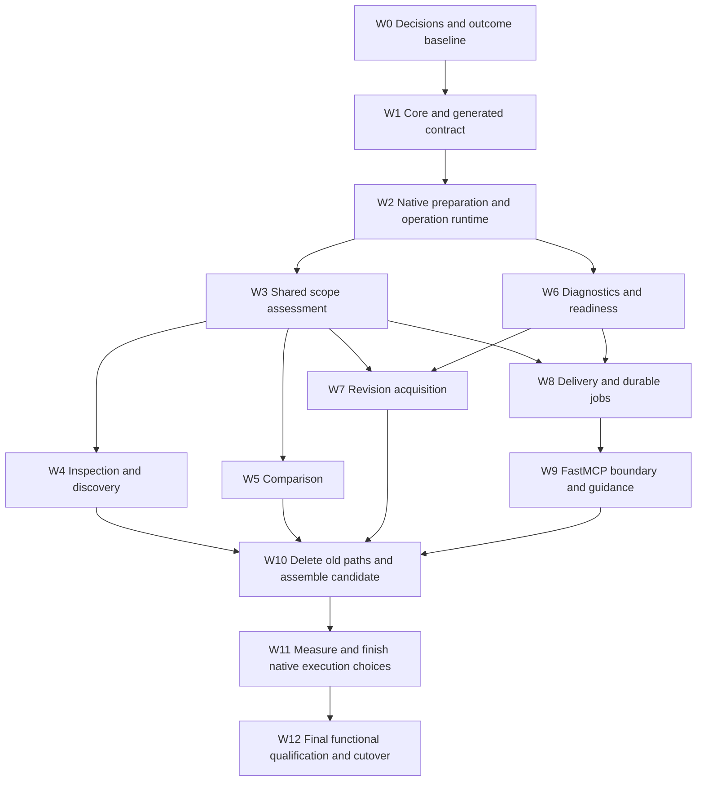

# Hard pivot to unified DataFusion research operations and faithful FastMCP delivery

## 1. Mandate, scope and evidence

**Deliver one replacement design:** shared Rust research contracts, DataFusion-native coverage
and selection, reachable bounded evidence, structured diagnostics, and a thin FastMCP adapter
that delivers the same meaning over tools and resources. Remove superseded implementations and
update every consumer together. There is no compatibility layer, dual contract, engine switch,
old cursor decoder, migration reader or staged client transition.

This plan was requested on 2026-09-14 and completed on 2026-09-15 following the
[design review](../design_review/reviews/design_review_mcp-datafusion-fastmcp_2026-09-14.md).
The user's subsequent hard-pivot instruction replaces the review's compatibility alternatives
and its preference for retaining historical result readability in the new runtime. This plan
was initially a `draft`, with every work package and proposed verification `not_run`.
The user authorized implementation on 2026-09-15; implementation and the single production
activation completed that day. Its current status is `done`. The
[execution ledger](13-research-operations-execution-ledger.md) records final boundaries and actual
checks; the [final qualification report](../reports/plan13-final-qualification-2026-09-15.md)
closes J01–J20 and D01–D12. Planning itself performed no state reset.

The product delivered through [Plan 12](12-architecture-first-completion.md) is the working
baseline. Do not reopen its completed work or repeat its stopped registry-only audit. This is
new architecture and behavior work with its own source-bound completion evidence.

Planning baseline: Git HEAD `41ac67219ea39e6b085dde6273c9df08c9937bba`, with the review,
capability-map directory and external campaign report untracked at planning start. Tracked
source was clean. Existing `STATUS.md` historical dirty-tree wording is not the live Git state.
Keep unrelated work intact. No new runtime or acceptance campaign was executed to create this plan.

### Inputs and boundaries

- [External functional campaign](../reports/mcp-functional-datafusion-2026-09-14.md): all F1–F4,
  O1–O9, artifact/job delivery observations and its 40-crate breadth sweep.
- The review's three DataFusion capability maps and FastMCP 4.0.0 reference, with the pinned
  source checks recorded in review §1. Keep DataFusion 55.1.0, Arrow/Parquet 59.3.0 and FastMCP
  4.0.3. Context7's 3.2.x/main material is discovery, not exact-release evidence. No upgrade
  project is required; verify any newly used consequential API against the installed release.
- Rust continues to own identities, evidence, scope, query policy, jobs, effects and publication.
  DataFusion remains in `enrichment-store`; no Python evidence engine or core-to-store dependency
  inversion. Python owns mechanical MCP transport and adapter-local failures when Rust is unreachable.
- Keep hosted rustdoc first, Griffe static extraction, ty, rust-analyzer, execution qualification,
  the six epistemic classes and the outside-studied-repository boundary. Preserve exact input
  provenance and the existing native producer allocation boundary.
- No new database, Delta Lake adoption, generic analyzer/workflow platform, embedded agent,
  arbitrary SQL/shell tool or Python-owned durable scheduler.

### What hard pivot changes in the review's recommendation

| Review option or constraint | Plan decision |
|---|---|
| Add richer semantics only where the old root schema allows them | Replace the active research wire contract and all generated consumers directly. Freeze a new target; preserve original provenance bytes as history. |
| Keep an exception for error-shaped overflow if clients require it | Delete that representation. Delivery location is independent of research outcome; `BUDGET_EXCEEDED` means actual capacity failure. |
| Version and potentially preserve old projection/cursor behavior | Support only the new selection/page contract. Version identities for reproducibility and reject obsolete requests/cursors without translating them. |
| Preserve old result/journal readability | Use a fresh active state generation for the new contract. No old-result/journal conversion or legacy runtime reader. |
| Apply small repairs before architectural integration | Build the shared contracts first and land corrections through them. No temporary handler-specific coverage/error/paging implementation. |
| Optional extra DataFusion/FastMCP machinery | Keep the review's adoption criteria. Full implementation means completing the selected design, not enabling unrelated features. §8 disposes of every optional capability. |

Physical retention of historical files is separate from runtime compatibility. Preserve frozen
documents and the previous service-owned state as inactive evidence; the new service need not
read it. Start and qualify the new generation without deleting retained user evidence. Reclaiming
that inactive state is a separate explicit cleanup operation, not a prerequisite for the pivot.
Development scratch can be reclaimed through the existing ownership-aware tools. No broad reset
of XDG roots, credentials, unrelated containers or repositories belongs in this work.

## 2. Target contracts to implement

**Execution refinement, 2026-09-15:** after evaluating the user's Pydantic suggestion against
installed FastMCP/Pydantic probes, use authored Python presentation models composed from generated
Rust domain DTOs. This replaces the proposed native MCP catalog/schema-composition machinery.
Rust continues to own requested scope, result meaning, enforced limits, cursor identity and
durable recovery. Pydantic owns MCP presentation/defaults and validates the explicit lowering to
native requests. W1/W9 conformance therefore proves semantic preservation across two declared
interfaces, rather than requiring identical presentation schemas. ADR-0037 records the decision;
the [upstream verification](../architecture/plan13-upstream-verification.md) supplies exact evidence.

These are the selected planning targets. W0/W1 record them in ADRs and the living design before
dependent behavior is integrated. This plan is sequencing evidence, not a substitute for those
decisions. Identifiers below are proposed type/concept names, not claims of existing APIs.

| Contract | One owner and concrete target | Invalid or incomplete behavior |
|---|---|---|
| `OperationSpec` | Small Rust-owned catalog for the nine tools: request/payload schema, defaults, effects, supported scopes, ordering and recovery routes. Generate mechanical schema/metadata outputs. | Unknown operations, fields and enum values fail validation; no fallback contract. |
| `ResearchSelection` | One typed inspection selection replaces overlapping `depth`/`aspects` interpretation: default preset or explicit aspect selections. Default is signature, availability and bounded documentation. Execution intent remains separate and explicit. | Old arguments are rejected. Excluded fields are declared omitted, never treated as absent source evidence. |
| `RequestedScope` / `CoverageAssessment` | Rust defines sufficiency; DataFusion evaluates a transient requested-domain relation against snapshot-bound `CoverageFact` rows and compatible producer scope. | Distinguish indexed, partial, missing, unknown and explicitly not applicable. No coverage row means unknown; no rows alone never proves absence. |
| `AspectOutcome` | Each selected aspect has available/absent/unavailable/omitted/failed disposition, supporting identities, bounded data and any diagnostic. | An independent failed aspect can yield a partial answer; a failed shared snapshot/admission prerequisite cannot. |
| `PageContract` | Per-aspect or per-result stable ordering, snapshot(s), normalized selection, contract digest, last key, count semantics and continuation. Use keysets for relations and offsets for immutable byte windows. | Reject scope/snapshot/contract mismatch. Never silently drop alternatives or restart against a different snapshot. |
| `ResearchOutcome` | Keep `ok`, `partial`, `pending`, `error` with one core derivation. Missing required evidence makes the answer partial; expected producer latency makes it pending. | A page boundary alone does not make fully supported evidence partial. A truly failed operation stays error even if its diagnostic is stored. |
| `DeliveryDescriptor` | Separate inline/page/artifact representation, immutable result identity, effective limits and typed retrieval action. Move aspect pagination into typed data; retire ambiguous whole-envelope pagination. | No success represented as a budget error; no original outcome/coverage lost when an artifact is required. |
| `Diagnostic` / `RecoveryAction` | Closed Rust cause/stage/budget/rule and retry class, affected IDs, bounded witness, correlation and typed next action. Adapter transport variants use the same generated presentation contract. | Unknown job is a nonretryable lookup failure; permission, corruption, capacity, timeout and invalid plan remain distinguishable. |
| `OperationContext` | Own pinned inputs, effective policy, admission/deadline/cancellation, child queries, retained output and diagnostic linkage. | Queueing and retained batches count toward declared limits; child queries cannot repeatedly reset the operation's budget. |
| `RelationContract` | Store-owned input/output field roles, nullability, identity/provenance metadata and invariant witnesses for fixed query families. | Reject invalid preparation/output; optimizer key declarations follow admission proof, not the reverse. |
| `ExtractionDisposition` | Rust records retained files, directories, safe link omissions and refusals with archive/path/policy provenance. DataFusion derives affected source coverage. | Never extract/follow links; reject dangerous entries; required omitted inputs prevent complete-source/build claims. |
| `Readiness` / terminal job data | Typed online/offline capability states; compact terminal outcome and direct result reference. One operator setup action catalog. | Transport disconnect is not cancellation; failed underlying work is clearly distinct from successful status retrieval. |

### Outcome and delivery examples

| Request/result | Required response meaning |
|---|---|
| Default SessionContext inspection | Useful signature, availability and a small docs projection; relationship navigation is discoverable without enumerating all edges. |
| Explicit relationships, more rows than fit | Ordered first page, `has_more`, continuation and exact/unknown count label. Continue to all retained edges within the declared query limits. |
| Docs and release notes requested; only docs supported | `partial`, observed docs deltas, and per-side missing/unknown release-note assessment. No certified zero for notes. |
| Complete supported answer exceeds inline bytes | Original `ok` or `partial`, compact preview, result handle and section/page action; MCP `is_error=false`. |
| Actual query memory/deadline failure | `error`, explicit capacity cause and actionable narrowing/operator guidance; MCP `is_error=true`. |
| Job is done but its research result failed | Job-status retrieval can succeed; typed `result_outcome=error`, diagnostic and next action make failure unmistakable. Reading the research result preserves that error. |
| No docs body, versus docs excluded from selection | An evaluated absent-doc state versus an omitted projection with reason. Neither invents text. |

Coverage sufficiency is over the selected subject domain, not every historical producer attempt.
Retain independent failed attempts as provenance when a later compatible observation supplies
the evidence. Never merge incompatible environments, aliases, sources or epistemic classes to
manufacture completeness. First acquisition and retained/offline reads call the same evaluator;
freshness is a separate field and may legitimately differ.

`max_bytes` will explicitly bound the canonical research envelope. MCP framing/text has a
separate measured allowance and transport limit. Return the effective envelope cap and a complete
retrieval action. Preserve the existing configured caps initially; do not raise limits to hide
an indivisible relationship/variant or inefficient artifact slice. Frame-limit changes need the
same raw-wire validation as the new contract, not an unmeasured allowance increase.

## 3. Work order and exits

Each work package replaces its production callers and deletes its displaced logic in the same
slice. Intermediate commits are development checkpoints, not alternate supported deployments.
The complete candidate is qualified in isolated fresh state before the one deployed cutover.

W4/W5 and W7 can be developed independently once their inputs are settled; this diagram does
not prescribe agent delegation. W8 can start from agreed types while W4/W5 are built, but must
integrate their actual payloads before W10. Per-slice functional checks start immediately;
W12 is the consolidated final-source run, not the first time outputs are examined.

## 4. Dependency-ordered work packages

### W0 — Record the hard-pivot decisions and executable outcome baseline

**Dependencies:** none. **Owner:** design/core maintainer. **Findings:** R1–R9; charter G1–G7.

1. Create proposed decision records using the ADR workflow for: shared scope/selection;
   the new research/delivery wire contract; operation execution/diagnostics; and safe revision
   omission. Allocate actual IDs when creating the records, then populate this plan's `adrs`.
   Respond explicitly to ADR-0029/0030 and affected provisions of ADR-0015/0024/0028/0034/0035.
   Carry forward still-required invariants when a record is superseded; do not erase its argument.
2. Update the relevant living design sections, especially §7.1, §7.3 and §8, with these targets
   and the hard-pivot boundary. Keep the frozen blueprint/handoff unchanged. W1 completes the
   scoped contract review before affected ADRs are marked accepted; no automatic acceptance is
   inferred from the earlier review's `Revise` verdict.
3. Turn §6's journeys into assertions in existing test tiers. Capture exact source/binary/config
   identities and representative original failures. Reuse trustworthy campaign inputs, not its
   old shape-only pass classifications. Record any baseline measurement that cannot be reproduced
   as unavailable, rather than inventing before/after evidence.
4. Define the fresh-state generation and active-contract location. Use a new dated provenance
   bundle and an active contract directory such as `contracts/research-operations/`; original
   frozen files retain their bytes and historical role. New version markers are compatibility
   rejection and provenance boundaries, not dispatch switches for old implementations.

**Exit:** concrete target examples, proposed records and source-bound scenario inventory exist;
every review finding maps to implementation and a functional assertion. No schema or runtime
has been weakened to make historical assertions pass.

### W1 — Implement the single Rust operation and wire contract

**Dependencies:** W0. **Owner:** core/wire maintainer. **Findings:** R1/R2/R4/R8/R9.

**Touchpoints:** [request.rs](../../crates/enrichment-core/src/request.rs),
[wire](../../crates/enrichment-core/src/wire/mod.rs),
[schema emitter](../../crates/enrichment-core/src/wire/schema.rs),
[schema conformance](../../scripts/schema-conformance.py), generated schemas and Python DTOs.

1. Implement §2's typed selection, scope, aspect, page, outcome, delivery, diagnostic and job
   payloads. Keep domain meaning in authored Rust types. Build one small operation declaration
   surface; reuse existing enum/request schema machinery instead of introducing a general DSL.
2. Compose each tool's output schema in authored Pydantic presentation models over generated
   Rust domain DTOs, including typed success/partial/pending/error
   and delivery variants. A stored-result descriptor has its own valid payload variant; it must
   not be validated as if the complete tool data were inline. Keep effects, adapter defaults
   and supported resource views in one authored presentation catalog; recovery semantics
   remain Rust-owned. Test lowering into native requests and output composition, as §2 specifies.
3. Use one active schema version. Remove old `depth`/`aspects`, whole-envelope pagination and
   old overflow expectations from live consumers. Regenerate via `just schemas-generate`;
   never edit generated DTOs or schemas by hand.
4. Refreeze the new target with independent positive/negative examples. Retarget schema
   conformance and enum fixtures to that target. Keep historical provenance verification and
   add verification of the new bundle; do not require the new runtime to accept historical
   envelope examples. Preserve stable acceptance IDs, documenting any changed contract assertion.
5. Run the scoped design review on the concrete contract, update ADR status appropriately and
   complete design/index updates in the same slice. A new MUST-level gap is not waived by the pivot.

**Exit:** reproducible generation, typed payload specialization and original-wire rejection
agree between Rust and Python. Pending requires a job; errors require a diagnostic; pages and
artifact continuations validate without pretending to contain the complete answer.

### W2 — Connect native preparation, relation contracts and operation resource ownership

**Dependencies:** W1. **Owner:** store/runtime maintainer. **Findings:** R6/R7.

**Touchpoints:** [runtime.rs](../../crates/enrichment-store/src/runtime.rs),
[provider.rs](../../crates/enrichment-store/src/provider.rs),
[admission.rs](../../crates/enrichment-store/src/admission.rs),
[query_diagnostics.rs](../../crates/enrichment-store/src/query_diagnostics.rs),
[scoring.rs](../../crates/enrichment-store/src/scoring.rs),
[semantic.rs](../../crates/enrichment-store/src/semantic.rs).

1. Introduce the operation context above existing request-isolated sessions and shared RuntimeEnv.
   Account for queue time, planning, all child execution, retained batches and final result work.
   Reconcile operation admission with existing query permits: do not recursively acquire the
   same bounded semaphore or hold an outer permit while waiting for an identical inner permit.
2. Add fixed-family plan preparation checks and declared relation field contracts. Preserve
   DataFusion's default analyzer/coercion/optimizer sequence. Validate required metadata and
   nullability through analysis, optimization and actual output; outer joins can legitimately
   make a field nullable. Field tags do not prove row membership or make all IDs interchangeable.
3. Retain exact admitted file groups, conservative Inexact filter pushdown and residual filters.
   Preserve projection/limit safety and admission-before-key-assertion. Turn invariant witness
   queries into bounded typed diagnostics rather than discarding their offending identities.
4. Keep scoring and canonical identity hashing as pure specialized Rust UDFs. Declare precise
   result fields/nullability and captured function identity. Preserve canonical preimages; test
   scalar/array/null/empty inputs and partition independence for changed functions.
5. Link request, operation, query, stage and retained result diagnostics. Record plans/metrics
   from the execution that ran, including bounded failure information; never re-execute a failed
   query just to obtain EXPLAIN ANALYZE. Retain important failure evidence beyond the small ring.

**Exit:** representative valid native queries return identical typed evidence; malformed
relation/identity inputs fail with a witness. A multi-query request has one enforced budget and
correlated diagnostics, releases ownership on failure, and cannot deadlock nested admission.

### W3 — Replace independent coverage and result-status interpretation

**Dependencies:** W1/W2. **Owner:** core semantics + store query maintainer. **Findings:** R1/R9.

**Touchpoints:** [relational.rs](../../crates/enrichment-core/src/evidence/relational.rs),
[views.rs](../../crates/enrichment-store/src/views.rs),
[resolve.rs](../../crates/enrichment-daemon/src/ops/resolve.rs),
[compare.rs](../../crates/enrichment-daemon/src/ops/compare.rs), all research renderers.

1. Define closed coverage sufficiency rules in core and lower transient requested domains into
   native views. Include comparison side, selected subject domain, requested evidence kind and
   compatible producer/environment scope. Use outer/anti joins and aggregates to retain unknowns,
   indexed-empty results, gaps and source provenance explicitly.
2. Derive requested, available, missing and excluded aspects from these same declarations.
   Implement one core outcome projection from assessed scope and operation diagnostics. First
   acquisition, retained/offline reuse, overview, search, inspection and comparison all use it.
3. Replace API-only comparison completeness and first-acquisition/retained branch-specific gap
   assembly. Keep raw producer coverage facts unchanged unless their semantics require a recorded
   schema change; the assessment is primarily a view, not another persistent coverage authority.

**Exit:** the same evidence has the same coverage meaning cold and warm; all requested comparison
scopes are accounted for; absent evidence is never an inferred zero. Focused sufficiency cases
cover indexed-empty, partial, missing, unknown and a later compatible successful observation.

### W4 — Make inspection and discovery reachable through native selection

**Dependencies:** W2/W3. **Owner:** store query + daemon research maintainer. **Findings:** R2/R9.

**Touchpoints:** [query.rs](../../crates/enrichment-store/src/query.rs),
[inspect.rs](../../crates/enrichment-daemon/src/ops/inspect.rs),
[browse.rs](../../crates/enrichment-store/src/browse.rs),
[search_plan.rs](../../crates/enrichment-store/src/search_plan.rs),
[page.rs](../../crates/enrichment-core/src/search/page.rs).

1. Compile the new selection once. Default inspection returns signature, availability and a
   small documentation projection. Exact definition selection remains available for ambiguous
   paths. Retained reads never implicitly request source builds or semantic execution.
2. Replace indivisible relationship/observation/heading alternatives with explicit bounded
   projections and stable native pages. Preserve complete facts and their IDs; do not persist
   projected records as new observations. Return selected aspect outcomes independently where
   the contract allows it, with a complete route to retained alternatives.
3. Select keys and requested columns before hydration. Evaluate endpoint-specific equality
   selections plus union/dedup against the existing relationship semi-join. Adopt the better plan
   only with equal identities/direction/self-edge/external-target results and measured benefit.
4. Derive separate lexical children and typed members using their proper relations. Add bounded
   method/field/variant navigation. Fold re-export fragment presentation only for compatible
   source/locator/subject qualification; retain independent observations and citation alternatives.
5. Make absent documentation, excluded payload and unavailable extraction distinct. Label source
   snippets as actual bounded windows unless a trustworthy item-end span exists; do not add a
   new parser merely to shorten an excerpt. Every page cursor binds the actual selected snapshot.

**Exit:** SessionContext, DataFrame, ParquetReadOptions and Expr are usable with default selection;
explicit relationship traversal reaches all retained edges without loss/duplication. Independent
signatures survive relationship presentation boundaries; actual engine failures remain explicit.

### W5 — Compare native flat alternatives under assessed coverage

**Dependencies:** W2/W3. **Owner:** store comparison maintainer. **Findings:** R1/R7; O4.

**Touchpoints:** [comparison.rs](../../crates/enrichment-store/src/comparison.rs),
[comparison projection](../../crates/enrichment-store/src/projection/comparison.rs),
[compare.rs](../../crates/enrichment-daemon/src/ops/compare.rs).

1. Replace full per-key array construction and its fixed alternative-count rejection with typed
   `(scope, key, value)` set reconciliation. Use native joins with explicit null-safe equality;
   derive changed keys before payload hydration. Preserve current set semantics; compare occurrence
   counts only for a declared bag-sensitive scope, not by assuming an `EXCEPT ALL` oracle.
2. Page changed keys and then bounded before/after alternatives with their source IDs. A large
   key gets a nested continuation; one large rendered value gets an artifact reference. Neither
   must fit an unbounded nested cell for the comparison to be useful.
3. Consume W3's per-side assessment. Report observed differences and uncertainty separately;
   unsupported sides do not turn every retained record into a certified addition/removal.
   Preserve exact totals where promised, distinguishing them from unknown/lower-bound counts.
4. Retain rustdoc/compiler/environment confounders. Classify the Infallible/never example as an
   observed representation difference with unresolved compatibility unless a version-qualified
   rule proves more. Do not replace the strings or assert a demonstrated breaking change.

**Exit:** DataFusion 54.1.0→55.1.0 docs/API comparisons retain supported changes; missing release
notes are explicit. High-variant fixtures page successfully, with independently specified expected
sets, nulls, duplicates, order ties and provenance intact.

### W6 — Unify actionable diagnostics and readiness

**Dependencies:** W1/W2. **Owner:** core/daemon maintainer. **Findings:** R3/R4/R6/R7.

**Touchpoints:** [common.rs](../../crates/enrichment-daemon/src/ops/common.rs),
[verify.rs](../../crates/enrichment-daemon/src/ops/verify.rs), wire errors/status,
query/admission failures and operator status projections.

1. Classify failures at origin: unknown ID, unavailable snapshot, permission/I/O, corrupt state,
   invalid plan, actual memory/spill/deadline capacity, policy refusal and internal defect.
   Map them into the declared public code/cause contract; remove blanket retryability and
   generic data-directory repair advice. Existing public code categories may remain where apt.
2. Implement typed recovery actions carrying complete arguments/handles and prerequisite class.
   Do not propose unchanged retries for deterministic limits or execute a suggested action on
   the agent's behalf. Unknown jobs may use `ARTIFACT_UNAVAILABLE`, with nonretryable lookup cause.
3. Derive one readiness view for route implementation, installed dependency, enabled profile,
   qualification, retained evidence and daemon reachability. Share concrete setup guidance across
   status, verification and execution inspection; presence of a binary is not qualified execution.
4. Attach bounded invariant/query witnesses and operation correlation. A failed diagnostic write
   must not overwrite the original cause or claim the original query succeeded.

**Exit:** unknown, unreadable and corrupt job cases have distinct useful actions; query failures
identify the failing stage/limit; a static-only host consistently explains supported reads and
the prerequisite for execution. All selected error paths use the shared projection.

### W7 — Admit safe revision evidence with explicit omission coverage

**Dependencies:** W1/W3/W6. **Owner:** producer/policy maintainer. **Findings:** R5.

**Touchpoints:** [archive/mod.rs](../../crates/enrichment-core/src/archive/mod.rs),
[revision.rs](../../crates/enrichment-daemon/src/ops/revision.rs), revision provenance and admission.

1. Validate every archive member's path, type, duplicate/collision behavior and expansion budget
   before extraction or omission. Keep decoding/path checks in bounded Rust. Never create/follow
   symlinks or hard links; reject traversal, devices, conflicting entries and malformed metadata.
2. Record permitted link omissions with archive digest, normalized member path/type, bounded
   untrusted target text, reason and policy identity. Preserve the raw archive. Do not suppress
   arbitrary extraction errors or skip accounting for omitted members.
3. Determine the selected package's required source/workspace/configuration closure. An unrelated
   root link can be omitted without denying all package evidence; a missing required manifest,
   module or inherited workspace input prevents a complete-source/build claim. Mark the affected
   source scope explicitly; retained static facts can still be useful under their declared scope.
4. Join extraction dispositions to requested coverage through W3 and retain enough evidence for
   offline replay. Update policy/producer identity; reuse existing scratch/lease/cleanup ownership.

**Exit:** campaign revision `7d3835c71f30cbd3c3ae4041732267f1f453097a` is reachable for the
selected DataFusion package despite an unrelated CLAUDE.md link. Required-input and hostile-link
fixtures fail safely; offline revision reuse and studied-repository isolation still work.

### W8 — Replace overflow and nested job delivery with directly usable results

**Dependencies:** W1/W2/W3/W6; integrate W4/W5 payloads before W10.
**Owner:** daemon delivery/publication maintainer. **Findings:** R8/R4; G5 obligation.

**Touchpoints:** [delivery.rs](../../crates/enrichment-daemon/src/delivery.rs),
[artifact.rs](../../crates/enrichment-daemon/src/ops/artifact.rs),
[verify.rs](../../crates/enrichment-daemon/src/ops/verify.rs), jobs and publication descriptors.

1. Implement the new delivery descriptor everywhere: inline calls, durable jobs, journal recovery,
   comparison and artifact reads. Preserve the original outcome, requested-scope assessment and
   concise guidance. Delete the error-shaped `result_artifact_id` overflow convention entirely.
2. Return compact terminal job data with `result_outcome`, context/snapshot identity, diagnostic
   when failed, and a direct result reference/first useful page. Remove whole-envelope nesting.
   Status retrieval and the underlying operation outcome remain explicitly separate.
3. Extend the existing Markdown `section` capability with a declared typed result-section selector
   for coverage/signature/changes/aspects. Preserve bounded byte reads as a general artifact
   operation, not a legacy-result decoder. For structured results, create a bounded section/page
   index during writing; never repeatedly parse a complete large JSON result to select a field.
4. Stream large retained result/index output using the existing bounded sink/publication facilities.
   Admit bytes, index references and complete export closure before terminal success. Recovery
   reads committed artifacts; it does not rerun producers or create missing result artifacts.
5. Replace repeated halving with encoded-byte-aware fitting that accounts for JSON escaping,
   UTF-8 and base64. Always make progress or return a typed minimum-budget failure. Keep mandatory
   identity/action fields intact; expose requested/effective caps and exact/unknown count semantics.

**Exit:** finishing a job immediately exposes its outcome and direct retrieval route. An oversized
supported answer remains successful/partial and reaches a named section's first useful page in
one follow-up read.
Unicode/binary roundtrips, disk failure, commit interruption, recovery and export preserve closure.

### W9 — Implement the complete FastMCP boundary and agent guidance

**Dependencies:** W1/W6/W8. **Owner:** Python adapter maintainer. **Findings:** R4/R8/R9.

**Touchpoints:** [server.py](../../python/enrichment_mcp/server.py),
[daemon_client.py](../../python/enrichment_mcp/daemon_client.py),
[catalog contracts](../../tests/contract/test_mcp_catalog.py), shipped library-research skill
and operations documentation.

1. Keep nine stable tool names and thin explicit wrappers; use generated native request/domain
   DTOs with the authored presentation catalog from §2. Declare cancellation and acquisition
   effects truthfully. Eliminate competing defaults/annotations, test adapter-to-native lowering,
   and replace the untyped offline-status bypass with an explicit adapter-observed variant.
2. Set input strictness and unexpected-error masking explicitly. Check original JSON at the MCP
   boundary before coercive binding can change meaning, using supported 4.0.3 validation hooks.
   Match Rust rejection for strings-as-numbers, booleans-as-integers, nulls, extra fields and enums.
   Protocol-invalid input can remain a precise MCP validation error before operation admission.
3. Use canonical `ToolResult` construction with structured data and `is_error` determined by the
   actual research/transport result. Partial/pending and successful artifact continuations remain
   normal results. Keep only a concise preview plus the one structured envelope; no duplicate JSON
   text or automatic artifact expansion. Never clip the sole recovery handle/action.
4. Separate request oversize, connection failure, timeout, framing failure, malformed JSON and
   invalid JSON-RPC response. Validate version, response ID and result/error exclusivity; configure
   the stream-reader limit consistently with the advertised frame bound. An adapter timeout does
   not cancel a Rust job. Return a recovery handle whenever one was actually issued.
5. Add a small tools/resources middleware layer for correlation, timings and bounded unexpected
   exception reporting. Use context/DI and cheap lifespan ownership where useful; listing the
   catalog must not fetch evidence or require a running daemon.
6. Ship capability-aware progress from real core stages and result resource links, with ordinary
   tool fallback. Progress is supplementary and negotiated; no guessed percentages or second
   scheduler. Derive a compact workflow/recovery resource from the shipped skill and operation
   catalog. Update examples for the new arguments, coverage, jobs and artifact selectors.

**Exit:** raw stdio and actual clients receive the correct error flag, typed payload, complete
recovery action and advertised effects. Offline catalog/status works; tool/resource reads agree;
clients without progress/resource-link rendering still complete the same research journey.

### W10 — Close the deletion ledger and assemble one deployable candidate

**Dependencies:** W4/W5/W7/W9 and their integrated W8 delivery.
**Owner:** integration maintainer. **Findings:** all; removal ledger in §5.

1. Complete every deletion row and update tests/fixtures, scripts, generated models, shipped
   skill, resource templates and operator examples together. No old-contract handler, alternate
   serialization branch, engine toggle or historical state import remains reachable.
2. Extend `scripts/architecture-check.py` for retired entry points and scoped ast-grep fixtures
   for forbidden construction paths where code shape is a reliable oracle. Do not ban ordinary
   Rust collections/UDFs or mistake string absence for semantic proof.
3. Assemble daemon, executor, native worker and Python adapter from one candidate source and lock
   set. Verify launch paths/configuration/qualification identity point to those actual artifacts.
   Rehearse fresh-state startup and incompatible-state rejection in isolated state; no automatic
   migration, fallback startup or state deletion is permitted.

**Exit:** one complete candidate exists with only the new contract, a closed removal ledger,
current generated consumers and representative working Rust/Python journeys. Production activation
waits for W12's qualification; no client transition layer is shipped in the interim.

### W11 — Measure and finish native execution choices

**Dependencies:** W10. **Owner:** query/runtime maintainer. **Findings:** R7/R8; review P6.

1. Measure fixed end-to-end tasks under the recorded limits: known API lookup, high-fanout
   inspection, unfamiliar-capability search, release comparison and pending completion. Include
   cold/warm inputs and one/eight clients; report queue/plan/scan/hydration/serialization/read
   time, first useful result, child queries, bytes/calls, spill and retained/peak memory.
   Record sample counts and latency distributions; interpret p50/p95 in light of the sample size,
   without presenting a handful of timings as a reliable tail-latency estimate.
2. Decide lazy view reuse versus a bounded per-operation key/score index using actual repeated
   count/page costs in search, comparison and overview. Keep native work relational until a
   measured reuse or streaming-egress boundary. Any retained computation key binds snapshot,
   selection/query/coverage/function/schema/config identities and lease ownership.
3. Remove demonstrated recomputation and delivery waste; select endpoint join shape and tune
   batch/partition/concurrency settings only when equal-result measurements support the change.
   Prefer operation-local reuse over adding a persistent cache. Verify eviction/drop releases
   buffers, spill and leases. Keep exact totals where promised; any new cheap-count mode is explicit.
4. Record the selected physical plans and tradeoffs, including cases with no demonstrated win.
   No arbitrary latency target, workstation upgrade or exhaustive benchmark matrix blocks
   functional completion. Actual nontermination, unbounded accumulation, avoidable repeated full
   result parsing or failure of declared budgets does block completion.

**Exit:** the repeated-work/materialization questions are answered with measurements, chosen
implementations and ownership rules. Correctness and useful delivery improve; any broader
throughput work is explicitly deferred, with an observable trigger rather than an unproved claim.

### W12 — Qualify final outcomes and perform the single cutover

**Dependencies:** W11 and all functional/removal exits. **Owner:** integration/client maintainer.

1. Run §6's full campaign against the final candidate, including all nine tools, corrected
   assertions for F1–F4/O1–O9, the 40-crate family and Rust/Python canaries. Inspect actual evidence
   values, citations, missingness and next actions; a valid envelope alone cannot pass a scenario.
2. Run the appropriate final checks in §7 once on that source, recording blocked prerequisites
   honestly. Test static-only and qualified execution behavior, real Codex/Claude interaction,
   two-client cancellation/disconnect and affected publication/export/cleanup boundaries.
3. Start the new deployment once with a fresh active state generation and matching binaries,
   adapter and configuration. Stop old per-client adapters/daemon before routing callers to the
   new one; do not run a mixed generation. Preserve prior inactive state without exposing it as
   a runtime fallback. Do not copy old journals/cursors/results into the new active state.
4. Run a small post-activation smoke: status, exact resolve, default high-fanout inspect, one
   comparison, pending completion and direct result read. Verify actual deployed identities,
   effective limits, no leftover task-owned workers and no studied-repository mutations.
5. Record final-source receipts, the functional report and explicit deferrals. Update ADR evidence,
   the living design, plan outcome, plans index, operations guide and `STATUS.md` from reality.
   Run a scoped closing design review; do not mark this plan done with a failed functional exit
   or an unresolved core truthfulness/validity/recovery contract.

**Exit:** the new deployment alone serves the tested contract, every required outcome is proven,
all retired paths are absent, and the handoff names exact artifacts and any external limitations.

## 5. Removal ledger

Close these rows through actual caller/build/schema checks, not renamed helpers or a disabled
branch. Historical review/ADR/provenance text may still name old behavior; it is not executable
compatibility code. Adapt meaningful existing assertions to the target instead of deleting the
assertions that exposed the defect.

| ID | Remove from the active implementation | Replacement / package | Proof of removal and behavior |
|---|---|---|---|
| D01 | Independent acquisition/retained/API-only completeness assembly | Shared scope assessment, W3 | All research renderers consume the same assessment; J03/J04/J10 |
| D02 | Overlapping inspection depth/aspects interpretation and implicit all-aspects selection | Typed selection, W1/W4 | Generated MCP/RPC schemas reject retired inputs; default and explicit pages pass J01/J02 |
| D03 | Relationship/observation/heading presentation sentinels that require a whole alternative set | Per-aspect bounded pages, W4 | No production default requests complete alternatives; complete traversal passes; true compute caps remain |
| D04 | Comparison group bound and full `array_agg` alternatives before reconciliation | Flat native key/value comparison, W5 | Actual plan and source route use flat reconciliation; high-variant J05 passes |
| D05 | Blanket store/query errors and retry advice unrelated to cause | Typed diagnostic projection, W6 | Cause/action tests and source call-site inventory; J06/J15 |
| D06 | Error-shaped successful overflow and whole-envelope nesting in terminal jobs | Delivery descriptor and compact job result, W8 | No overflow exception in MCP error mapping; J07/J08/J17 |
| D07 | Repeated whole-result parsing and halving-based slice fitting | Indexed structured result sections and encoded-size fitting, W8 | Byte/progress oracles, actual direct-section journey and measured payload utilization |
| D08 | Competing tool defaults/schemas/effects and offline data bypass | One authored MCP composition over generated domain DTOs; typed offline variant, W1/W9 | Catalog/lowering conformance, strict input parity and J12/J13 |
| D09 | Generic daemon-unavailable mapping for oversize/malformed/timeout cases | Distinct transport diagnostics, W9 | Real framing/connection/protocol tests, including >default-reader-limit valid response |
| D10 | Whole-archive link refusal as the only revision disposition | Safe omission/required-input refusal, W7 | J09 plus hostile-entry regression; no permissive skip-all branch |
| D11 | Old active envelope/cursor/result/journal readers and fixtures used as runtime targets | One new contract and fresh state, W1/W10 | Generated/current tests reference only the new target; old generation fails closed; no migration/dual reader |
| D12 | Obsolete skill examples, resource descriptions, test helpers and deployment consumers | Current operation catalog and installed candidate, W9/W10 | All public examples validate against current requests; actual installed client journeys pass |

A cheap source-shape rule belongs in `rules/` with positive/negative fixtures. Relation coverage,
effect behavior and lifecycle validity require executable outcomes, not a hook or grep assertion.
Enforcement configuration itself remains outside this plan's editable surface.

## 6. Functional outcome matrix

J01–J20 are plan-local journey identifiers, not new acceptance-registry IDs. All are `not_run`
at plan creation. Strengthen the existing e2e/contract/client tiers; add a small campaign driver
only where the existing fixtures cannot express the sequence. Retain raw MCP responses and exact
inputs so another agent can independently assess the same outcomes.

| Journey | Inputs / boundary | Required functional outcome | Review / package |
|---|---|---|---|
| J01 — Useful default inspection | DataFusion 55.1.0 SessionContext, DataFrame, ParquetReadOptions; datafusion-expr Expr | Default returns correct signature, available docs and explicit coverage; no relationship presentation failure or blind-retry advice | F1; W3/W4 |
| J02 — Complete bounded navigation | Explicit relationships and qualified observations; n−1/n/n+1 fixtures, alias/self/external targets | Stable pages collectively equal the expected retained identities without loss/duplication; correct directions and source IDs; cross-snapshot/selection cursors rejected | F1/O3; W4 |
| J03 — Missing comparison scope | datafusion 54.1.0→55.1.0, docs + release notes | Docs changes remain; missing/unknown notes assessed separately for both sides; overall partial; no claimed zero or unchanged notes | F3; W3/W5 |
| J04 — Coverage sufficiency | Indexed-empty/nonempty, partial/missing/no fact, incompatible scope, later compatible successful attempt | Zero only for an evaluated supported domain; no silent union of environments; failed attempts remain provenance without permanently poisoning later complete scope | R1; W3 |
| J05 — Accurate scalable comparison | API/docs changes, high-variant key, nulls/duplicates/ties; Infallible/never example | Flat reconciliation matches independent expected sets; before/after variants page; compiler representation difference remains qualified, not a proven breaking change | O4/R7; W5 |
| J06 — Correct job recovery action | Well-formed unknown job ID, unreadable journal, corrupt record | Three distinct causes/actions; unknown ID is nonretryable and does not prescribe directory repair | F2; W6 |
| J07 — Useful pending and terminal jobs | Cold resolution/comparison and failed work; eight concurrent requests | Pending has a recoverable job handle; terminal status immediately exposes result outcome/reference; no full-envelope nesting or misleading success summary | O6/delivery; W8/W9 |
| J08 — Bounded direct result retrieval | Same answer inline and stored; coverage/signature/changes section; Unicode escaping/base64 | Same research outcome and scope; one follow-up reaches the first useful section page; effective caps explained; every cursor advances; exact roundtrip succeeds | Delivery observations; W8 |
| J09 — Safe revision reachability | Campaign pinned commit and package_subdir; unrelated link; required-input and hostile archives | Useful admitted package evidence and explicit omission scope; safe refusal for required/unsafe inputs; no link following; offline revision reuse works | F4; W7 |
| J10 — Cold/retained agreement | First acquisition then cached/offline/revalidated read of the same evidence | Scope and completeness agree; legitimate freshness changes are isolated; source IDs and qualification remain stable | O5/O8; W3 |
| J11 — Honest discovery and excerpts | Re-export docs, independent same-text sources, methods/fields, missing docs, source snippet | Compatible aliases fold with citations; independent sources remain; members reachable; absence/omission distinct; excerpt describes its actual window | O1/O3/O7/O9; W4 |
| J12 — Faithful MCP output and effects | Raw stdio for ok/partial/pending/error/continuation/failed job; all tool actions | Typed structured result and error flag agree; acquisition/cancellation effects advertised; no duplicated large JSON; complete next action | R4; W9 |
| J13 — Input and transport boundary | MCP/RPC invalid original JSON, oversize/short/malformed/wrong-ID response, offline daemon | Shared strict semantics for admitted requests; actionable pre-admission rejection; proper frame limit; offline catalog/status typed and immediate | R4; W1/W9 |
| J14 — Deployment capability guidance | Static-only environment and qualified Rust/Python profiles | Policy refusals name actual setup prerequisites; static reads remain usable; qualified execution works; optional progress absent/present never changes success | O2; W6/W9 |
| J15 — Operation budget and diagnostics | Multi-query operation, memory/spill/deadline pressure, retained output overlap | One bounded operation; stage/cause/request linkage; no nested semaphore deadlock, uncontrolled accumulation or false complete aspect | R6/R7; W2/W6 |
| J16 — Shared-work cancellation and disconnect | Two clients/interests, cancel one; adapter timeout/disconnect; restart | Only authorized interest cancellation affects work; survivor recovers; timeout does not falsely report cancellation; ownership is reclaimed | R7/R8; W2/W8/W9 |
| J17 — Result publication and export | Failure writing artifact/index, interrupt around commit, restart/export | No success without complete admitted result closure; restart reads committed bytes without producer rerun or new result write; export contains referenced sections | G5; W8 |
| J18 — Family breadth and cross-language regression | All 40 campaign crates at 55.1.0; representative existing Rust/Python canaries; exact versions | Resolve/overview/search/inspect produce source-supported usable evidence and honest gaps; live evidence counts are not blindly matched to stale receipts | Campaign breadth; W12 |
| J19 — Real agent task completion | Actual Codex and Claude Code: capability discovery, consequential API check, upgrade investigation and recovery | Agent reaches bounded relevant evidence, cites support and explains missing scopes/next steps through the shipped skill and new tools | R4/R8/R9; W9/W12 |
| J20 — Single-generation deployment | Fresh candidate state, obsolete schema/cursor/journal attempts, installed post-cutover smoke | Only current binaries/contract are selected; old inputs fail clearly with no translation; all three binaries/adapter match; studied repository digest unchanged | Hard pivot; W10/W12 |

The source campaign's G5.2 and G7.4 previously passed shape-level checks despite F3/F2. Their
replacements must assert the missing-scope interpretation and next action. Expected `pending`,
explicit policy refusal, unsupported evidence and HTTP-cache counters unchanged by catalog reuse
are not automatically failures. Conversely, a successful MCP envelope cannot excuse false coverage.

## 7. Verification and completion discipline

### Per slice

- Rust changes: affected crate Clippy/tests and the relevant native/daemon fixture. Use
  `CARGO_INCREMENTAL=0` for this workspace's recorded compiler condition; retain the pinned toolchain.
- Wire changes: `just schemas-generate`, then `just schema-conformance` against the new target;
  original-wire positive/negative cases at both Rust and raw MCP boundaries.
- Python changes: `uv run ruff check`, `uv run ty check`, and selected
  `uv run pytest tests/contract tests/e2e` cases. Keep Python tools under uv and generated code generated.
- Producer/publication changes: affected real execution/ownership boundary plus
  `just state-leak-check`. Fixtures must verify actual refused/retained evidence, not mock success.
- Contract/ADR/deletion changes: `just adr-index` after records change, `just adr-lint`,
  `just provenance-check`, `just architecture-check` and appropriate ast-grep fixtures.

Use a few decisive negative/boundary cases where meaning, identity, safety or ownership can be
lost. Do not expand every input into a Cartesian matrix or add tests that only mirror the helper
being tested. For native replacements, expected identities/values must have an independent basis.
Representative source/rustdoc comparisons and actual agent outputs are required evidence.

### Final candidate

Run `just ci`, the affected `just test-execution` tier, `just test-live`, `just test-client`,
and `just state-leak-check` on the final candidate with source/config-bound receipts. Build and
qualify all three binaries through the existing command surface. Regenerate acceptance reporting
from those real receipts after gate wiring is final; keep stable IDs and retire only by recorded
supersession. Do not repurpose plan-local journeys as fictitious executed registry gates.

The final functional campaign supplements these checks with J01–J20's output-level assertions.
Report `passed`, `failed`, `blocked`, `not_run` accurately. Missing credentials, a producer image
or network access name a prerequisite and remain `blocked`; mocks cannot turn them into passes.
No whole-suite rerun is needed after a documentation-only change. A material source fix after
qualification requires the affected checks again and enough integration coverage to establish
the final candidate, not blindly relabeling previous receipts.

### Completion requires both behavior and replacement

1. All required journeys meet their intended outcomes on the final candidate and installed smoke.
2. Every D01–D12 row is closed, including generated and human-facing consumers.
3. The shared contracts are used by all relevant tools; no copied per-handler semantic repair
   remains hidden behind successful examples.
4. Candidate wire/field/cursor validity, error projection, result closure and cancellation are
   proven; the closing design review resolves the current G1–G7 findings for the new scope.
5. W11 records actual choices/costs without an invented speedup or arbitrary timing prerequisite.
6. The one deployed generation and its state/ownership boundaries are verified and documented.

Retain a concise execution ledger when implementation starts: package status, source identity,
changed paths, command/log, observed output, remaining failure and deletion closure. Create it
under `docs/plans/` only when there is real execution to record. Planning checkmarks are not test
receipts; do not mark a package complete merely because its files exist.

## 8. Capability adoption and explicit exclusions

| Capability from the review/maps | Delivery decision | Trigger for additional machinery |
|---|---|---|
| Native expressions, joins, windows, aggregates and typed views | Required in W3–W5 for coverage, facets, reconciliation and pages | Shared semantics must remain in native plans; fixed trusted SQL is acceptable |
| Preparation contracts and field-aware UDFs | Required in W2 for used query families | Add a custom AnalyzerRule only when a repeated semantic check/rewrite cannot stay in the small shared preparation boundary; prove repeat safety/subquery behavior |
| Exact providers and admission witnesses | Preserve/strengthen in W2 | Exact filter pushdown only after predicate-equivalence proof; no broad provider rewrite |
| Operation-local retained index / streaming sink | W8 streaming and W11 measured reuse decision required | Persistent caching only after repeated cross-operation benefit with complete semantic keys and lease accounting |
| ConfigExtension | Defer; core policy already has an owner | A concrete native planner consumer needs the captured read-only projection; it must replace repeated plumbing, not create writable policy |
| UDTF / custom logical node | Defer | Multiple actual consumers need a named parameterized relation factory or an operation cannot be represented correctly with existing plans |
| Catalog/information_schema diagnostics | Use bounded actual relation/function/config inventory where it explains a query in W2/W6 | Never equate engine inventory with whole-library capability coverage or expose raw SQL |
| FastMCP structured results, schemas, middleware, explicit validation/masking | Required in W1/W9 | Actual 4.0.3 raw-wire behavior determines integration details |
| Context/DI/lifespan | Use for cheap adapter resource/correlation ownership in W9 | No domain state or acquisition during catalog listing |
| Resources, result links and real-stage progress | Required in W9 with portable tool fallback | Unsupported optional host presentation never prevents a research task |
| Workflow/recovery guidance | Required derived resource and shipped skill updates in W9 | Separate prompts/completions deferred until a supported client journey demonstrates benefit beyond those surfaces |
| FastMCP tasks/Docket, response cache, Tool Search/dynamic providers | Excluded from this pivot | A distinct future requirement must justify another protocol projection; never a second job authority or evidence-search implementation |
| Code Mode, sampling, embedded reasoning, remote Apps/proxy/auth platform | Excluded from this local evidence-service design | Requires a separate product/deployment decision; does not satisfy any current finding |

Deferred items receive a concise register entry with the adoption trigger and responsible
maintainer when their governing ADR is written. They do not leave a required finding unresolved.
If a required outcome turns out to need one, bring it into that package with exact-release
evidence and a focused oracle; do not quietly claim it was implemented or stop at a placeholder.

## 9. Review traceability and implementation risks

| Finding / remaining charter concern | Work packages | Outcome proof |
|---|---|---|
| R1 shared coverage; G1/G2/G6 | W1/W3/W5 | J03/J04/J10 |
| R2 high-fanout inspection; G2/G7 | W1/W4/W8 | J01/J02/J08 |
| R3 cause and recovery | W2/W6/W9 | J06/J13/J15 |
| R4 faithful MCP and effect declarations; G3/G4 | W1/W6/W9 | J12/J13/J14/J19 |
| R5 revision reachability | W3/W6/W7 | J09/J20 |
| R6 field/validation diagnostics; G3 | W2/W6 | J04/J05/J15 plus native field/witness fixtures |
| R7 resource ownership/reuse | W2/W5/W11 | J07/J15/J16 and equal-result measurements |
| R8 useful durable delivery; G5 | W1/W8/W9 | J07/J08/J16/J17 |
| R9 discovery distinctions | W3/W4/W9 | J02/J11/J19 |
| Complete hard replacement | W0/W1/W10/W12 | D01–D12 and J20 |

The principal risks are concrete: coverage aggregation can overclaim completeness; paging can
skip/duplicate facts; new typed delivery can strand a committed job; field metadata can be lost
through a valid optimizer transformation; operation permits can deadlock; archive omission can
hide a required input; FastMCP binding can coerce invalid original input. Each has a named oracle
above. The pivot removes compatibility complexity but does not remove these proof obligations.

Keep provenance versions even with one supported implementation: they explain what produced
the evidence and prevent stale cursor/state selection. Keep safety refusals when a required
archive closure cannot be established; useful static evidence is preferable to a false build
equivalence claim. Capacity remains bounded, and `ok` means correct within declared scope.

## 10. Plan validation and execution checkpoint

Implementation authorized and started on 2026-09-15. See the
[execution ledger](13-research-operations-execution-ledger.md) for current work and receipts.

**Documentation validation, 2026-09-15:** spelling checks passed for both files; all 53 local
links resolve. Structural checks passed for W0–W12, D01–D12, J01–J20, section order, finding
traceability, code fences and whitespace. `just rules-test` passed all eight existing ast-grep
fixtures. `git diff --check` passed for the tracked index change; the new plan's no-index
whitespace check emitted no diagnostics (exit 1 denotes added content). These are documentation
checks only; no product/acceptance tests or implementation changes were made.

## Outcome (recorded after implementation)

### What was built

Implemented the shared Rust research/2.0 contracts and their production consumers. DataFusion
55.1.0 now evaluates requested sufficiency, independent selection/pages, flat comparison and
qualified semantic scope. Default analysis/optimization/physical planning, independent Arrow
requirements, bounded invariant witnesses and operation-owned resource limits govern execution.
Measured operation-local indexes replace repeated score/key/namespace work. Complete indexed
result closure precedes publication; restart recovers immutable bytes read-only. Safe revision
omissions remain explicit, and FastMCP 4.0.3 delivers typed outcomes and portable native recovery.

All W0–W12, D01–D12 and J01–J20 exits passed. Independent final-source replay passed 432 native,
223 Python, 12 execution, 2 live and 15 installed-client tests. Acceptance is 47 passed active
gates and retired P08 as not_run, with no failures or blockers. The closing design review accepts
G1–G7 for the declared scope. Exact commands, skips and limitations are in the final report.

The verified installation `plan13-3ae079f9718a` was activated once at 13:49:55 UTC with a fresh
state/6 root. Deployed status, exact DataFusion resolve/default inspection, pending comparison,
direct changes read and Python canary passed. Both global registrations and managed skills match;
old daemon/adapters stopped and prior evidence/configuration remain inactive and unchanged.

### A mistake made and corrected

Several implementation mistakes were corrected through functional oracles. Large nested async
publication futures overflowed the native stack; heap ownership before polling fixed all three
failing publication paths without raising stack limits. The first overview reused a lazy namespace
selection inconsistently; retaining one operation-local selected relation fixed actual Expr
overview and a 300-namespace boundary fixture. Claude hid structured MCP errors, so a generic text
summary concealed the recovery action; a bounded native diagnostic projection now passes actual
installed recovery and raw-frame byte checks. A later observer confused pre-admission argument
errors with failed jobs; paired correlation tests and the final independent client replay pass.
Original failed receipts remain preserved rather than being recast as successful commands.

### Deviations from the plan, deliberate

ADR-0037 records the evaluated authored Pydantic presentation composition over generated Rust
domains, replacing a proposed native MCP schema-composition framework while preserving Rust
semantic ownership. The portable error preview preserves recovery when host rendering omits
structured errors. Exact-release native measurements select operation-local indexes and the
existing endpoint semi join; they do not justify unrelated planner extensions or batch tuning.

Final observer/test-only corrections received affected checks and independent full component
replays under §7, rather than another redundant aggregate CI run. The original CI failure is
reported honestly. The preceding candidate's unchanged-native family/performance evidence stays
attributed to it; the current adapter has focused, actual-client and deployed receipts. Production
preserves its static-only policy while qualified execution is proven in isolated roots. Revision
build closure, universal completeness, process RSS guarantees and broad throughput machinery
retain the explicit limitations/adoption triggers in the accepted ADRs and measurement report.
