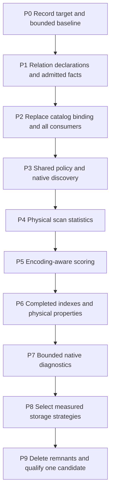

# Hard pivot to DataFusion catalog binding and shared native policy

## 1. Mandate and execution boundary

Implement the complete target from the
[DataFusion capability and catalog design review](../design_review/reviews/design_review_datafusion-capability-leverage_2026-09-15.md),
including F1–F7, through one architectural replacement. The user selected a **hard pivot** on
2026-09-15: the project is still in design, has one owner, and implementation is actioned through
Codex. Optimize for reaching the target directly and quickly. Do not organize this as a gradual
consumer migration, parallel legacy/new service, or compatibility program.

**Selected destination:** immutable bound inventories projected through real DataFusion
`CatalogProvider` and `SchemaProvider` implementations, backed by the existing exact admitted
`TableProvider` machinery. One typed declaration/binding path supplies names, visibility, fields,
validated keys, effective policy, ownership and discovery. Native scan statistics, encoding-aware
scoring, property-aware operation indexes and bounded diagnostics consume that same architecture.

This selects the review's full provider design. Its shared-builder-plus-mutable-catalog alternative
is not the destination or an independently supported intermediate architecture. An internal builder
is useful only as the constructor for the selected immutable providers.

### Planning status and inputs

- **Execution authorized:** the user subsequently requested the entire plan on 2026-09-15.
  Implementation, qualification, independent audit and single activation are complete.
- Baseline HEAD: `a78c74191d69ad82de7348c6503b58443f7f9c13`. Tracked source was clean at planning
  start. The requested review, its evidence directory and
  [separate MCP campaign](../reports/mcp-functional-datafusion-2026-09-15.md) were already untracked.
  Preserve them. They are inputs to this work, not proof of new implementation.
- The review's 55.1.0 source checks, recorded MCP research and
  [mechanism probes](../design_review/reviews/evidence/datafusion-capability-leverage-2026-09-15/research-receipt.json)
  are reusable discovery/interface evidence. Do not repeat that whole investigation before coding.
- Read [Plan 13](13-datafusion-research-operations-hard-pivot.md), its
  [ledger](13-research-operations-execution-ledger.md), the living
  [design](../design/DESIGN.md), and the three maps:
  [data contracts](../design_review/capability-maps/datafusion_data_model_contracts_capability_spec.md),
  [logical planning](../design_review/capability-maps/datafusion_logical_planning_capability_spec.md),
  [types/UDFs](../design_review/capability-maps/datafusion_semantic_analysis_types_udfs_capability_spec.md).
  Frozen blueprint/handoff remain provenance and are not edited.
- Keep DataFusion **55.1.0**, Arrow/Parquet **59.3.0**, object_store **0.13.2**, FastMCP **4.0.3**
  and the pinned toolchain. Context7/the DataFusion skill and local rustdoc/source answer newly
  consequential API questions during implementation. This is not a dependency upgrade project.

### What hard pivot means here

| Topic | Selected rule |
|---|---|
| Existing code | Keep code because it implements the target contract. Rewrite or delete obsolete assembly, names, plumbing and tests; do not port them mechanically. |
| Consumers | Replace all production consumers of a displaced contract in the same coherent slice. Tests follow the target contract. |
| Legacy behavior | No compatibility aliases, old namespace lookup, dual provider factories, engine switch, fallback registration path or old-format translation. |
| Working sequence | One Codex execution stream and one active implementation direction. Work packages are dependency boundaries, not separate teams or approval handoffs. |
| Scope | Complete the architectural obligations outright. Complete each measurement-dependent choice with a recorded adopt/decline result; do not leave an uninvestigated tuning backlog disguised as completion. |
| State and interfaces | Retain existing formats/interfaces when they already fit the target. Do not change them merely to signal a pivot. If a target contract changes, version it and use fresh derived state rather than writing a legacy converter. |
| Historical evidence | Inactive prior state may remain as evidence. Supporting it in the target runtime is not required. Destructive evidence cleanup is separate from this plan. |
| Qualification | Focused checks after coherent changes, one consolidated final qualification. Do not spend the implementation repeatedly replaying the baseline suite. |

Rust retains identity, admission, evidence, policy, job and durable publication authority. Python
remains thin transport plus the separate extraction worker. Keep hosted rustdoc first, static
Griffe, ty/rust-analyzer, explicit execution profiles, six epistemic classes, exact manifests and
the outside-studied-repository boundary. A catalog namespace is not an authorization system or a
durable transaction manager. Do not introduce a general rule interpreter, database, workflow
engine, raw SQL MCP tool or another publication authority.

## 2. Decisions and target contracts

The listed ADRs govern retained boundaries. P0 records the new catalog/policy design in a concise
ADR and the living design before dependent behavior is treated as accepted. Allocate actual new
ADR IDs then and append them to this plan; do not invent IDs or rewrite accepted ADR arguments.
Supersede an earlier decision only where its argument actually becomes untrue. This is execution
work inside P0, not an unanswered product choice or a request for another planning round.

Names below are proposed internal concepts; choose repository-consistent Rust names during P1.

| Contract | Sole source / required behavior | Reject or distinguish |
|---|---|---|
| Relation declaration | Existing finite `Relation` and catalog `Table` families reference codec-derived schemas, semantic key fields, relation class, allowed binding kind and rule/view definitions. A common descriptor interface shares mechanics without merging their distinct identities. | Missing/ambiguous key fields; independently written duplicate schemas; unsupported binding kinds. |
| Admission facts | Exact file witness, verified row count, validated keys and applicable invariant results, bound to schema/projection and source scope. Candidate facts are distinct from admitted facts. | Statistics or constraints claimed solely because a schema declares them; raw catalog history incorrectly labeled unique. |
| Bound inventory | Immutable declared-name → provider/view entry map with explicit candidate/admitted trust status, scoped to exact snapshot(s), environment(s), generation(s), policy and request ownership. Construction completes before installation. | Partial installation, mutable current-pointer lookup, cross-snapshot substitution, duplicate names; candidate bindings entering ordinary research operations. |
| Catalog/schema providers | Custom immutable `CatalogProvider` and `SchemaProvider` project the inventory; table names, existence, type and lookup agree. Optional mutations fail. `table_type` is cheap. | Missing name is `Ok(None)`; failure resolving a known entry is an error. Empty admitted relation remains a present table. |
| Operation workspace | One separate native memory schema for temporary views/indexes; approved builder methods own registration. | Shadowing admitted namespaces; temporary tables entering shared caches or durable metadata. |
| Effective native policy | One immutable Rust value derived from validated configuration; supplies runtime/table options, provider consumers and diagnostic projection. | Independent default/override paths; writable SQL settings changing frozen domain policy; secret/ambient values in metadata. |
| Policy projection | A small **read-only ConfigExtension** projects that same native policy into DataFusion and `df_settings`; actual source-option construction consumes the typed value. | Second policy storage/authority; reported values that differ from values used by scans. |
| Contract discovery | Bounded native structural inventory plus typed domain rows derived from the declarations and bound inventory. Existing diagnostics and conformance checks consume them. | Whole-library coverage inferred from engine inventory; unbounded enumeration masked by a SQL LIMIT; missing nested role metadata. |
| Completed index | Typed result containing provider, exact pre-pagination row count, contract/binding identity and established physical properties. | Count reused for another filter domain; unknown order treated as sorted; detached resource ownership. |
| Query diagnostics | Existing operation-correlated trace plus bounded rule transitions and accurately scoped managed-memory/consumer information. | Full plan dumps per rule; global peak labeled per-query; observation resetting another operation's state. |

### 2.1 Catalog layout and binding

Use one explicit namespace scheme throughout native consumers:

| Catalog/schema | Contents | Mutability |
|---|---|---|
| `snapshot.evidence` | Exact admitted snapshot relations and declared admitted projections | Immutable |
| `snapshot.domain` | Native derived views bound to those exact sources | Immutable |
| `state.records` | Folded service-record relations from one pinned durable catalog generation | Immutable |
| `state.history` | Exact raw catalog files/history needed by folding and publication validation; no inferred uniqueness | Immutable; installed only for those internal operations |
| `candidate.evidence` | Complete candidate inputs for admission checks; not yet admitted domain facts | Immutable per validation attempt; installed only for admission |
| `before.evidence`, `before.domain`; `after.evidence`, `after.domain` | Independently pinned comparison inputs using the same inventory/schema implementation | Immutable |
| `operation.work` | Query-local views and completed indexes | Mutable only through the operation builder |
| `operation.metadata` | Derived relation/field/rule/binding inventory for this operation | Immutable |

These names are internal query contracts, not a new MCP surface. Use native `TableReference` and
column qualification; explicitly set the temporary-work defaults. Eliminate bare admitted table
references and `SIDE_`/`before_`/`after_` text-substitution assembly. Do not add aliases for the old
names. Operation variants install only the pinned scopes they need; schema absence is deliberate
and inspectable, never fallback to another catalog.

Raw-history and candidate scopes use the same descriptor, inventory and provider implementation,
with explicit binding kinds and trust state. They are not separate registration engines. Build the
complete candidate inventory before validation; successful admission produces a new admitted
binding rather than mutating a candidate's trust in place. Domain constraints and optimizer facts
are published only after the validation appropriate to each fact. Replace `raw_*` aliases with
qualified history references, including in folding and publication checks.

Use the native `MemoryCatalogProviderList` privately for one-time root installation. The 55.1
root registration trait has no `Result`, so do not invent error semantics for it. Do not expose
post-construction root mutation through the operation API. Keep the existing bounded RuntimeEnv
shared; share immutable declarations/providers where valid, never mutable catalogs or request
leases in the template. A `SessionState` clone alone is not a snapshot.

Immutable domain views retain native logical visibility. Reuse the subquery-aware lease binding
in `leases.rs` rather than hiding views behind opaque scans. Cache source-independent definitions
or exact admitted-source plans only under their complete identity; request-specific leases are
attached after cache lookup. A completed inventory and its executable handles retain the bound
inputs for the required planning, execution, result and diagnostic lifetimes.

### 2.2 Policies, rules and adaptive behavior

Policy flows **configuration → validated effective Rust policy → native consumers and derived
metadata**. No reverse path from `information_schema` rows or SQL SET becomes authority.

The new native source-option factory is a concrete consumer of captured policy, and native
diagnostics inspect its effective values. This satisfies the review/Plan 13 trigger for the
read-only ConfigExtension: it replaces independent provider defaults and separate reporting
plumbing. Preserve a single shared immutable value; configuration-extension cloning cannot share
mutable state. Use a non-reserved simple prefix such as `enrichment`, fully qualified entry names,
and a setter that explicitly refuses mutation. Do not add a second opaque session extension unless
an actual native consumer needs a handle that this projection cannot appropriately contain.

Table declarations supply standard key/reference rule parameters. Small native plan builders
generate repeated uniqueness/closure checks. Specialized conditional rules remain ordinary typed
Rust functions returning offending-row plans with stable rule IDs. Admission executes them before
trusted facts are published. DataFusion supplies relational enforcement; metadata and
`Constraints::new_unverified` do not. Physical field/role checks remain a separate preparation
boundary because schema compatibility does not establish domain validity.

Adaptive behavior means selecting an admitted projection, index layout or scan option from known
binding facts and measured policy. It does not mean runtime package discovery, hidden I/O, mutable
global rules or arbitrary callbacks deciding semantics. P8 selects bounded physical strategies;
the same policy supplies their implementation and explanation.

### 2.3 Formats and source identity

Retain target-compatible Arrow codecs, immutable artifacts, semantic identities, research/2.0
operations and generated transport machinery. Catalog names and scan settings are not new library
evidence identities. Keep semantic snapshot identity separate from physical layout/artifact and
operation-policy identities.

If adding persistent layout metadata or changing a canonical contract requires a version change,
update its authority, writers, admission and all readers together; qualify fresh state. Old
incompatible state rejects explicitly without translation. Do not require old journals, cursors,
namespaces or results to run on the new design. Neither reset nor delete retained user evidence
merely because the executable is replaced.

## 3. Execution order and exits

Architecture comes first. P1/P2/P3 form one coherent replacement phase; foundation edits may
temporarily depend on old callers while that phase is being edited, but there is no completed
slice, release or supported switch with both binding systems. Every work package has one executor:
**Codex**, with the user as project owner. There is no separate migration team or approval queue.

| Exit | Must be true before proceeding past the phase |
|---|---|
| A — P1–P3 architecture | Every production snapshot/catalog/comparison reader uses the immutable provider hierarchy and shared policy. Work tables have a separate scope. Superseded registration paths are deleted. Metadata describes those same bound objects. |
| B — P4–P7 engine integration | Physical scans consume validated counts; scoring accepts native strings without forced Utf8 coercion; completed-index counts avoid replay; established order/partition facts and bounded diagnostics survive actual consumers. |
| C — P8 decisions | Each listed workload-dependent choice has a measured adopt/decline result and the selected strategy is the only production implementation of that choice. No speculative prototype remains. |
| D — P9 completion | Target architecture, deletion ledger and functional oracles all close on one identified candidate; actual installed MCP smoke succeeds; status and evidence match that source. |

## 4. Work packages

### P0 — Record the target and prepare a minimal execution baseline

**Inputs:** review F1–F7 and the user's hard-pivot instruction. **No predecessor.**

1. Read actual source/status and record the starting HEAD, task-owned edits, pins and active
   service identity. Reuse the review's API evidence and Plan 13 fixtures. Start with `just --list`;
   do not run the full suite to rediscover a working baseline.
2. Record the selected catalog/binding/policy contracts in a concise ADR and relevant living-design
   sections. Mark new behavior Proposed until implemented/verified. Keep accepted boundary arguments
   intact; record any actual supersession explicitly. Use the existing review and scoped contract
   checks to support the decision; do not restart a general architecture-review campaign.
3. Map existing consumer entry points and negative oracles to P1–P9. Capture only the baseline
   plan/counter measurements needed for the comparison in P8. Existing external MCP diagnostic
   findings remain visible; bring one into this work only if it blocks a required target journey.
4. Initialize §9 execution records. Do not generate a second competing plan or fill acceptance
   results from historical logs. Design checks, functional evidence and gate execution remain distinct.

**Exit:** Target choices are concrete; the next action is P1 implementation. No unresolved choice
between a full immutable provider hierarchy and the review's mutable-container alternative.

### P1 — Make relation declarations and admission facts executable

**Depends on P0. Findings F1/F2/F3.** Primary surfaces: `admission.rs`, `catalog_generation.rs`,
`projection/`, `parquet_admission.rs`, `preparation.rs` and a small store contract module if needed.

1. Extract a common descriptor/binding interface from the existing `Relation` and `Table` families.
   Continue deriving schemas from codecs. Declare semantic keys, class, eligible binding kinds,
   projections and named domain-view definitions through those same finite authorities.
2. Resolve key field names against the actual Arrow schema; derive native column indices and
   validation expressions. Delete the independent `PrimaryKey([0])` convention. Preserve nullable
   Unique versus non-null PrimaryKey semantics. Reject missing or ambiguous determinants.
3. Consolidate repeated uniqueness and ordinary reference checks into native plan builders driven
   by the declarations. Keep conditional provenance/ecosystem/subject rules explicit, typed and
   inspectable. Rule IDs, parameters and offending-identity output drive diagnostics and metadata.
4. Retain validated row counts and physical file facts returned by isolated admission. Create a
   typed distinction between candidate inputs and admitted inputs with publishable statistics/keys.
   Preserve the bounded native subprocess, exact digest and file witnesses.
5. Treat raw catalog files/history separately from folded validated service records. Do not claim
   raw `selections` or append-file keys are unique. Preserve atomic publication and current folding
   semantics; surface folded keys only where their native lowering preserves the claim.

**Proof:** key-reordering and duplicate/dangling-input cases; codecs remain the schema source;
invalid data cannot construct an admitted binding. Statistics remain dormant until P4 consumes them.

### P2 — Replace registration workflows with immutable native catalogs

**Depends on P1. Findings F1/F2.** Primary surfaces: `runtime.rs`, `admission.rs`,
`catalog_generation.rs`, `leases.rs`, `views.rs`, `query.rs`, `comparison.rs`, `browse.rs`,
`search_plan.rs`, `coverage.rs`, `semantic_scope.rs`, repository/ingestion consumers and tests.

1. Implement immutable CatalogProvider/SchemaProvider projections of a complete bound inventory.
   Implement consistent list/existence/type/lookup behavior; refuse optional mutations. Keep lookup
   local to already admitted inputs and cached definitions. Failed construction installs nothing.
2. Install §2.1's namespaces through one operation/session constructor. Retain a private native
   catalog list and separate mutable `operation.work`. Hide raw registration access behind scoped
   operation methods; validation/staging operations use explicitly typed candidate bindings.
3. Replace `AdmittedRelations::register`, `register_leased`, `register_views`, repeated
   `PinnedCatalog::session` assembly, and their callers. Update publication validation and offline
   bundle/query consumers as well as interactive paths; a second path in a less-visible reader is
   still a failed pivot.
4. Replace before/after copied table registrations and `SIDE_` SQL substitution with two independently
   pinned inventories and native qualified references. Update every admitted table reference,
   including view definitions, to the target namespaces. Keep fixed trusted SQL where it is clear.
5. Preserve transparent view expansion, native optimizer defaults, field contracts, subquery-aware
   source retention, fresh physical planning and output lifetime. Cached view definitions hold no
   request leases; retained plans and results cannot read a newer generation through an alias.
6. Delete superseded binding methods and old-name tests once their production consumers switch.
   Do not leave forwarding shims. Add the narrow architecture rule that prevents new callers from
   bypassing the selected admitted/work registration boundary.

**Proof:** ordinary snapshot, durable catalog, inspection projection, comparison, publication
validation and offline read operate through the same hierarchy. Reject admitted mutation and
shadowing; distinguish missing/empty/failed; old pins survive new publication and cancellation.

### P3 — Bind one effective native policy and derive discovery from it

**Depends on P2. Findings F1/F2/F6.** Primary surfaces: daemon `service.rs`/configuration,
store runtime/provider/preparation/diagnostics, generated status DTOs if their contract changes.

1. Derive one immutable native policy from validated configuration. It owns the effective native
   strategy values; existing core policy and operation identity remain the semantic authorities.
   Replace independently constructed provider defaults and duplicated metadata/report mappings.
2. Implement the read-only ConfigExtension in §2.2, with native source-option construction as an
   actual typed consumer. Verify naming, clone isolation, mutation refusal and full enumeration.
   Use the same policy to construct TableParquetOptions and report effective scan configuration;
   preserve required metadata and shared runtime limits. A recorded flag must affect its consumer.
3. Enable internal information_schema for the bound native session. Add finite typed projections
   for relation contracts, nested field paths/roles, named rules, admitted proof status and bindings.
   Generate them from P1/P2, not independent lists. Represent unavailable inventory explicitly.
4. Change existing query/status diagnostics and conformance checks to consume this inventory.
   Capture it for the operation whose plan is being explained; do not inspect a later global state.
   Budget enumeration, nested traversal, rows and bytes before materializing metadata. Implement
   cheap table_type; native LIMIT does not guarantee bounded provider enumeration.
5. Keep engine inventory distinct from evidence coverage. Use information_schema's actual 55.1
   capabilities: structural columns/settings/routines, with domain metadata supplied separately.
   Add no raw-SQL public tool. If status DTOs change, regenerate schemas/Python and update their
   real consumers once, with no old/new response branch.

**Architecture exit A:** No independent snapshot registration or provider-policy construction
remains. Tests can enumerate the exact relation/policy objects that native planning resolves.

### P4 — Feed proven source statistics to physical scans

**Depends on P3. Finding F3.** Primary surfaces: provider/admission/catalog binding and lease tests.

1. Carry validated exact row counts into `FileScanConfigBuilder::with_statistics`. Start with
   facts already established during mandatory admission; do not add another data scan for them.
2. Merge per-file facts with checked arithmetic and appropriate precision. Physical file bytes,
   decoded Arrow bytes and column-value byte statistics are different quantities; publish each
   only in the native field whose meaning matches. Keep unknown facts Absent rather than zero.
3. Let native projection/filter/limit handling weaken statistics correctly. Test nullable counts,
   multi-file and empty inputs. Keep residual predicates and conservative Inexact pushdown.
4. Validate witnesses and bind input ownership/provenance before optimization can replace a scan
   with a constant. Old or changed inputs must not become valid because no rows will be read.
   Preserve the operation's source identities even when the physical scan disappears.
5. Add richer column statistics only through P8's explicit decision. Implementing only
   `TableProvider::statistics()` does not complete P4: it is not consumed by the built-in 55.1
   optimizer. A scan_with_args override is useful only when an actual statistics-request consumer
   is wired through to returned plan statistics.

**Proof:** eligible count plan has no data scan; results equal a reference scan for filters,
projections, NULLs, limits and multiple files; changed/missing sources still fail at binding.

### P5 — Preserve native string encodings in scoring

**Depends on P4 in the single execution sequence. Finding F4.** Surfaces: `scoring.rs`, TextColumn,
search consumers and scoring tests.

1. Replace exact Utf8-only arguments with per-position coercible native logical-string signatures.
   Keep the Boolean slot, accepted argument count, NULL/error semantics and return-field metadata.
2. Keep complete SearchSpec identity in UDF equality/hash and provenance. Native built-in eligibility
   predicates remain visible; keep the specialized scoring algorithm ordinary Rust.
3. Verify Utf8, LargeUtf8 and Utf8View inputs produce identical scores, explanations and page order,
   including Unicode, long values, scalar inputs and nullable fields. Inspect the actual analyzed
   consumer plan to prove forced Utf8 casts are gone where the target permits.
4. Preserve the current dictionary fallback correctly. Do not advertise dictionary preservation
   while TextColumn still materializes dictionaries; evaluate a separate native-encoding path in
   P8 only if it serves observed inputs. Remove obsolete exact-Utf8 assumptions from tests/callers.

**Proof:** semantic equality across supported encodings and an actual native plan using the
encoding-preserving signature. No whole-service speed claim from the coercion unit alone.

### P6 — Return complete index facts and reuse native physical properties

**Depends on P5. Finding F5.** Surfaces: `operation_index.rs`, runtime fold/materialization API,
search/overview/comparison builders and consumers.

1. Replace the provider-only materialization return type with the completed-index contract in §2.
   Count rows with checked arithmetic during the existing write/fold; retain maximum batch bytes,
   source/selection identity and resource ownership. Publish it only after successful completion.
2. Update every count/page consumer to use the exact count for that index's complete selected
   domain. A cursor changes the page, not the total domain. A new predicate/subset cannot reuse
   the parent's count without a new derivation. Delete unfiltered IPC replay just to compute count.
3. Capture ordering/partition information established by the native materialization plan, or
   establish it with explicit native sort/repartition when the chosen layout requires it. Feed
   truthful SortExpr/partition properties to StreamingTable. A single partition is not a sort proof.
4. Support both property-known and property-unknown results through one typed contract. Preserve
   ordering only across transformations that maintain it; projected-away sort/hash keys lose
   their claims. Distinguish per-partition order from global page order. Keep final tie-breakers.
5. Retain DiskManager/SpillFile quotas and bounded IPC decoding. A bounded small-index memory
   strategy is a P8 choice, not permission for an unbounded MemTable/collect path. No persistent
   cross-operation index cache or physical-plan reuse is introduced.

**Proof:** count causes no second index decode; zero/one/many-batch and failure cases behave
correctly; known-order pages can use native properties; unknown-order pages still sort correctly;
quotas, cancellation and last-reader release remain intact.

### P7 — Add bounded native rule and resource diagnostics

**Depends on P6. Finding F7.** Surfaces: runtime, query_diagnostics, service status/generated DTOs.

1. Wrap the empty shared FairSpillPool with PeakRecordingPool before any reservations. Report
   current and maximum managed reservations with their actual shared-runtime scope. Do not reset
   the global peak per operation or label it as process RSS or per-query peak.
2. Use analyzer/optimizer observer callbacks to record bounded rule names and whether a plan
   changed. Capture lightweight capped events during work so failures retain their own context;
   detailed text is budgeted and only produced for selected diagnostic paths. Do not render every
   full plan after every rule or parse formatted plan text to recover authoritative facts.
3. Preserve operation/family/binding identity, existing stable failure classes and structured
   budget witnesses. Record truncation explicitly. Wire new fields through actual status/result
   consumers and generated models only where needed.
4. Evaluate TrackConsumersPool in P8 for useful bounded failure attribution. Avoid a second
   accounting authority and preserve the underlying DataFusion resource error classification.

**Engine exit B:** Production callers use P4–P7 capabilities; they are not unused helpers or
standalone probes. The review's core semantic/encoding/count/observation omissions are closed.

### P8 — Choose and finish measured physical strategies

**Depends on P7. Findings F3/F5/F6/F7.** This is bounded engineering work, not an open-ended
benchmark phase. Architecture exit A and engine exit B are mandatory regardless of timings.

For each row below: use the existing workload family, compare one credible alternative, record
semantic equality and cost, select the result, and delete the rejected prototype. One follow-up
experiment is appropriate if a result is inconclusive; otherwise retain the simpler conservative
strategy with the reason and a precise future trigger. Do not call an unrun experiment a decline.

| Choice to settle | Required target integration / adoption rule |
|---|---|
| Parquet decoder filtering and filter reordering | Exercise actual typed source-option consumption on selective ID/eligibility queries and large nested payloads. Adopt when avoided decoding outweighs predicate/cache cost; retain residual filtering. |
| Row-group and file sizing | Separate storage layout policy from processing batch size and catalog delta transaction limits. Measure cold metadata and selective scans. Keep write/file/admission bounds; no implicit unbounded buffers or current 1024-row assumption copied as policy. |
| Page indexes and column Bloom filters | Existing read support stays enabled where appropriate. Evaluate writer metadata for selective, actually queried keys; account for write time, file bytes and admission. Do not add Bloom filters to every column. |
| File grouping and native scan parallelism | Use truthful native partitioning and current shared limits; measure small files and larger scans under one and several operations. No unbounded task fan-out or treating downstream repartitioning as parallel file I/O. |
| Retained-index ordering | Compare unsorted materialization plus native page sort with sort-once plus exposed ordering for repeated consumers. Preserve exact tie/NULL behavior. Select by a small declared strategy only if both have real workloads. |
| Small-index memory versus IPC | Compare a reservation-backed bounded memory path with current spool behavior for empty/tiny/large indexes. Retain one strategy unless both clearly justify a measured threshold; spill/cap enforcement stays explicit. |
| Richer statistics | Add column facts only where admission/source metadata can establish sound precision and a native consumer benefits. Count-only statistics are a complete minimum; no duplicate footer/admission pipeline. |
| TrackConsumersPool | Evaluate bounded top-consumer detail and overhead under failed allocations/concurrent work; keep it only if useful without altering classification or creating misleading attribution. |
| Dictionary-preserving scoring | Evaluate only if representative inputs reach scoring as dictionaries; current fallback remains correct. No positive encoding claim without a non-materializing implementation and equivalence proof. |

Use cold/warm, tiny/large, selective/unselective and concurrent cases from actual Rust/Python
research operations. Record construction, admission, preparation, metadata, decoding, execution,
index replay, delivery, file size, managed memory and RSS separately where material. Use matched
inputs and repeated paired samples; record sample count and dispersion. Adopt performance changes
only with repeatable workload benefit and no semantic/resource regression, not a single faster run.

Bound expensive experiments through the existing runtime; do not raise limits to hide a failure.
Make new configurable layout values part of one validated policy and effective-settings report.
Where a persistent layout changes, follow §2.3 directly rather than maintaining two readers.

**Decision exit C:** Every row has an executed decision record (or explicit not-applicability
supported by inspected workload/feature evidence); selected changes are integrated and rejected
experimental branches are gone. Unrelated capabilities remain deliberately excluded under §7.

### P9 — Close deletion, verify the candidate and activate once

**Depends on P8. All findings.**

1. Close §5's deletion ledger with source paths and consumer evidence. Run the narrow architecture
   rules. Check production use, not just absence of strings: no caller independently chooses
   admitted visibility, lease attachment, namespace aliases or provider defaults.
2. Run relevant quality checks and §6's functional oracles on one identified final source. Reuse
   existing test fixtures and infrastructure; add focused behavior tests for the new boundaries.
   Do not rerun unrelated producer/client breadth campaigns merely because they exist.
3. Complete one consolidated native/Python regression run, plus the affected publication/lease
   and real-client tiers. Track exact source/build/config identities. Resolve regressions before
   declaring completion; keep unrelated known external campaign findings explicitly separate.
4. Build one candidate with the repository's locked installation workflow. Run an actual installed
   MCP journey in isolated fresh state: status/metadata, exact DataFusion 55.1 resolve, useful
   inspection, search/overview, two-snapshot comparison, paging/artifact reads and offline reuse.
   Exercise empty/missing/capacity outcomes and ownership release. Native standalone probes and
   mocked clients do not substitute for this path.
5. During authorized plan execution, activate the qualified candidate once using the existing
   operator installation/registration mechanism and a source-bound manifest. Preserve the selected
   production execution profile. If formats changed, activate fresh target state while preserving
   incompatible old state inactive; otherwise target-compatible state can be reused. No deployment
   or destructive state action occurs merely from authoring this plan.
6. Update the plan outcome, living design evidence, STATUS and plan index from actual results.
   Apply the acceptance-report skill if regenerating/summarizing machine acceptance gates; unmatched
   gates remain not_run. A scoped review verdict is not a machine-gate pass. Leave no task-owned
   qualification process running after completion.

**Exit D:** All required architecture, integration, deletion and functional obligations are
complete; optional strategies have final decisions; the activated candidate matches the evidence.

## 5. Replacement and deletion ledger

These are semantic obligations. Renaming the old implementation or retaining a forwarding method
does not close a row. Preserve an existing helper only when it directly serves the target.

| ID | Remove or replace | Target / evidence | Package |
|---|---|---|---|
| D01 | Three independent AdmittedRelations registration modes | One bound inventory projected through immutable schemas; leased/candidate binding kinds are typed inputs | P1/P2 |
| D02 | Repeated PinnedCatalog raw/empty/view registration assembly | Same descriptor/binding mechanism; typed raw-history versus folded-record semantics | P1/P2 |
| D03 | Copied before/after tables, `SIDE_` substitution and legacy admitted aliases | Qualified native references to two immutable pins | P2 |
| D04 | Public/general admitted-table registration access and shared raw/work namespace | Private root construction, immutable source schemas, explicit operation work builder | P2 |
| D05 | Independently assumed key column zero and repeated mechanical key checks | Key indices and invariant plans derived from authoritative schema/declaration | P1 |
| D06 | Provider-specific Parquet defaults disconnected from effective configuration | One native policy, read-only projection and consuming source-option factory | P3 |
| D07 | Independently maintained contract/policy diagnostic lists | Native inventory plus typed declaration-derived metadata and operation binding | P3 |
| D08 | Validated row counts discarded before scan planning | Admitted statistics consumed by physical FileScanConfig | P4 |
| D09 | Forced exact-Utf8 scoring signature and matching consumer assumptions | Native logical-string coercion with preserved result semantics | P5 |
| D10 | Provider-only completed-index return and count-only full IPC replay | Typed completed index with exact domain count and established properties | P6 |
| D11 | No-op rule observers and missing native managed-memory high-water data | Bounded observer events and correctly scoped native counters | P7 |
| D12 | Storage row-group sizing implicitly equated to processing batch/delta size | Explicit validated layout policy and P8 decision evidence | P3/P8 |
| D13 | Experimental alternative implementations, compatibility flags and obsolete test paths | One selected target implementation per contract; target-only behavior tests | P8/P9 |

Keep: exact-file identity and native admission isolation; codec-owned schemas; transparent native
views; typed parameters and relational operations; full operation budgets and leases; immutable
publication; generated transport contracts; narrow specialized algorithms. These already implement
the target and need no replacement merely for novelty.

## 6. Functional and regression oracles

All rows begin **not_run**. Names below identify proposed obligations, not pre-existing test
functions or machine acceptance IDs. Record the actual test location, command, source and log at
execution. Prefer extending existing store/contract tiers over a separate testing framework.

| ID | Observable oracle | Coverage |
|---|---|---|
| J01 | Names, existence, cheap type lookup and table lookup agree for present, absent, empty and failed bindings | F1/F2; immutable schemas |
| J02 | Admitted catalog/schema mutations and work-name shadowing are rejected; failed inventory construction installs nothing | F1; namespace validity |
| J03 | Snapshot, inspection projection, durable catalog, validation staging and offline bundle readers use the selected binding path | F1; hidden consumer closure |
| J04 | Before/after comparison uses independently pinned qualified sources and returns the same changes/coverage/pages | F1; side identity |
| J05 | Old plan/reader/result remains valid across new publication; cancellation and final drop release leases/permits/spill | F1/F3/F5; lifecycle |
| J06 | Field reorder remaps declared keys; duplicate keys/dangling conditional references fail before trusted constraints | F2; admission authority |
| J07 | Actual provider policy, read-only ConfigExtension entries, bound diagnostics and native scan options agree | F2/F6; single policy |
| J08 | Metadata is derived, operation-scoped and bounded; nested roles and missing/error distinctions survive | F2/F7; truthful discovery |
| J09 | Count scan disappears only with admitted physical exact statistics; filters/limits/NULLs/multiple files retain correct results | F3; engine consumer |
| J10 | Changed or unadmitted source is rejected even when optimization could eliminate its scan | F3; trust before optimization |
| J11 | Scoring results and field metadata match across Utf8/LargeUtf8/Utf8View; actual plan avoids unnecessary Utf8 casts | F4; representation preservation |
| J12 | Completed-index count incurs no second decode; count domain, pagination, empty/failing writes and quotas are correct | F5; materialization |
| J13 | Declared ordering/partitioning matches actual rows through projection; ties/NULLs and unknown-order cases remain correct | F5/F6; physical properties |
| J14 | Peak/consumer diagnostics preserve pool limits and scope; rule events and failure context stay capped and correlated | F7; observability |
| J15 | Every P8 strategy decision has matched semantic/cost evidence and its selected implementation is actually consumed | F3/F5/F6/F7; measurement |
| J16 | Installed real MCP completes the selected Rust/Python research journeys and offline reuse with bounded truthful delivery | All; product integration |
| J17 | D01–D13 close without aliases, fallbacks, shadow engines or unused new infrastructure | All; hard-pivot completion |

### Proportionate command ladder

1. During architecture edits, compile the affected crates as needed. After a coherent Rust slice,
   run `cargo clippy --locked --offline -p enrichment-store -p enrichment-daemon --all-targets`
   and its focused tests, using repository feature/profile conventions and `CARGO_INCREMENTAL=0`.
   Do not write tests that merely restate a declaration; test divergent bindings and outcomes.
2. For changed wire/status DTOs, run `just schemas-generate`, `just schema-conformance`, then
   relevant `uv run ruff check`, `uv run ty check` and `uv run pytest tests/contract`. Reuse the
   pinned environment; do not substitute another type checker or install dependencies globally.
3. For publication/admission/ownership changes, run the affected real negative/lifecycle cases
   and `just state-leak-check` in their designated isolated development environment. Real MCP
   production research is separately identified and is not mislabeled as a state-leak test.
4. At P9 run `just fmt-check`, `just architecture-check`, `just rules-test`, `just deps-policy`,
   `just adr-lint`, `just provenance-check`, and one final native/Python regression set. Reuse
   equivalent already-recorded checks only when source, command scope and configuration match.
5. Run J16 on the installed candidate, then one activation smoke. Broaden testing only for changed
   dependencies, observed regressions or an unmet required oracle. Never accept static inventory,
   mocks, historical gate tallies or the review's four microprobes as terminal qualification.

Build/test profile details and exact final commands are recorded when executed, not guessed in
advance. A failed, blocked or not_run required oracle stays visible. Do not weaken an oracle to
make the pivot look complete, and do not stop at a green subset while production callers still
use superseded architecture.

## 7. Complete review-scope disposition

“All changes” includes a decision for every recommendation. It does not require adding every
DataFusion feature that the review explicitly rejected or deferred for lack of a consumer.

| Review scope | Plan disposition |
|---|---|
| F1/F2 and E1: catalog binding, declarations, policies, discovery | Required P1–P3; review's temporary procedural-binding tolerance ends at exit A |
| F3/F4 and E2: physical statistics and native string coercion | Required P4/P5; no throughput threshold can waive implementation of these proven consumer paths |
| F5: completed counts and source physical properties | Required P6; specific ordered/memory layouts are settled in P8 |
| F6 and D3: source options, decoder filtering, sizing, page/Bloom use, grouping | Shared options/layout authority required P3/P8; all workload choices receive bounded evidence-backed disposition |
| F7 and E3: peak, rule observations and consumer diagnostics | Peak/rule integration required P7; TrackConsumersPool is a P8 decision |
| D2: ConfigExtension | Promote to required P3 with the concrete policy/scan/discovery consumers in §2.2; do not add unrelated options or another authority |
| D1: persistent prepared-plan caching | Excluded from this pivot. Existing immutable view reuse and completed-index contract are the target; revisit only for a measured cross-operation planning bottleneck with complete keys/lease accounting |
| Shared native invariant builders | Required for repeated rules in P1; specialized conditional checks remain explicit ordinary functions |
| Custom AnalyzerRule / SQL planners / logical nodes | Excluded unless target semantics cannot be represented by the selected native plans and preparation. A concrete necessity requires a short scoped decision and integration proof, not a speculative framework |
| UDTFs; UDAFs; UDF preimage, interval, monotonicity, placement and short-circuit hooks | Deferred: current consumers are served by native views/builders/functions and specialized scoring. Adopt only for a specific valid semantic contract; a hard pivot does not make unsupported promises safe |
| DFExtensionType | Deferred: current field-role/admission contracts suffice. Revisit for actual operator/type semantics, not merely to label string identifiers |
| ArrowMemoryPool / allocator feature changes | Deferred: feature and allocator-aware integration require a demonstrated unmanaged-allocation consumer. Existing isolated decode and reservations remain required |
| Native sinks | Existing Arrow/Parquet write path remains target-compatible. Use a native sink only for a demonstrated batch-output consumer, never as a substitute for durable publication |
| Remote/async catalog resolution, ListingSchemaProvider, DynamicFileSchemaProvider | Excluded: target is an already admitted local exact inventory. No path discovery, remote coherence layer or implicit acquisition during lookup |
| Substrait/protobuf plans, FFI providers, distributed execution | Excluded: no current consumer; their trust/version/lifetime machinery is outside this service increment |
| New MCP tools or wholesale FastMCP redesign | Excluded: reuse the thin research/2.0 boundary and generated consumers; change bounded status presentation only when target diagnostics need it |

Record deferred triggers in the existing decision register during P0/P9 with Codex as executor
and the user as accountable project owner. They are deliberate scope decisions, not unresolved
core work or handoffs to other maintainers. Separate MCP campaign diagnostic findings remain
separately tracked unless they obstruct a required J-row; no whole-service defect closure is
implied by this plan's completion.

## 8. Completion definition

The plan is complete only when:

1. Every production reader/planner uses the selected immutable catalog/schema/provider architecture;
   declarations and effective policy drive execution and discovery through one binding path.
2. F1–F7's mandatory changes have actual consumers and J01–J17 have source-bound results. A
   measurement-dependent feature can be declined only with the recorded scope/evidence required
   by P8; no mandatory architectural change is waived on performance grounds.
3. D01–D13 are closed. No compatibility implementation, obsolete namespace contract, duplicate
   policy interpreter or unused “new architecture” remains in production.
4. All current correctness boundaries hold: exact provenance/admission, truthful coverage and
   NULLs, complete semantic reuse keys, native field preservation, bounded ownership, publication
   and thin Python transport. New native optimizations do not weaken them.
5. One final candidate has completed the relevant regression and actual installed journeys,
   activation matches its source/build/configuration receipt, and state/docs truthfully record it.

Do not declare completion because declarations, modules, tests or an architecture diagram exist.
The execution paths and deletion evidence must demonstrate the pivot.

## 9. Execution record

Execution authorized 2026-09-15. **P0–P9 are passed; the plan is done and activated.**
The source, deletion and functional
ledgers are recorded in the [final qualification report](../reports/plan14-final-qualification-2026-09-15.md).
The review's earlier tests remain design evidence only.

| Package | State | Implemented/deleted boundary | Actual command/source/log |
|---|---|---|---|
| P0 | passed | Baseline captured; ADR-0040 and living design record the selected immutable hierarchy; exact pinned source verified | `just --list`; baseline `a78c7419`; ADR-0040 evidence table |
| P1 | passed | Shared finite codec/key/reference contracts; typed candidate/admitted binding; validated counts retained | Final native regression; declaration/admission/catalog tests |
| P2 | passed | All snapshot, staging, durable, comparison, projection and bundle consumers use immutable bound catalogs; old registration/aliases removed | D01–D05/J01–J06; final native and installed consumers |
| P3 | passed | One effective policy, read-only native extension and actual Parquet factory; bounded declaration-derived metadata | `native_policy` and `native_catalog` tests; installed settings |
| P4 | passed | Physical exact row statistics remove eligible count scans; source trust and leases survive elimination | Count-elimination and multi-file/NULL/filter/LIMIT tests |
| P5 | passed | Native logical-string coercion preserves supported encodings, result semantics and roles | Actual analyzed UDF differential test, scoring suite |
| P6 | passed | CompletedIndex owns exact count/identity/properties; count-only replay removed; native IPC/resource contract retained | Index count, failure/quota, ties/NULL/projection tests and product pages |
| P7 | passed | Capped rule transitions and bounded fingerprints; shared-runtime managed peak without resets | Native diagnostics tests and installed capacity/ownership result |
| P8 | passed | All nine choices measured or explicitly not applicable; only selected production strategies retained | [Measured decisions](../reports/plan14-physical-strategies-2026-09-15.md), distinct source/binary receipts |
| P9 | passed | D01–D13 and J01–J17 closed; native/Python regression, installed MCP, real clients, independent replay and single activation passed | [Qualification](../reports/plan14-final-qualification-2026-09-15.md); source `5b2640ca15e4` |

## Outcome

The final source replaces the old procedural registration architecture with immutable native
catalog/schema binding, shared declarations/rules, one read-only native policy, admitted physical
statistics, encoding-aware scoring, completed-index facts and bounded observations. Opaque derived
providers and legacy namespace assembly are deleted. P8 adopts decoder/reorder, observation-key
Bloom and bounded whole-file groups; explicit layout is independent of processing batch size.
Unsorted IPC, conservative unknown column facts and the existing pool remain selected for the
recorded reasons. Unsupported speculative branches are absent from production.

D01–D13 and J01–J17 have source/consumer mappings in the qualification report. Native final
regression: **441 passed, 16 skipped**. Actual installed research, capacity recovery and Codex/Claude
stdio checks pass. Python regression: **188 passed, 35 external-profile prerequisite skips,
17 deselected**. Independent replay reproduced both commands and the current gate report:
**28 passed / 0 failed / 11 blocked / 9 not_run of 48**. This is scoped Plan 14 completion,
not renewed certification of unselected external profiles or unrelated live/client gates.

The candidate activated once at **21:36:31 UTC** and passed the deployed smoke. Active source:
`5b2640ca15e4`, installation `/home/paul/.local/opt/library-enrichment/plan14-5b2640ca15e4`.
Compatible evidence state and static-only policy remain selected. No required Plan 14 work remains.
